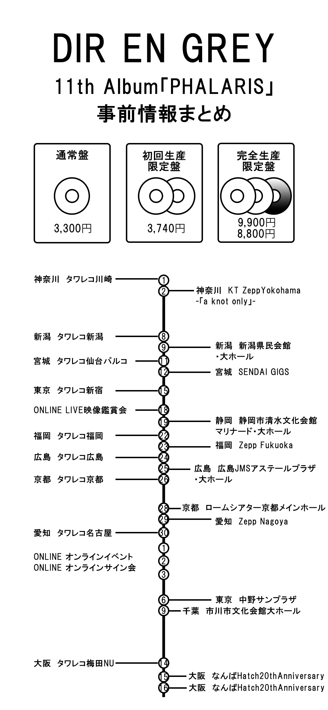

---
categories:
- DIR EN GREY
date: Tue, 24 May 2022 06:03:40 +0000
slug: post-14688
tags:
- DIR
- DIR EN GREY
title: DIR EN GREY 11th Album「PHALARIS」リリース前情報（インストアイベントやツアー日程等）まとめ
---

DIR EN GREYの11枚目のアルバム「PHALARIS」が2022年6月15日にリリースされる。前作「<a href="https://www.warawareotoko.com/2018/09/27/post-12119/">The Insulated World</a>」からおよそ4年の間をあけて、ついに発売されることとなった。今回は発売前の解禁情報をまとめておく。すでに申し込み期日が過ぎているものなどもあるので、その点留意が必要。
<h2>アルバムコンセプト</h2>

<iframe title="YouTube video player" src="https://www.youtube.com/embed/y8sPLo-mZao" width="560" height="315" frameborder="0" allowfullscreen="allowfullscreen"></iframe>

古代ギリシャの拷問器具「ファラリスの雄牛」に着想を得て命名されたとのこと。
熱せられ黄金に見える外見からは想像できない、中身の惨状。以下参照

アートワークはこちらの方が制作されたようです。
<blockquote class="twitter-tweet">

そうなんです。DIR EN GREYとコラボなんです。まだ画像は公開されてませんがよろしくお願いします。 <a href="https://t.co/0e9m415Cg8">https://t.co/0e9m415Cg8</a>

— MUNE/コアチョコ HARDCC (@mune41) <a href="https://twitter.com/mune41/status/1526863465033322496?ref_src=twsrc%5Etfw">May 18, 2022</a></blockquote>

<blockquote>
<h3>ファラリスの雄牛とは？</h3>
真鍮で鋳造された、中が空洞の雄牛の像であり、胴体には人間を中に入れるための扉がついている。受刑者となったものは、雄牛の中に閉じ込められ、牛の腹の下で火が焚かれる。真鍮は黄金色になるまで熱せられ、中の人間を炙り殺す。
雄牛の頭部は複雑な筒と栓からなっており、苦悶する犠牲者の叫び声が、仕掛けを通して本物の牛のうなり声のような音へと変調される[2]。

出典: フリー百科事典『ウィキペディア（Wikipedia）』:<a href="https://ja.wikipedia.org/wiki/%E3%83%95%E3%82%A1%E3%83%A9%E3%83%AA%E3%82%B9%E3%81%AE%E9%9B%84%E7%89%9B">ファラリスの雄牛</a></blockquote>
<h3>メンバーアーティスト写真</h3>
今回は全員きちんと人間の形をしているようです。
<blockquote class="instagram-media" style="background: #FFF; border: 0; border-radius: 3px; box-shadow: 0 0 1px 0 rgba(0,0,0,0.5),0 1px 10px 0 rgba(0,0,0,0.15); margin: 1px; max-width: 540px; min-width: 326px; padding: 0; width: calc(100% - 2px);" data-instgrm-permalink="https://www.instagram.com/p/CdvJY-GLgbO/?utm_source=ig_embed&amp;utm_campaign=loading" data-instgrm-version="14">

&nbsp;

この投稿をInstagramで見る

&nbsp;

<a style="color: #c9c8cd; font-family: Arial,sans-serif; font-size: 14px; font-style: normal; font-weight: normal; line-height: 17px; text-decoration: none;" href="https://www.instagram.com/p/CdvJY-GLgbO/?utm_source=ig_embed&amp;utm_campaign=loading" target="_blank" rel="noopener">DIR EN GREY(@direngrey_official)がシェアした投稿</a>

</blockquote>

また衣装制作はいつものこちらの方が制作されたとのことです。
<blockquote class="twitter-tweet">

2022.6.15 RELEASE
DIR EN GREY 11th ALBUM
『PHALARIS』
京さん、薫さん、Toshiyaさんの衣裳を製作させて頂きました！<a href="https://twitter.com/hashtag/%E4%BA%AC?src=hash&amp;ref_src=twsrc%5Etfw">#京</a> <a href="https://twitter.com/hashtag/%E8%96%AB?src=hash&amp;ref_src=twsrc%5Etfw">#薫</a> <a href="https://twitter.com/hashtag/Toshiya?src=hash&amp;ref_src=twsrc%5Etfw">#Toshiya</a><a href="https://twitter.com/hashtag/DIRENGREY?src=hash&amp;ref_src=twsrc%5Etfw">#DIRENGREY</a> <a href="https://twitter.com/hashtag/PHALARIS?src=hash&amp;ref_src=twsrc%5Etfw">#PHALARIS</a> <a href="https://t.co/uadRushfiC">https://t.co/uadRushfiC</a>

— THE d'OR (@_THEdOR_) <a href="https://twitter.com/_THEdOR_/status/1527253399770910720?ref_src=twsrc%5Etfw">May 19, 2022</a></blockquote>

<h2>CD情報</h2>
発売形式は3パターン。どれもアルバム収録曲に違いはないが、オプションが異なっている。

収録曲は「朧」「落ちた事のある空」を含む11曲
<ol>
 	<li>Schadenfreude</li>
 	<li>朧</li>
 	<li>The Perfume of Sins</li>
 	<li>13</li>
 	<li>現、忘我を喰らう</li>
 	<li>落ちた事のある空</li>
 	<li>盲愛に処す</li>
 	<li>響</li>
 	<li>Eddie</li>
 	<li>御伽</li>
 	<li>カムイ</li>
</ol>
<h3>通常盤</h3>
[itemlink post_id="14689"]

(CDのみ) SFCD-0273 ￥3,300 (tax in)
収録曲11曲のCD1枚
<ol>
 	<li>Schadenfreude</li>
 	<li>朧</li>
 	<li>The Perfume of Sins</li>
 	<li>13</li>
 	<li>現、忘我を喰らう</li>
 	<li>落ちた事のある空</li>
 	<li>盲愛に処す</li>
 	<li>響</li>
 	<li>Eddie</li>
 	<li>御伽</li>
 	<li>カムイ</li>
</ol>
<h3>初回生産限定盤</h3>
[itemlink post_id="14691"]

初回生産限定盤
2枚組(CD＋特典CD) SFCD-0271～272 ￥3,740 (tax in)

DISC1:
<ol>
 	<li>Schadenfreude</li>
 	<li>朧</li>
 	<li>The Perfume of Sins</li>
 	<li>13</li>
 	<li>現、忘我を喰らう</li>
 	<li>落ちた事のある空</li>
 	<li>盲愛に処す</li>
 	<li>響</li>
 	<li>Eddie</li>
 	<li>御伽</li>
 	<li>カムイ</li>
</ol>
DISC2:
<ol>
 	<li>mazohyst of decadence</li>
 	<li>ain’t afraid to die</li>
</ol>
<h3>完全生産限定盤</h3>
[itemlink post_id="14692"]
[itemlink post_id="14693"]

完全生産限定盤
特殊パッケージ仕様
3枚組(CD＋特典CD＋特典Blu-ray)SFCD-0265～267 ￥9,900 (tax in)
3枚組(CD＋特典CD＋特典DVD)SFCD-0268～270 ￥8,800 (tax in)

DISC1:
<ol>
 	<li>Schadenfreude</li>
 	<li>朧</li>
 	<li>The Perfume of Sins</li>
 	<li>13</li>
 	<li>現、忘我を喰らう</li>
 	<li>落ちた事のある空</li>
 	<li>盲愛に処す</li>
 	<li>響</li>
 	<li>Eddie</li>
 	<li>御伽</li>
 	<li>カムイ</li>
</ol>
DISC2:
<ol>
 	<li>mazohyst of decadence</li>
 	<li>ain’t afraid to die</li>
</ol>
DISC 3：
Blu-ray or DVD
疎外 2021.6.5 東京ガーデンシアター
<ol>
 	<li>DOZING GREEN (Acoustic Ver.)</li>
 	<li>絶縁体</li>
 	<li>空谷の跫音</li>
 	<li>人間を被る</li>
 	<li>Devote My Life</li>
 	<li>CLEVER SLEAZOID</li>
 	<li>DIFFERENT SENSE</li>
 	<li>赫</li>
 	<li>Ranunculus</li>
 	<li>谿壑の欲</li>
 	<li>The World of Mercy</li>
 	<li>朧</li>
 	<li>かすみ</li>
 	<li>Followers</li>
 	<li>OBSCURE</li>
 	<li>落ちた事のある空</li>
 	<li>Sustain the untruth</li>
 	<li>激しさと、この胸の中で絡み付いた灼熱の闇</li>
</ol>
<h2>インストアイベント:直筆サイン入りオリジナルカードお渡し会 （メンバー1人）</h2>
それぞれ開催店舗のサイトなどに詳細が記載されていますが、この記事公開時点ですでに予定数締切の店舗などもでているかもしれません。ご注意ください。

詳細はオフィシャルサイトにて必ず確認を

開催日：2022年6月1日(水) 18:00〜
【神奈川】会場：タワーレコード川崎店　店内イベントスペース

開催日：2022年6月8日(水) 19:00〜
【新潟】会場：イオンモール新潟南1Fマリンコート

開催日：2022年6月11日(土) 12:00〜
【宮城】会場：タワーレコード仙台パルコ店　店内イベントスペース

開催日：2022年6月15日(水) 19:00～
【東京】会場：タワーレコード新宿店　9Fイベントスペース

開催日：2022年6月22日(水) 19:00〜
【福岡】会場：タワーレコード福岡パルコ店　店内イベントスペース

開催日：2022年6月24日(金) 18:00〜
【広島】会場：タワーレコード広島店　店内イベントスペース

開催日：2022年6月26日(日) 17:00〜
【京都】会場：タワーレコード京都店　店内イベントスペース

開催日：2022年6月30日(木) 18:00〜
【愛知】会場：タワーレコード名古屋パルコ店　店内イベントスペース

開催日：2022年7月14日(木) 19:00〜
【大阪】会場：タワーレコード梅田NU茶屋町店　店内イベントスペース
<h2>DIR EN GREY×SHIBUYA TSUTAYA コラボカフェ</h2>
！！！！最初聞いた時は耳を疑いました。
事前予約制でチケット代が発生します。
<blockquote>メンバープロデュースのフード＆ドリンクはもちろん、メンバーの巨大ビジュアル・衣装展示・貴重な写真展示、コラボカフェオリジナルグッズの販売など、DIR EN GREY一色となった空間をお楽しみいただけます。

<a href="https://ameblo.jp/shibuya-tsutaya/entry-12743761291.html">https://ameblo.jp/shibuya-tsutaya/entry-12743761291.html</a></blockquote>
【コラボカフェ開催概要】
開催期間
2022年6月28日(火）～7月13日(水)の16日間

会場
〒150-0042 東京都渋谷区宇田川町21－6
SHIBUYA TSUTAYA 7F WIRED TOKYO 1999（SHELF67内）

また7/10（日）にはメンバー参加のイベントの開催も決定とのことで、そのイベントに参加するにはアルバムの購入が必要です。

参加方法
SHIBUYA TSUTAYA オンラインショップ（https://shibuyatsutaya.stores.jp）にて、『PHALARIS』（下記【対象商品】参照）を購入し、ご応募された方の中から抽選で当選されたお客様が本イベントに参加いただけます。抽選で当選されたお客様は別途チケットの申込が必要となり、チケット代金が発生します。

※イベント内容はメンバー 1名によるトークイベント＆直筆サイン入りオリジナルカードのお渡し会を予定しております。
※チケット代金は5,500円（税込）になります。
※チケット代金には、スペシャルフード、スペシャルドリンクの提供、コラボカフェ限定特典（ランチョンマット）が含まれています。

日時
・7/10(日)

対象商品は全形態のようです。
2022年6月15日（水）発売　DIR EN GREY『PHALARIS』
【完全生産限定盤】3枚組(CD＋特典CD＋特典Blu-ray)SFCD-0265～267 ￥9,900 (税込)
【完全生産限定盤】3枚組(CD＋特典CD＋特典DVD)SFCD-0268～270 ￥8,800 (税込)
【初回生産限定盤】2枚組(CD＋特典CD)SFCD-0271～272 ￥3,740 (税込)
【通常盤】(CDのみ)SFCD-0273 ￥3,300 (税込)

※1点ご購入につき一口分自動応募となります。応募券の発送はございません。

詳細はオフィシャルサイトにてご確認ください。
<h2>オンラインイベント</h2>
<h3>LIVE映像鑑賞会</h3>
完全生産限定盤購入者対象で、特典ディスクの「疎外」のLIVE映像鑑賞会が実施されます。
メンバーもチャットにて参加予定とのこと
こちらは全員対象
＜開催日時＞
2022年6月18日(土)午後20時～（予定）
<h3>オンラインサイン会</h3>
完全生産限定盤購入者対象で、応募した中から抽選でオンラインサイン会が実施されます。
＜特典内容＞
A賞　京 オンラインサイン会　【20名様】
B賞　薫 オンラインサイン会　【20名様】
C賞　Die オンラインサイン会　【20名様】
D賞　Toshiya オンラインサイン会 【20名様】
E賞　Shinya オンラインサイン会 【20名様】
F賞　直筆サイン入り『PHALARIS』告知ポスター【50名様】

＜オンラインサイン会実施予定日＞
2022年7月1日(金)～7月3日(日)
<h3>メンバー1~2名参加のオンラインイベント</h3>
全形態対象となっています。１シリアルにつき１申し込みとのことで全てに参加するには3枚購入が必要なようです。

＜特典内容＞
・《2022年7月1日(金)開催》オンラインイベント①【応募者全員招待】
・《2022年7月2日(土)開催》オンラインイベント②【応募者全員招待】
・《2022年7月3日(日)開催》オンラインイベント③【応募者全員招待】
<h2>ツアー「TOUR22 PHALARIS -Vol.I-」</h2>
神奈川県　　2022/6/2(木)　KT Zepp Yokohama -｢a knot｣only-
新潟県　　　 2022/6/9(木)　新潟県民会館・大ホール
宮城県　　　 2022/6/12(日)　SENDAI GIGS
静岡県　　　 2022/6/19(日)　静岡市清水文化会館マリナート・大ホール
福岡県 　　　2022/6/23(木)　Zepp Fukuoka
広島県 　　　2022/6/25(土)　広島JMSアステールプラザ・大ホール
京都府 　　　2022/6/28(火)　ロームシアター京都・メインホール
愛知県 　　　2022/6/29(水)　Zepp Nagoya
東京都 　　　2022/7/6(水)　中野サンプラザ
千葉県 　　　2022/7/9(土)　市川市文化会館・大ホール
大阪府 　　　2022/7/15(金)なんばHatch　-Namba Hatch 20th Anniversary-
大阪府 　　　2022/7/16(土)なんばHatch　-Namba Hatch 20th Anniversary-

Vol.ⅠということなのでVol.Ⅱが発表されるんでしょうね。
<h2>メディア情報</h2>
2022/6/3(金)19:00～20:30
FM NACK5「BEAT SHUFFLE」
リモート生ゲスト出演(Toshiya＆Shinya)
※出演時間：19:03-19:20 / 19:25-19:55

2022/6/15(水)発売
音楽と人増刊 「PHY」Vol.21 ＜表紙巻頭＞インタビュー
[itemlink post_id="14696"]

「MASSIVE Vol.40」&lt;表紙・巻頭特集&gt;撮り下ろし＆パーソナルインタビュー
https://twitter.com/youmasuda/status/1527454466878111744?s=20&amp;t=1LKWcysN9gKat1xtTbGgcQ
<h2><a href="https://twitter.com/s_s_p_y">しんぺー</a>はこう思った。</h2>
以上、5月24日時点の情報でした。

情報には誤りがある場合がありますので、くれぐれもオフィシャルサイトを確認の上、各申し込み等をしてください。
<blockquote class="twitter-tweet">

今日はリズム隊リハでした

みっちりと練習しました <a href="https://t.co/F5ANGDvjOJ">pic.twitter.com/F5ANGDvjOJ</a>

— Shinya/DIR EN GREY/SERAPH (@224_Shinya) <a href="https://twitter.com/224_Shinya/status/1528341817086791680?ref_src=twsrc%5Etfw">May 22, 2022</a></blockquote>

<blockquote class="twitter-tweet">

今日もリズム隊リハでした

みっちりと練習しました <a href="https://t.co/n5NJLc0xJa">pic.twitter.com/n5NJLc0xJa</a>

— Shinya/DIR EN GREY/SERAPH (@224_Shinya) <a href="https://twitter.com/224_Shinya/status/1528706694695428096?ref_src=twsrc%5Etfw">May 23, 2022</a></blockquote>

楽しみです。

といったところで本日は以上です。
おやすみなさい。

