---
categories:
- DIR EN GREYのLIVEレポ
- TOUR22 PHALARIS -Vol.I-
date: Sat, 04 Jun 2022 22:05:19 +0000
slug: post-14709
tags:
- DIR EN GREY
- LIVEレポ
title: 【ライブレポ】DIR EN GREY TOUR22「PHALARIS -Vol.I-」-a knot only-2022_06_02@KT Zepp
  Yokohama
---

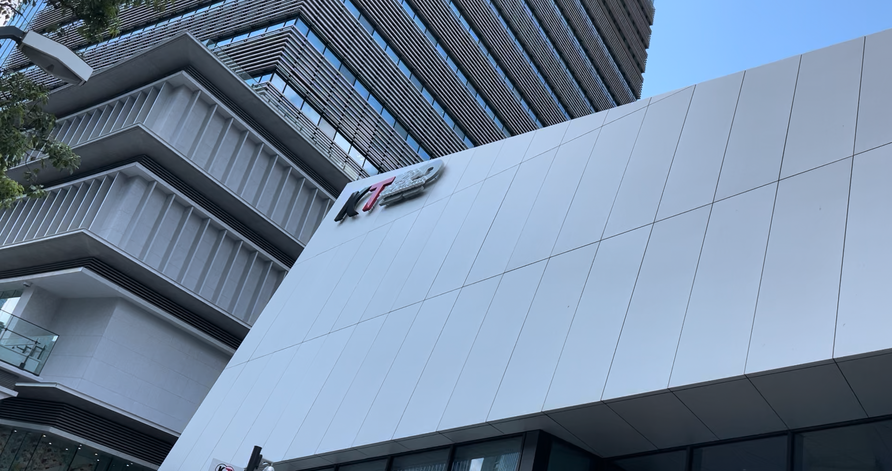
ついに始まったDIR EN GREYのTOUR22「TOUR22 PHALARIS -Vol.I-」

その初日であり、ファンクラブ限定ライブであったKT Zepp Yokohamaのライブレポです。
<h2>TOUR22「TOUR22 PHALARIS -Vol.I-」</h2>
[caption id="attachment_14695" align="aligncenter" width="659"]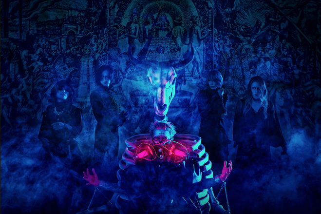 DIR EN GREY/PHALARIS[/caption]

2022年6月15日にリリースのDIR EN GREY11枚目のアルバム「PHALARIS」のツアーで、全12公演。

また、Vol.Iとなっていることからも分かる通り、おそらくVol.IIが控えているものと思われます。

今のところの全日程は以下の通りです。

神奈川県　　2022/6/2(木)　KT Zepp Yokohama -｢a knot｣only-
新潟県　　　 2022/6/9(木)　新潟県民会館・大ホール
宮城県　　　 2022/6/12(日)　SENDAI GIGS
静岡県　　　 2022/6/19(日)　静岡市清水文化会館マリナート・大ホール
福岡県 　　　2022/6/23(木)　Zepp Fukuoka
広島県 　　　2022/6/25(土)　広島JMSアステールプラザ・大ホール
京都府 　　　2022/6/28(火)　ロームシアター京都・メインホール
愛知県 　　　2022/6/29(水)　Zepp Nagoya
東京都 　　　2022/7/6(水)　中野サンプラザ
千葉県 　　　2022/7/9(土)　市川市文化会館・大ホール
大阪府 　　　2022/7/15(金)なんばHatch　-Namba Hatch 20th Anniversary-
大阪府 　　　2022/7/16(土)なんばHatch　-Namba Hatch 20th Anniversary-
<h3>KT Zepp Yokohama</h3>
周辺に商業施設もあるし、最大料金のある駐車場もたくさんあります。好立地だし道も広いし良い開場です。

<iframe style="border: 0;" src="https://www.google.com/maps/embed?pb=!1m18!1m12!1m3!1d3249.8022109567605!2d139.62369171525273!3d35.45969078024658!2m3!1f0!2f0!3f0!3m2!1i1024!2i768!4f13.1!3m3!1m2!1s0x60185db755d1cfcb%3A0xb3d0979a6d6c0535!2sKT%20Zepp%20Yokohama!5e0!3m2!1sja!2sjp!4v1654377586553!5m2!1sja!2sjp" width="600" height="450" allowfullscreen="allowfullscreen"></iframe>
<h2>ライブレポ</h2>
[caption id="attachment_14716" align="aligncenter" width="600"]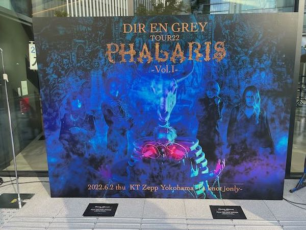 DIR EN GREY TOUR22「TOUR22 PHALARIS -Vol.I-」[/caption]

今回も前回まで同様のコロナ仕様ライブです。床に立ち位置が決められており、場所の指定があります。

入場時の検温と連絡票の提出、マスク着用義務があり、声援は禁止でした。

ただ、今回のライブでは京の「お前らの心の声響かせてくれ」はなかった気がします。いつもの普通の煽りがあり、一瞬場内から呼応する声が上がった気がします。
<h3>セトリ</h3>
<ol>
 	<li>新曲①</li>
 	<li>Celebrate Empty Howls</li>
 	<li>Phenomenon</li>
 	<li>Midwife</li>
 	<li>落ちた事のある空</li>
 	<li>新曲②</li>
 	<li>mazohyst of decadance</li>
 	<li>朧</li>
 	<li>新曲③</li>
 	<li>Behind a vacant image</li>
 	<li>Values of Madness</li>
 	<li>TDFF</li>
 	<li>詩踏み</li>
</ol>
EN.
<ol>
 	<li>蛍火</li>
 	<li>逆上堪能ケロイドミルク</li>
 	<li>INCREASE BLUE</li>
 	<li>CLEVER SLEAZOID</li>
 	<li>人間を被る</li>
</ol>

<a href="https://apple.co/3NoLZZo">https://apple.co/3NoLZZo</a>
<iframe allow="autoplay *; encrypted-media *; fullscreen *; clipboard-write" frameborder="0" height="450" style="width:100%;max-width:660px;overflow:hidden;background:transparent;" sandbox="allow-forms allow-popups allow-same-origin allow-scripts allow-storage-access-by-user-activation allow-top-navigation-by-user-activation" src="https://embed.music.apple.com/jp/playlist/%E3%83%A9%E3%82%A4%E3%83%96%E3%83%AC%E3%83%9D-dir-en-grey-tour22-tour22-phalaris-vol-i-a/pl.u-06oxDBWCWYE6pM"></iframe>

Apple Musicの登録はこちらから

<h3>メンバー衣装と演出</h3>
まず会場に入って目に付いたのが、京の新しいお立ち台。

前回までの朧の妊婦コンセプトから大きくかわり、オシャレな高級ステーキハウスの壁にかかっていそうな牛の頭骨でした。

メンバーの本編衣装です。

京はアー写の牛骨フルメイクかと思いきや、シンプルにいつもの穴あきスキニー、白タンクトップにライダース。ちなみに金髪短髪。

薫はアー写通り

Toshiyaもアー写通りと思われます。

Shinyaは白い

Dieはよく見えず。おそらく黒い。

アンコールでは、京はツアーグッズのブルゾンジャケット、薫はロングTシャツ、Toshiyaはキラキラと光るスパンコール？がついているシャツ。ボタン1つどめくらい。

Dieは胸が大きく開いた黒シャツ？ShinyaはおそらくコラボTシャツ

<h3>感想</h3>
１曲目の新曲から宗教感が強かった印象でした。

また、ツアー初日かつ初披露ということもありオーディエンス側もとりあえずじっくり聴いてみるという感じでした。ただ、これもツアーの日程が進むにつれ、ノリが生まれ終盤あたりにはじっくり聴く暇がないくらいの曲に変貌しているんじゃないかと思います。

新曲以外はどれもこれも、最近では頻出ではないものが多いものの、新曲との組み合わせもマッチしていたように思います。違和感なし。

リリースまでは曲を聴かない派ですが、最高のネタバレをありがとう。

そして、これを書かずにはいられない。

この日は個人的に入場前から正直少しイラついていました。

まず、物販がグダグダ

整理券配られるから早めに行って、もらった整理券の指定時間に行ったら、もうその時点でどうなっているか全くわからない。スタッフに聞いてもわからない。

ようやく番号順に整列しても、その後購入できるまでかなり時間がかかった。何のための整理券？

しまいには整列時点で、遅い番号の人は開場に間に合わないとのことでした。入場してから買ってくれとのこと。

ぼくは無事購入を済ませられました。

ただ、グダグダ感はまだおさまらず入場の際にもグダグダしていました。

VIPとexclusiveの入り口、一般の入り口と別れてたのに、中に入ったら合流。かつ手指消毒と検温の機械も2つしかなく、そこで列がスタック。

どうなってるの

２階席の座席は、折り畳みではなかたtので、たつとごくには割と狭めでした。あと角度的に前の人で京が見えず。

と、ここまでつらつら不満を書きましたが、でも、これがライブってもんだよな！？

不平不満含めて、押し合いへし合い、汗臭い、息くさい、負傷に、アザ、見えない、見れない、酸素ない

男だからと蹴られ、退場時には押されたのに押すなと言われ、最悪だな最悪だなと繰り返され

虜怖い

でも、それががライブだよな！？

道なき道を上手から下手に移動する際、道を譲り合い、侍のように視線で語り合い会釈しあう。

これがライブだよな！！

コロナに慣れて、ご用意された「親切」に甘んじるのもそろそろ終わりだ！

我々は不自由を受容していたはず。

ここからまたライブをしていこうぞ。

と自分に言い聞かせました。

完全を目指す不完全をまざまざと体験しにいく、それがライブだったはず。

そういった意味では、ライブらしいライブでした！
<blockquote class="twitter-tweet">

【最新映像公開】
2022年6月2日(木)より開催する“TOUR22 PHALARIS -Vol.I-”のトレーラー映像が公開となりました。

DIR EN GREY - TOUR22 PHALARIS -Vol.I- Trailer<a href="https://t.co/kCTNaxzNFK">https://t.co/kCTNaxzNFK</a><a href="https://twitter.com/hashtag/DIRENGREY?src=hash&amp;ref_src=twsrc%5Etfw">#DIRENGREY</a> <a href="https://twitter.com/hashtag/PHALARIS?src=hash&amp;ref_src=twsrc%5Etfw">#PHALARIS</a> <a href="https://t.co/AzipsrUPy6">pic.twitter.com/AzipsrUPy6</a>

— DIR EN GREY (@DIRENGREY_JP) <a href="https://twitter.com/DIRENGREY_JP/status/1530111928692899840?ref_src=twsrc%5Etfw">May 27, 2022</a></blockquote>

<h3>物販</h3>
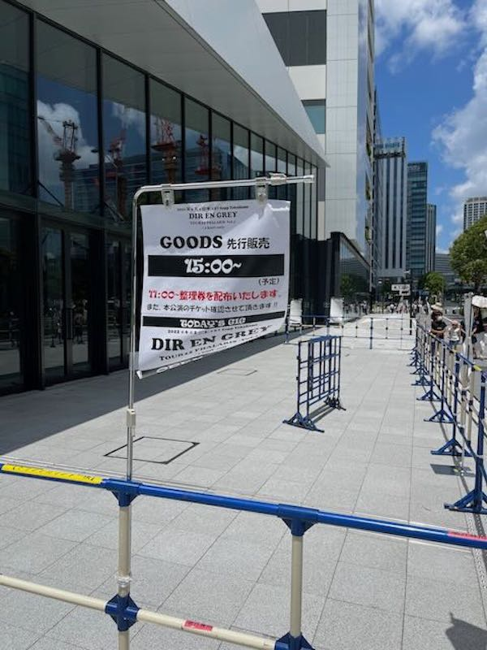

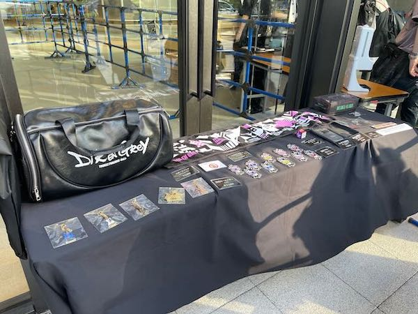

下で書きますが物販で一悶着ありました。

ちなみに購入したのはこの3点。ロンTとTシャツ、あと過去ツアーの絶縁キャップ（白）が売っていたので買ってしましました。
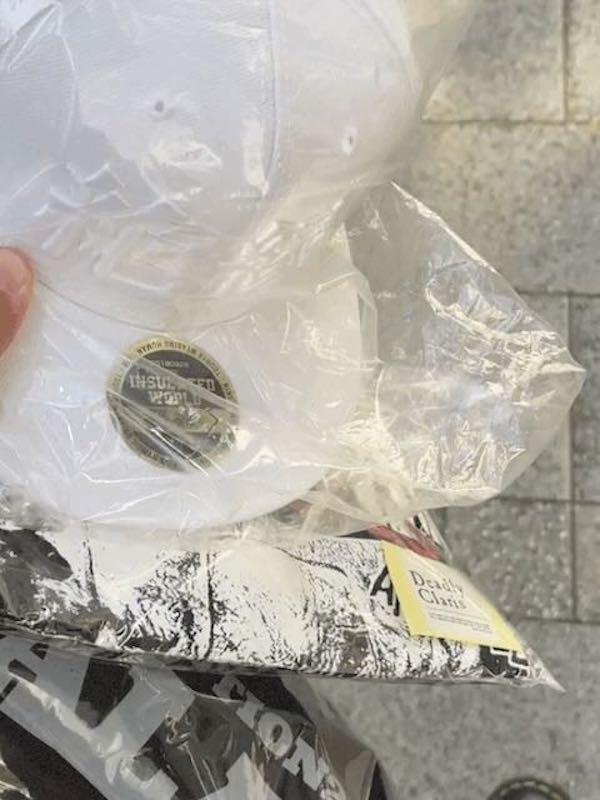

その結果特典の缶バッチいただきました。
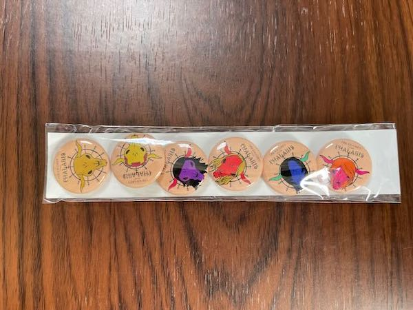

Tシャツ詳細
デザインがかなり良いです。<a href="https://core-choco.shop-pro.jp/">ハードコアチョコレート</a>とのコラボとのこと。
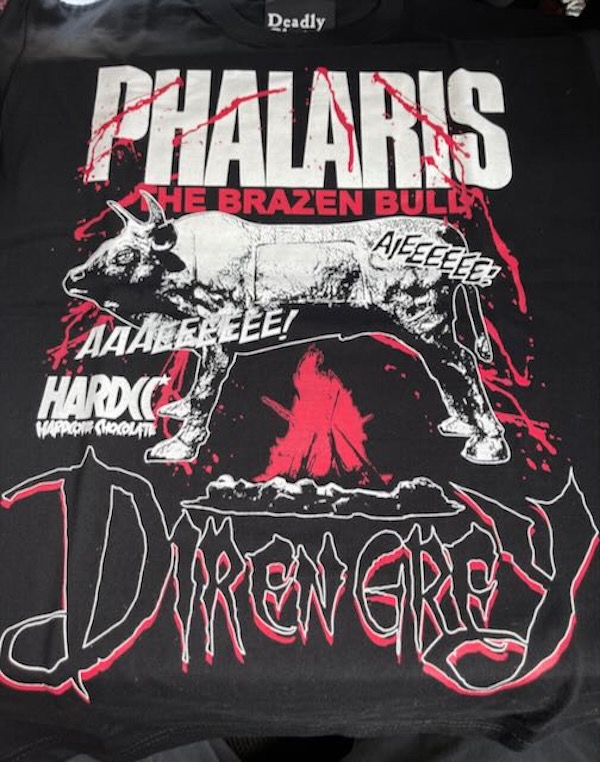

左袖にワンポイント
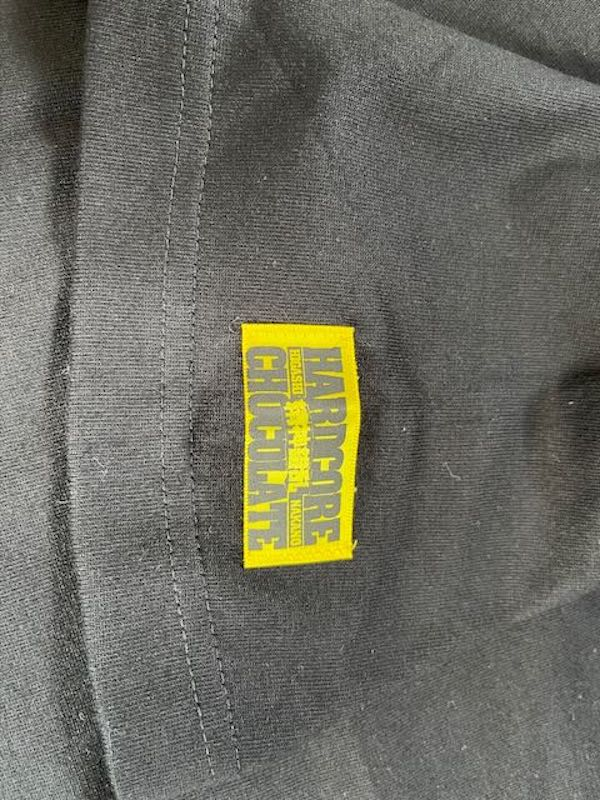

ロンT詳細
シンプルなデザインで普段着てても違和感なさげ。大きいサイズの方を買いました。MADARANINGEN x MILKBOY PUNロンTと同じくらいのサイズ感でした。
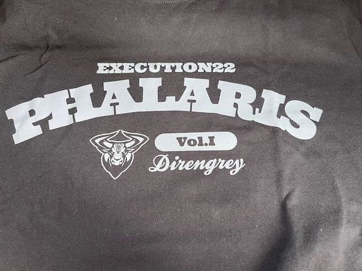

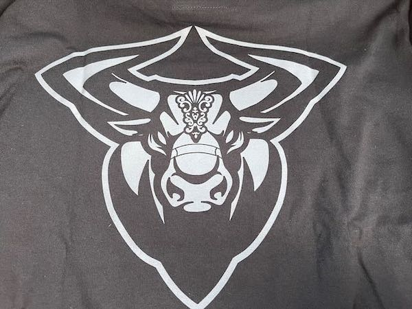
<blockquote class="twitter-tweet">

YouTube更新！

昨日から始まったDIR EN GREYツアーの最速グッズ紹介の動画です&#x1f403;

↓フルバージョン↓<a href="https://t.co/i5J2C7luAW">https://t.co/i5J2C7luAW</a> <a href="https://t.co/DD6YRKwjwQ">pic.twitter.com/DD6YRKwjwQ</a>

— Shinya/DIR EN GREY/SERAPH (@224_Shinya) <a href="https://twitter.com/224_Shinya/status/1532663610920513539?ref_src=twsrc%5Etfw">June 3, 2022</a></blockquote>

<h3>Exclusive Ticket／VIP Ticketお土産</h3>
ネタバレになります。

Exclusive Ticket／VIP Ticketのお土産です。

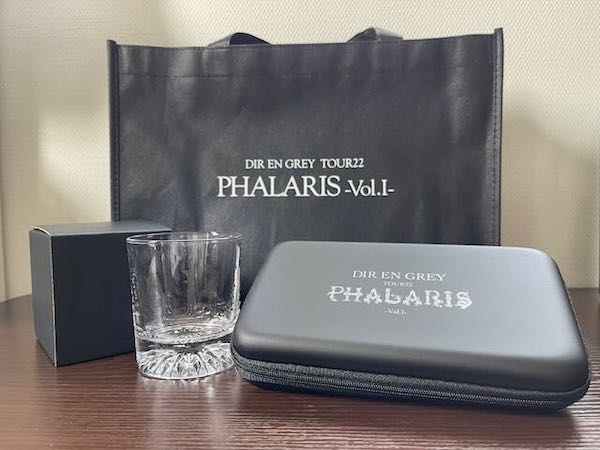
ガラスのコップ、ガジェット関連のケーブルとか小物を入れられるポーチ、とポートレート。
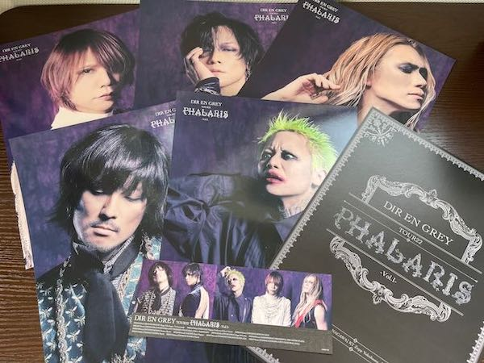

ポーチは結構ちゃんとしてる。
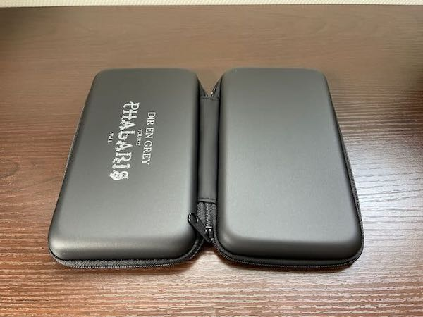
待ち時間中、車の中で持っていったNEWニンテンドー2DS LLでポケモンソウルシルバーをやっていたんですが、ポーチに本体収まりました。過去作も収納できたし超いい
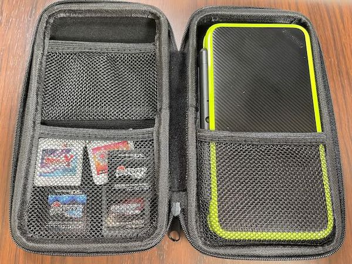
<h2><a href="https://twitter.com/s_s_p_y">しんぺー</a>はこう思った。</h2>
早く、もうそろそろ今までのライブに戻りたい。

声を出し、もう体が動かない、その絶頂での恍惚感

その時にしかできない思考がある。

それを味わいにライブに行ってる。

眺めるだけのライブはもうそろそろ限界。

と言ったところで本日は以上です。

おやみなさい。

[itemlink post_id="14693"]
[itemlink post_id="14692"]
[itemlink post_id="14691"]
[itemlink post_id="14689"]