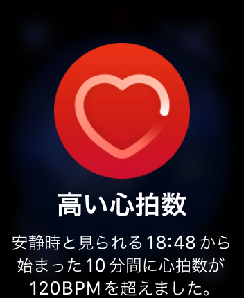

---
categories:
- DIR EN GREYのLIVEレポ
- TOUR22 FROM DEPRESSION TO ________
date: Wed, 16 Nov 2022 10:03:28 +0000
slug: post-14783
tags:
- DIR EN GREY
- LIVEレポ
title: 【ライブレポ】DIR EN GREY 25th Anniversary TOUR22 FROM DEPRESSION TO ________ 2022_11_14@KT
  Zepp Yokohama
---

久しぶりにフラットな気持ちでライブに臨めた。

特にうしろめたさもなく、ダウナーな気分でもなく、行き過ぎたドキドキワクワクという興奮もなく

可もなく不可もなく、フラットな気持ちでした。

ただ、やはり今回もしっかりとApple Watchからの通知が来ていました。
体は正直です。

<h2>セトリ</h2>
前回参戦した時若干変わったセトリで、これまた聞きたい曲ばかりでした。
<ol>
 	<li>MARMALADE CHAINSAW</li>
 	<li>朔</li>
 	<li>Machiavellism</li>
 	<li>DRAIN AWAY</li>
 	<li>Ash</li>
 	<li>TDFF</li>
 	<li>The Perfume of Sins</li>
 	<li>朧</li>
 	<li>13</li>
 	<li>ain't afraid to die</li>
 	<li>孤独に死す、故に孤独。</li>
 	<li>Merciless Cult</li>
 	<li>CHILD PREY</li>
 	<li>THE IIID EMPIRE</li>
</ol>
<ol>EN.
 	<li>GDS</li>
 	<li>C</li>
 	<li>JESSICA</li>
 	<li>THE FINAL</li>
 	<li>激しさとこの胸の中で絡みついた灼熱の闇</li>
 	<li>羅刹国</li>
</ol>
<h2>感想</h2>
フラットな気持ちでライブに臨んでたはずなのに、「孤独に死す、故に孤独」ではやはり感情揺さぶられて涙してしまった。
当時の自分の気持ちとか景色を思い出さずとも、曲によって奥底に眠ったものを呼び起こされる様な感覚。

と思ってたら京も口内掻っ切って血吐いてた。

やはり、このあたりの曲はそういう心境なのね。

最後の方、割とメンバー感でのワチャワチャもあったっぽいけど頭振ったりなんやかんやでもう記憶なし。ラスト羅刹国では、京自身も煽りまくって最後の最後まで頭振り続けてて、お立ち台上からフラッと落ちかけてた。

餌巻きも完全復活で、それぞれ投げてた。薫が帰る間際に、バックスクリーンを指さしてたので、何か告知か？？と思ったら
<h2>追加公演</h2>
次回のツアー告知か?Blu-ray?

と思ったら、まさかの追加公演。しかもフルキャパシティの声出し解禁ライブ

この時をどれだけまっただろうか

DIR EN GREY 25th Anniversary
TOUR22 FROM DEPRESSION TO ________ -「a knot」LIMITED EXTRA-

ただ、会場が新宿BLAZE

キャパ800人

絶対にチケット取れないだろこれ。そして下手しら死人出るのでは。。。

https://twitter.com/direngrey_jp/status/1592812902947622912?s=46&t=LoBfzsCKpb6pHrJBzsFUJA
<h2>声出し解禁についての個人的な思い</h2>
声出し解禁ということで、それぞれ虜の間でも思うところがある人もいるだろうと思う。

ぼく個人としての考えを書いておきたい。

このライブの翌日にジャニーズからも声出し解禁の声明が出されてたけど、正直、もうそういう舵取りをしていい時期だと思う。

<a title="https://www.johnnys-net.jp/page?id=text&amp;dataId=1952" href="https://www.johnnys-net.jp/page?id=text&amp;dataId=1952">https://www.johnnys-net.jp/page?id=text&amp;dataId=1952</a>

社会として、リスクを許容しつつ戻すべきところは戻してもいい。（在宅勤務とかは一生続いてくれ）

一方で、そのためのガイドラインも、業界で策定してみたりもしてるっぽい

<a title="https://www.japan-mva.com/_files/ugd/58f3a1_258915be13e64ed2adcb873ab966d86a.pdf" href="https://www.japan-mva.com/_files/ugd/58f3a1_258915be13e64ed2adcb873ab966d86a.pdf">https://www.japan-mva.com/_files/ugd/58f3a1_258915be13e64ed2adcb873ab966d86a.pdf</a>
ざっと読んでみてかいつまんで言うと、マスクしてればコールアンドレスポンスはOKみたいです。

ミソは、大声と継続的な発声の違いです。

【定義】
・「大声」の定義
飲食店などにおいて、通常会話を行う際の声量を上回る大きさの声

・「継続的な発声」の定義
1 曲に対しては、その曲の総演奏時間の約 25%程度以上の時間の声出し

多分ですが武道館のカラオケ演出は大声なのでNGで、煽りに対してのレスポンスは継続的な発声なのでオッケーみたいな感じでしょうか

ただ、このガイドラインをどうやって遵守するのか、そもそも遵守する意味があるのか

とかは多分結構曖昧なのではと思われます。

これに科学的根拠とか法的根拠なんかはきっとないんだろうと。ただ、音楽やライブに関わる人たちが、自分たちの居場所を取り戻すために、社会情勢に即した形でなんとか取り返せた部分なんだと思います。

だからこそ慎重に守りながら進むべきという考えもあるでしょう。

しかし、一方で先頭に立って戦う者がいてもいいのでは？

以前のToshiyaの言葉が思い出されます。

「僕たちは動き出すことを決めました。後は判断は個人で」（みたいな主旨）

もうみんな大人だし、自分の置かれた立場での状況に応じて参戦を個人で決めていけばいいんじゃないかと思います。

ぼくは行きます。チケット取れたら。

<h2><a href="“https://twitter.com/s_s_p_y”">しんぺー</a>はこう思った。</h2>
思えば、アルバム一枚一枚で全く違う印象なのは、本当にすごい。

ツアー後半ではセトリ変わるんかな？

とりあえず追加公演当たらなければ、ぼくの今回のツアー参戦はここまで！

といったところで本日は以上です。
おやすみなさい。