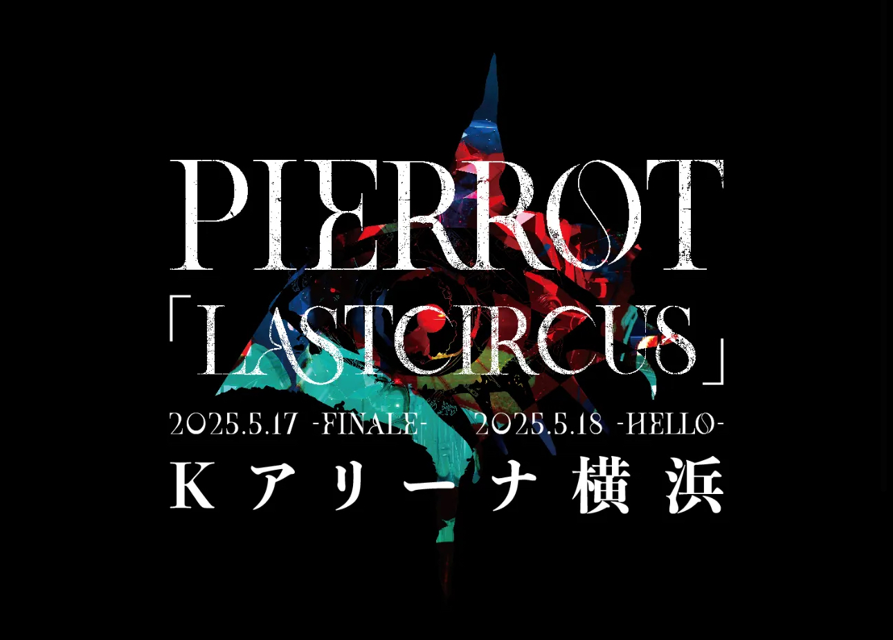

---
categories:
- PIERROTのLIVEレポ
date: Sun, 09 Feb 2025 13:53:04 +0000
slug: post-14836
tags:
- LIVEレポ
- pierrot
title: 【ライブレポ】PIERROT END OF THE WORLD LINE 2025_02_08@有明アリーナ
---

およそ10年ぶりのPIERROTのワンマンライブに行って来た。昨年のDIR EN GREYとの対バンイベント「ANDROGYNOS」にて突然発表された当ライブは改めてPIERROTとピエラーの凄さを教えてくれた。

そもそも、ぼくは長らく虜をやっているけれど、実はピエラーだ。初めて「ハルカ•••」を聞き鳥肌が立ち、まさに雷で撃たれた様な衝撃を覚えました。

生まれて初めて自分の意志で選択したもの、それがPIERROTでした。

FINALEに封入されていたライブ予約情報から、必死に電話をかけてようやく手に入れたのが1999年9月9日の横浜アリーナのチケットでした。最上階に近い遠くの席でしたが9列目99番という全て9並びの座席でした。

それからおよそ25年

<h2>感想</h2>
はっきり言ってピエラーは本当にヤバいと改めて改めて感じた。

ドラキュラとかHUMANGATEの「テテテテっ」てフリの時、自分は肘から手首でやる

でも２つ隣のお姐さんは肩から肘までがしなってた。ヤバすぎる。これがピエラーだよな！！

目の前にいた久しぶりにライブ来たであろうお姐さんは、ツレの人にこの曲なんだっけ！？って聞きつつもイントロ流れれば完全なフリが出来てる。

かく言う自分も歌詞含めて遺伝子レベルで情報が溢れ出してた。

そして唐突にキリトの歌詞の「キミ」ってのは、もしかしてアイジのことなのかな？と思った。

何ひとつ捨て去るはずないというのも、何があってもって、当時そんなことがなかったであろう時期に書いた歌詞ですら、この今日という日のための伏線だったのかよ！！？？？とすら思えた。

それと個人的には、おそらくこれが新生PIERROTの始まりだと思ってる。

PURPLE SKYの「今君と交わす次の約束も　きっと守ってみせるよ」

PIERROTのセトリや歌詞や全部に意味が込められてると思ってる

この曲順のここに、これを持ってきたというのは
そういうことだと

信じてる

<h2>セトリ</h2>
1.FINALE
2.Adolf
3.ENEMY
4.自殺の理由
5.脳内モルヒネ
6.ドラキュラ
7.満月に照らされた最後の言葉
8.パウダースノウ
9.THE LAST CRY IN HADES (NOT GUILTY)
10.鬼と桜
11.ゲルニカ
12.MAGNET HOLIC
13.PSYCHEDELIC LOVER
14.screen1 トリカゴ
15.PURPLE SKY
16.HAKEN KREUZ
17.MAD SKY-鋼鉄の救世主-
18.CREATURE
En.
19.深い眠りが覚めたら
20.PIECES
21.SEPIA
22.蜘蛛の意図
23.HUMAN GATE

<h2>有明アリーナ</h2>
ここはもうホントひどい。今まで行ったライブ会場で過去一行きにくい場所だった。体感では名古屋遠征したくらいの時間かかった。めんど過ぎる。

周辺もなんもない。海かぜ強くて寒い。

コーストの上位互換というか下位互換か。

もう2度と行きたくない会場だった。ちなみに音響は悪い？音が割れてる感じ。西武ドームかな？

<h2>LASTCIRCUS</h2>

いい加減、涙で見るPIERROTは辞めたい

そう思ってたし、SEPIAでもやっぱりそう思った。

単に、単純に、シンプルに、楽しいPIERROTを見たい

だから

いわゆる予定というか余命というやつ

ただ、このLASTは最後ではなく、最新のという意味なのではと思ってる。

新譜の情報出ると思ってたけど、これはこれで嬉しい。

さて、これを、２日目の会場で書いてる。

２日目よろしくお願いします。また、何かが変わった世界線でお会いしましょう。