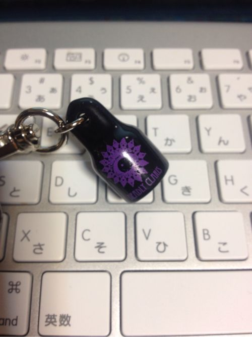
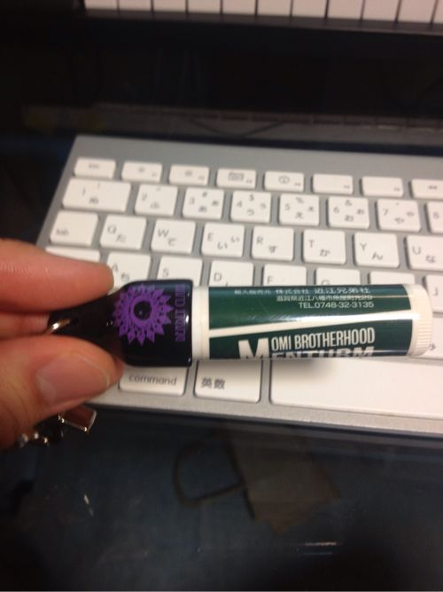

---
categories:
- DIR EN GREY
date: Sat, 04 May 2013 03:10:12 +0000
slug: post-1761
tags:
- DIR EN GREY
- TABULA RASA
- 京
title: DIR EN GREY TOUR2013 TABULA RASAツアーグッズ「Vホルダー」
---

さて昨日はツアーTシャツ買いました。会場1時間前でまだ残ってましたよ
ってか売り切れ一個も無かった。そんな中からVホルダーをパッと見てパッと買っちゃいましたので紹介します。<!--more-->
&nbsp;
&nbsp;
&nbsp;
&nbsp;
&nbsp;
&nbsp;
&nbsp;

<b>何に使うものか？？？？</b>

ぼく、これ何に使うか全くわかりませんでした・・・キーホルダー？？鈴？？

完全に鈴だと思ってました。LIVE中うるせーだろって思ってました。

否。違いました。

こんな風に使います。

もうわかりましたよね？これリップクリーム系のスティックのホルダーなんです！！

材質はゴムです。このゴムによってリップスティックのキャップを固定して、キーホルダーにしてくれます。

ただ、こんなもんにリップ付けてなくしちゃわいの？って思うでしょう？

実験しました。相当勢いよく振らなくちゃとれません！

ただこのキーホルダーをつける位置にはご注意ください。

ぼくはキーホルダーをいつも腰にぶら下げてるので、そこに追加しました。
ただ色んなものに接触する部位ですので、リップ本体側が落っこちたり、キャップ込みで落っこちたりしました。

とくに女の子ちゃんなんか高い口紅なんてダメです。
あくまで2個で100円程度のリップで。じゃないと後悔することになります。

ま、でも結構使えるアイテムだと思います！！

普段使いできるアイテム万歳！