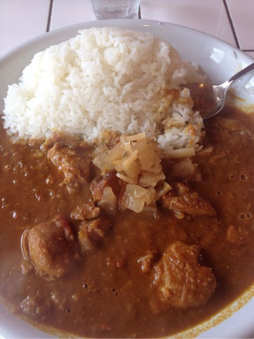
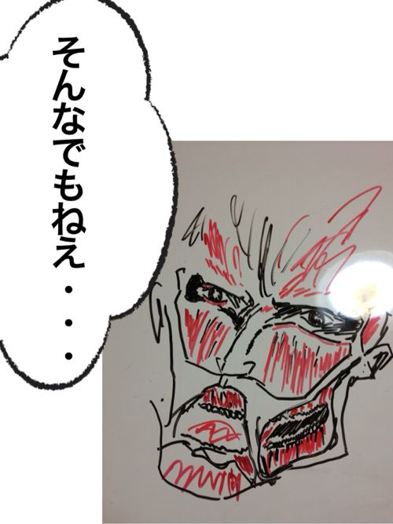

---
categories:
- ブログ
date: Fri, 10 May 2013 17:48:30 +0000
slug: post-1858
title: 中毒性たっぷり渋谷カレー激戦区本命中の本命、チリチリカレーのご紹介
---

クセになる味、渋谷カレー激戦区本命中の本命、チリチリカレーのご紹介ぃぃぃいい！！<!--more-->
&nbsp;
&nbsp;
&nbsp;
&nbsp;
&nbsp;
&nbsp;
&nbsp;
&nbsp;
&nbsp;
&nbsp;

スポンサーリンク

新入社員の時に先輩につれていってもらってからはまってます。
ここ本格的なインドカレーを日本人の好みにあうような味にアレンジしたカレーライス
を出すお店です。

<b>どこにあるの？</b>

ここにあります。
<iframe src="https://maps.google.co.jp/maps?f=q&amp;source=s_q&amp;hl=ja&amp;geocode=&amp;q=%E3%83%81%E3%83%AA%E3%83%81%E3%83%AA%E3%83%9E%E3%82%B5%E3%83%A9%E3%82%AB%E3%83%AC%E3%83%BC&amp;aq=&amp;sll=35.673343,139.710388&amp;sspn=0.633098,0.617294&amp;brcurrent=3,0x60188b5ebe91f419:0x17e05fe50cc860e4,0&amp;ie=UTF8&amp;hq=%E3%83%81%E3%83%AA%E3%83%81%E3%83%AA%E3%83%9E%E3%82%B5%E3%83%A9%E3%82%AB%E3%83%AC%E3%83%BC&amp;hnear=&amp;ll=35.673343,139.710388&amp;spn=0.633098,0.617294&amp;t=m&amp;output=embed" height="350" width="425" frameborder="0" marginwidth="0" marginheight="0" scrolling="no"></iframe>
<small><a style="color: #0000ff; text-align: left;" href="https://maps.google.co.jp/maps?f=q&amp;source=embed&amp;hl=ja&amp;geocode=&amp;q=%E3%83%81%E3%83%AA%E3%83%81%E3%83%AA%E3%83%9E%E3%82%B5%E3%83%A9%E3%82%AB%E3%83%AC%E3%83%BC&amp;aq=&amp;sll=35.673343,139.710388&amp;sspn=0.633098,0.617294&amp;brcurrent=3,0x60188b5ebe91f419:0x17e05fe50cc860e4,0&amp;ie=UTF8&amp;hq=%E3%83%81%E3%83%AA%E3%83%81%E3%83%AA%E3%83%9E%E3%82%B5%E3%83%A9%E3%82%AB%E3%83%AC%E3%83%BC&amp;hnear=&amp;ll=35.673343,139.710388&amp;spn=0.633098,0.617294&amp;t=m">大きな地図で見る</a></small>

渋谷と恵比寿の間くらいというどっちの駅からも遠いという立地です。

渋谷駅でたら明治通をひたすら恵比寿方面へ、並木箸交差点も通りすぎてそのまま直進です。
まっかな扉が見えたら、そこがチリチリカレー

スポンサーリンク

<b>どんな味？</b>

冒頭にも書きましたがインドカレー？ってくらいの香辛料が効いたカレーライスです。
とにかく辛い！！でも、舌にくるとか喉にくる辛さじゃありません。
頭皮から汗をかく辛さです。

冬でも汗をかきます。

辛さの耐性が普通レベルの人は普通に食べられます。しかし！辛いのが苦手な子とかは食べられないかもしれません。

で！

美味いかどうか

美味いです。美味いんです。

まぁ人によってはもしかしたら「そうでもない」って思われるかもしれませんが。

でも、昼の時間から閉店時間まで狭い店内はいつもお客さんで一杯です。

ぼくは大好きで大好きで通いすぎたのでお店のおかみさんに顔を覚えていただいております。

なので注文は大盛りか普通盛りかを聞かれるのみです。

&nbsp;

&nbsp;

ちなみにいつも頼むのはチリチリマサラカレーチーズトッポング　1,050円です。

このお店は辛さが2段階あり、マサラとつくカレーは辛い方のカレーになります。

その辛さをチーズをトッピングすることで多少マイルドにしております。ウマい！！！

うますぎて、以前ご紹介したレッグオンダイナーの店長にも進めたくらいですw

なお、辛さ2種類と書きましたが、実はさらに上があります。
ハバネロトッピングです。ハバネロの量が3段階あります。ぼくは2段階目まで挑戦しましたが、駅につくまでに体調わるくなりましたww

これは普通の人はやめましょうw

なお、この界隈はカレー激戦区で様々なカレー屋がひしめいております。
おいおいご紹介できればと思います！！！

本日は以上です！

