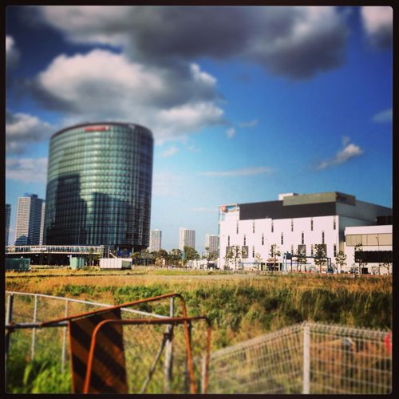

---
categories:
- DIR EN GREY
date: Sun, 12 May 2013 05:02:44 +0000
slug: post-1875
tags:
- DIR EN GREY
- LIVE
- TABULA RASA
- 京
title: DIR EN GREYのLIVEにパンピーの彼女をつれていく際の5つの注意事項
---

彼女をLIVEに連れて行く際の注意事項をご紹介します。<!--more-->

スポンサーリンク

DIR EN GREYのLIVEに彼女をつれていきたいなんて思った男の子ちゃんはいませんか？
曲を聞かせてLIVE DVD見せて、京のはにかむ笑顔、それを見てあつい想いを語れば一度くらいはLIVEに行ってみたいなんて言うことがあるんじゃないですか？
それでつれていったはいいけど、その時のあなたの対応で二度と行きたくないというトラウマを植え付けることになりかねません。
だからこそ、最新の注意を払って参戦する必要があります。

<b>予習と洗脳しっかり！</b>

やっぱりLIVE初めて行くような人や関心ない人が、行ってのれるってのは稀だと思います。
例えば、それが雅-MIYAVI-とかならいいのですが、DIR EN GREYとかだと無理です。無理なんです。

ここでこうのる、こんな曲がある、ってのがわからないとやっぱり、かわいそうです。だからちゃんと予習と洗脳はしっかりしておかないといけません。

洗脳用DVD選びのポイント（youtbeでも可）
<ul>
 	<li>全体的な雰囲気がわかるもの</li>
 	<li>グロくないもの（流血なし）</li>
 	<li>京が笑顔のやつ！バックステージ映ってたらなおよし！</li>
 	<li>やかん・ダイ・学orBooチャンネル</li>
</ul>
こんな所でしょうか。
個人的にはLIVE動画は昨年のCOUNT DOWN JAPANの映像を見せるのがいいかなと思います。
LIVE自体もDIR EN GREY初見の人用だし、映像もフルで表現できてるので見ていてDIR EN GREYの凄さが解るはず
なによりLIVEの半分がカーテンで仕切られていてメンバーがぼやけてるという、虜にとっては平常運転で彼らのドSさが伝わるはずですw

<b>会場へは車で行け</b>

普段、単独or友達と行く方は電車で行くことが多いでしょう。
平日なら会社帰り、学校帰りににそのまま行ったりするでしょうから。

でも、彼女とLIVEに行く場合、それが休日ならゼッタイ車で行きましょう。
車で行く事のメリットは、会場につくまでに他のファンを目に触れさせなことです。

他のファンを見させないことで無用な不安を与えることが防げます。

例えば、コスプレした女の子が大量にテンション高めに騒いでたりしたらちょっとひいちゃうでしょう？

それとやっぱりそれほど関心がない人を連れて行くのに1時間も2時間も電車で立ちっぱにさせて体力を削るのはよくないでしょう。
だってLIVEではどうせ立ちっぱになるんだから

だから車でいきましょう！
新木場なら<a title="夢の島公演駐車場" href="https://maps.google.co.jp/maps?q=%E5%A4%A2%E3%81%AE%E5%B3%B6%E5%85%AC%E5%9C%92%E7%AC%AC%EF%BC%91%E9%A7%90%E8%BB%8A%E5%A0%B4,+%E3%80%92136-0081+%E6%9D%B1%E4%BA%AC%E9%83%BD%E6%B1%9F%E6%9D%B1%E5%8C%BA%E5%A4%A2%E3%81%AE%E5%B3%B6%EF%BC%93%E4%B8%81%E7%9B%AE%EF%BC%92&amp;hl=ja&amp;ie=UTF8&amp;sll=35.648143,139.828487&amp;sspn=0.019791,0.01929&amp;t=h&amp;brcurrent=3,0x60188823f2bda121:0x559e9c1bb1899688,0&amp;ttype=now&amp;noexp=0&amp;noal=0&amp;sort=def&amp;hq=%E5%A4%A2%E3%81%AE%E5%B3%B6%E5%85%AC%E5%9C%92%E7%AC%AC%EF%BC%91%E9%A7%90%E8%BB%8A%E5%A0%B4,+%E3%80%92&amp;hnear=%E6%9D%B1%E4%BA%AC%E9%83%BD%E6%B1%9F%E6%9D%B1%E5%8C%BA%E5%A4%A2%E3%81%AE%E5%B3%B6%EF%BC%93%E4%B8%81%E7%9B%AE%EF%BC%92&amp;z=16" target="_blank" rel="noopener">夢の島公演駐車場</a>
横浜ブリッツなら目の前の駐車場、お台場のゼップなら駐車場沢山あります。埼玉スーパーアリーナならスーパーアリーナの駐車所もいいですけど混むので周辺の市営の駐車場かもしくは<a title="ここ" href="https://maps.google.co.jp/maps?q=35.888722,+139.629976&amp;hl=ja&amp;sll=35.888699,139.630044&amp;sspn=0.001233,0.001206&amp;t=h&amp;brcurrent=3,0x6018c10ab3e4d2ad:0xd355b455fda09c0f,0,0x6018c10ab6228efb:0xd44d4bf75400a77e&amp;ttype=now&amp;noexp=0&amp;noal=0&amp;sort=def&amp;z=17&amp;start=0" target="_blank" rel="noopener">ここ</a>がおすすめです。
大きい会場は大抵駐車場を備えているので、とりあえずそこに止めればOKです。

<b>LIVE前はご飯食べましょう</b>

お腹減ると集中力なくなるし不機嫌になります。あと、INWARD SCREAMの時お腹なったら恥ずかしいしね。
別に彼女と行く時でなくとも、自分自身にも言えることですが

で、満腹になるくらい食べるのはやめましょう

スタバでスコーン１つとかそれくらいで十分です。お腹重くなると帰って眠くなりますので、食べ過ぎ注意です。

ちなみに、周知の事実ですが新木場は周りにほとんどお店がありません。
これ要注意です。駅周辺はセブンイレブン、すき家、あとサブウェイ？だったかな、それくらいしかなかったと記憶してます。
新木場は要注意ですね。

横浜ブリッツは隣接してお店あります。ただ黒い人に選挙されているのでちょっと微妙かな
何か買っていって車の中で食べましょう

ゼップは周りにお店ありますので問題なし。

武道館も微妙かなぁ九段下は意外といい感じに入れるお店ないかも・・・さいたまは商業施設あるのでそこでOK

運動するので満腹厳禁です。

<b>会場に入ったら押しの発生しない後ろの方にいきましょう</b>

LIVE慣れしていない人をいきなり前につれてってごらんなさい。
一瞬でトラウマになります。LOUD PARKで前の方いったらいきなりモッシュで詰みましたw
とくにフェス系は要注意です。今日のオズフェスでもきっとそういった事象が発生するでしょう。

いつも前に行ってるから前で見たい気持ちはよくわかります。でも今日だけはホストがいるので最前の注意を払いましょう。

前より後ろ目、一段高くなってるあたり、もしくはバー近く
で、なおかつステージが一望できるところ　横の壁際でよっかかれるところがおすすめです。

彼女の身長にもよりますが、ちゃんと見えてるかの確認をとって、位置をキープしましょう。

それと周囲にも要注意。いかにも暴れそうな人がいたら注意です。
ちゃんと常識的な人の中に身を委ねましょう。

自分では麻痺しちゃってるかもしれませんが、ヘドバン
あれパンピーにとっては珍しいものなので、周りの女の子ちゃんの髪の毛のリーチにも気を使ってください。

それとドアの近くがベターです。LIVE前にトイレにもいっておきましょう。お酒のんでももらってもOKです。

安全と退路の確保です。これ重要

<b>LIVE中は彼女の身の安全を最優先</b>

さてLIVEがはじまりました。注意すべきは暗転した際のタイミングです。

ここで押しが発生しますので、最新の注意で守りましょう。

LIVE中も安全に配慮、そして見えているか、不快ではないかに注意を払いましょう。

自分だけのるのは御法度です。

それと今日だけはヘドバン封印で、もしくは小さめに

今日は彼女がお客様です。

スポンサーリンク

とまぁ、こんな所でしょうか。

楽しかったか聞いて「楽しかった、また行きたい」と言ってくれれば最高です！！

以上、「DIR EN GREYのLIVEにパンピーの彼女をつれていく際の5つの注意事項」でした！