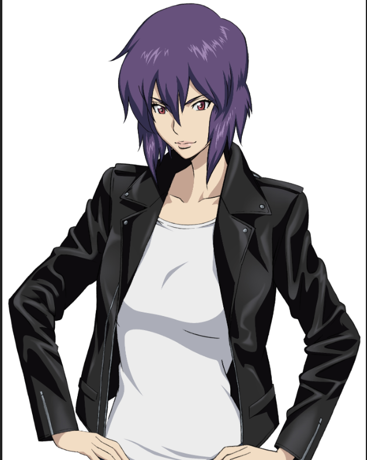
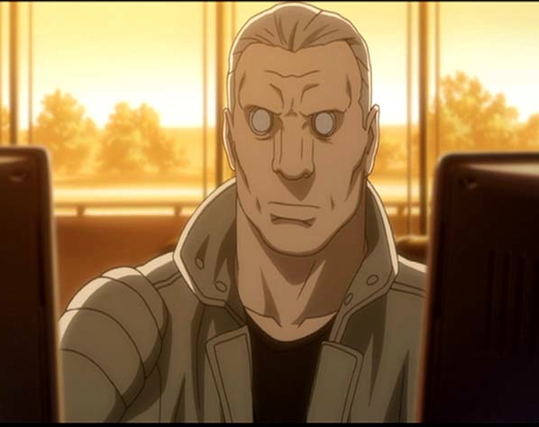
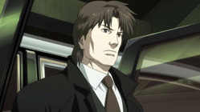
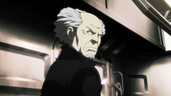

---
categories:
- アニメ
date: Thu, 27 Jun 2013 16:22:13 +0000
slug: post-2429
tags:
- 攻殻機動隊
title: 攻殻機動隊ARISE感想。その前に知らない人のために解説
---

攻殻機動隊ARISE「GHOSTPAIN」見てきやしたっ！

<!--more-->
<h2 style="padding: 8px 8px; border-color: #000000; border-width: 0 0 1px 5px; border-style: solid; background: #F8F8F8;"><strong>攻殻機動隊とは？</strong></h2>
今更ですが、攻殻機動隊をご存知か？

ぼくの一番好きなアニメです。厳密にいうと強く影響を受けたアニメが3つかそれ以上あって（←）そのうちの１つです。

リアルにのべ1000回以上見てます。

このアニメを見ることで、ぼくはかなり救われました。自分が何故こんななのか、その答えに至る一助となったのがこのアニメでした。

さてあらすじです。というかコウカクキドウタイってもんのご説明

そもそも前提として攻殻機動隊という作品には数種類あります。

1995年に映画化された「GHOST IN THESHELL」という士郎正宗氏が原作のアニメが最初です。

この映画は公開当初日本ではあまり流行らなかったらしいですが、アメリカで火がついて逆輸入みたいな形で日本で注目されるようになったとか。監督は押井守です。

で、そのあと2000年代に入ってテレビアニメ化されて、シーズン1・シーズン2と出て、また映画化1本、そのあとテレビの100分の話が1本となっている作品です。

テレビ版のシーズン1、シーズン2、100分のは1連の流れで、なおかつ映画とは登場人物や設定などはそこそこ一緒だけどパラレルな世界観です。

映画は映画で独自のスチームパンクを展開してます。 映画とテレビで監督違います。

これらのシリーズを総称して「攻殻機動隊」です。

どちらも世界観、背景は重なる部分がありますが、共通して全体的な背景を把握しづらいのでここでまとめます。
易しくね。

※以下テレビ版「より」の解説です。
<h2 style="padding: 8px 8px; border-color: #000000; border-width: 0 0 1px 5px; border-style: solid; background: #F8F8F8;"><strong>攻殻機動隊の世界観、時代背景、設定を見た事無い人のために易しく解説</strong></h2>
まず、この世界は2030年くらいです。
第3次核大戦と第4次非核大戦があったあとの科学技術が発達した世界です。

日本は放射能除去技術を確立し、それを武器に世界的に今よりも強い立場を持てる情勢にあります。

で、3つの技術が発達してます。

それはネットと義体化（＝サイボーグ化）技術、電脳化技術です。

<b>義体化技術</b>

義体化とは、義足や義手といった概念と同じで、体そのものを機械と取り替えることが可能という技術です。

で、全身を義体化することをサイボーグ化といいます。主人公たちは全身機械の体をもつ人間（サイボーグ）です。
注意が必要なのは物語中にアンドロイドという言葉がでてきますが、これはロボットのことです。

サイボーグは義体化した人間、アンドロイドはロボットという認識でお願いします。

<b>電脳化技術</b>

この時代は記憶のメカニズムが完全に解明されており、脳みそを機械化することが可能になってます。
で宗教上の理由や未成熟な子ども以外はほぼ全員が脳みそを機械化、すなわち電脳化しています。

それによって、この世界の様々なインフラを利用し、生活を送っているというわけです。

<b>ネット技術の発達</b>

要は脳みそがもうiphoneみたいな感じなんです。
通信とかもできちゃうし、外部記憶装置にデータアップしたりダウンロードしちゃったりって自由にできるわけです。
だから、ネット犯罪やネット経由に人間をのっとったり、記憶を改ざんしたする犯罪が横行しているのです。

こういった世界観とうことをまず理解しておくか否かで、飲み込みが全く違ってくると思います。

<h2 style="padding: 8px 8px; border-color: #000000; border-width: 0 0 1px 5px; border-style: solid; background: #F8F8F8;"><strong>攻殻機動隊の用語の説明</strong></h2>
さてさて上記の通り様々な技術の発達とともに新しい犯罪が生まれてくるわけです。

で、主人公の草薙素子はそんな犯罪に対して立ち向かう総理大臣直轄の警察組織「公安9課」に所属しております。

ここでやっとこさ内容に触れられるわけですが、公安9課を中心とした犯罪解明のお話なんです。はい。

<b>公安9課</b>

普通の警察よりも怖いです。犯罪の予兆を察知したら有無を言わさずに断罪します。

むしろ軍隊に近い組織です。 構成員は8名。

現場のリーダーにしてこの物語の主人公草薙素子。通称少佐。年齢不詳。

幼い頃に飛行機事故により瀕死の重傷を負い全身義体化しました。

電脳技術においても特A級です。

&nbsp;

&nbsp;

&nbsp;

&nbsp;

バトー

両目にペットボトルのキャップをはめたロリコン

&nbsp;

というのは嘘です。

&nbsp;
トグサ。メンバー中一番義体化率が低くて、電脳化以外はほぼ生身。

生身だけに色々と感が鋭く、何かと気がつく。奥さんと娘がいて、奥さんは株式投資をちょいちょいやってたりする。

&nbsp;

他数名は割愛wwww

あと、この公安9課の責任者がはげたじじい、荒巻大輔。通称課長。渋い
組織的には鬼平犯科帳の火付盗賊改方みたいな、荒事と諜報戦を得意とする隠密組織です。

&nbsp;

&nbsp;

<b>ゴースト</b>

魂みたいな意味だと思って。アンドロイドにはなくて、人間にはあるもの。 電脳化すると生まれる概念。これが人間であることの証。

<b>攻性防壁</b>

さっきも言いましたが電脳化しているから、頭に直接ほかの人間がハッキングしかけてくるわけですよ。
で、それを防ぐためのファイアウォールをこう読んでます。
で、ただ守るだけじゃなくて、相手に対して反撃をしてくれます。だから攻性なんです。
これがあるから、普通の生活をおくる上では、犯罪に巻き込まれることはあまりないみたい。
<h2 style="padding: 8px 8px; border-color: #000000; border-width: 0 0 1px 5px; border-style: solid; background: #F8F8F8;"><strong>今から見るならこの順番で見ろ</strong></h2>
攻殻機動隊 STAND ALONE COMPLEX

劇場版　GHOST IN THE SHELL

攻殻機動隊 STAND ALONE COMPLEX　2nd GIG

劇場版　イノセンス 攻殻機動隊 STAND ALONE COMPLEX　Solid State

Society 攻殻機動隊　ARISE

&nbsp;

さて次回はARISEの感想とか買いチャオかな！

それでは！おやすみなさい！最後まで読んでいただきありがとうございます！

&nbsp;

良かったらシェアボタンでシャアしてください〜
<iframe style="width: 120px; height: 240px;" src="http://rcm-fe.amazon-adsystem.com/e/cm?lt1=_blank&amp;bc1=000000&amp;IS2=1&amp;bg1=FFFFFF&amp;fc1=000000&amp;lc1=0000FF&amp;t=warawareotoko-22&amp;o=9&amp;p=8&amp;l=as4&amp;m=amazon&amp;f=ifr&amp;ref=ss_til&amp;asins=B00D7V6P44" height="240" width="320" frameborder="0" marginwidth="0" marginheight="0" scrolling="no"></iframe><iframe style="width: 120px; height: 240px;" src="http://rcm-fe.amazon-adsystem.com/e/cm?lt1=_blank&amp;bc1=000000&amp;IS2=1&amp;bg1=FFFFFF&amp;fc1=000000&amp;lc1=0000FF&amp;t=warawareotoko-22&amp;o=9&amp;p=8&amp;l=as4&amp;m=amazon&amp;f=ifr&amp;ref=ss_til&amp;asins=B00D7VJCVC" height="240" width="320" frameborder="0" marginwidth="0" marginheight="0" scrolling="no"></iframe>