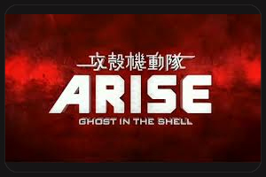
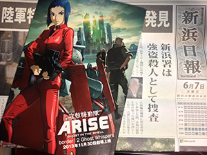

---
categories:
- アニメ
date: Sun, 30 Jun 2013 11:11:56 +0000
slug: post-2471
title: 攻殻機動隊ARISEの感想
---

結論から言いますと違和感なく見れたお！別にパッツンの少佐も悪くない<!--more-->
&nbsp;
&nbsp;
&nbsp;
&nbsp;

←これね、このパッツン感ね。これが少佐のニュービジュアルです。少女ちっくですね。タフさがないね。ゴリラじゃないね。ジブリのヒロインみたいね。

&nbsp;

&nbsp;

&nbsp;

&nbsp;

<b>お風呂に入ってるみたいな感じです。</b>

Ghost in the shellは怠い虚脱感
攻殻機動隊stand alone complexは清々しさ
攻殻機動隊stand alone complex 2nd GIGはぬるい風
イノセンスは微睡む
攻殻機動隊stand alone complexSSSは疾走感

そんなイメージでした。本当はもっと良い言葉があったんですが忘れちゃいました。でもそんな感じですよね←

で、今回のARISEに関してはお風呂に入ってる感じです。バブル感です。それはきっとコーネリアスのせいですよね。

泡のお風呂に入ってる感じです。

攻殻機動隊って言ったら、緊張感っていうか緊迫感が１つの売りだったと思います。
今回は、新シリーズ代1話ってことで、見てる方も多分手探りだったと思います。

あのキャラはちゃんとこちらのイメージを崩さないように描かれてる？
あのキャラがちょい役ででてたりする？合田さんの髪の毛あるころが登場するの？とか

なので、そういった意味での緊張感はありましたね。

ただし、アクションやナゾ的なところではちょこっとだけ拍子抜け。

ん〜って感じです。

画像もちょい粗くね？

映画版なんだしさ、もう少し細かく描いてよ

Solide State Societyを見ろ！もっとこまけーぞ！

あと内容な、内容も内容でよくわかねーよ！

薄い内容をこねくり回しすぎ。連ドラの映画版じゃねーんだからもっと濃い内容にしてーなー

あと自走式地雷ね、何あれ

<b>で、結局おもしろかったの？何点なの？</b>

面白いかどうかで言ったら、、、面白い！・・・かな・・・ん〜これは攻殻の新シリーズってことで補正かかっちゃってるかも・・・

68点くらいかな

次は映画館じゃなくてもいいかなって感じですわ

別にディするわけではなくてね。

でも、ファンとしてはやっぱり嬉しいし、見に行っちゃうんだろうなきっと。

でも、ま、これもありっちゃありです！

まー現段階であーだこーだ結論付けちゃうのもナンセンスな気がする！

けどね！けどだよ！

もう少し絵細かくかいてよね！そこだけ！そこだけは言わして！！

以上！

あと見に行くとバトー主人公の漫画と設定内容が書かれたブックレットもらえます！

&nbsp;

&nbsp;

<b>今から見るには</b>

映画館に行かなくても見れるんです。都内だと六本木と渋谷くらいなので、50分の作品ですからまー家で見てもいいんじゃね？絵粗いしww（←）
<ul>
<ul>
	<li>映画館　上映は7月5日まで</li>
	<li><a href="http://www.amazon.co.jp/gp/product/B00BB1MALO/ref=as_li_ss_tl?ie=UTF8&amp;camp=247&amp;creative=7399&amp;creativeASIN=B00BB1MALO&amp;linkCode=as2&amp;tag=warawareotoko-22">Amazonで買う</a>(7月26日発売）</li>
	<li><a href="http://www.b-ch.com">バンダイチャンネル</a>で見る</li>
</ul>
</ul>
こんな所でしょうか。映画館行かないならバンダイチャンネルで見るのがよろしいかと。

ぼくもバンダイチャンネルでもう一回見よ

さーて次回作は11月30日公開です。遠いな、、、おい

<iframe style="width: 120px; height: 240px;" src="http://rcm-fe.amazon-adsystem.com/e/cm?lt1=_blank&amp;bc1=000000&amp;IS2=1&amp;bg1=FFFFFF&amp;fc1=000000&amp;lc1=0000FF&amp;t=warawareotoko-22&amp;o=9&amp;p=8&amp;l=as4&amp;m=amazon&amp;f=ifr&amp;ref=ss_til&amp;asins=B00BB1OBG6" height="240" width="320" frameborder="0" marginwidth="0" marginheight="0" scrolling="no"></iframe><iframe style="width: 120px; height: 240px;" src="http://rcm-fe.amazon-adsystem.com/e/cm?lt1=_blank&amp;bc1=000000&amp;IS2=1&amp;bg1=FFFFFF&amp;fc1=000000&amp;lc1=0000FF&amp;t=warawareotoko-22&amp;o=9&amp;p=8&amp;l=as4&amp;m=amazon&amp;f=ifr&amp;ref=ss_til&amp;asins=B000KPJF1K" height="240" width="320" frameborder="0" marginwidth="0" marginheight="0" scrolling="no"></iframe><iframe style="width: 120px; height: 240px;" src="http://rcm-fe.amazon-adsystem.com/e/cm?lt1=_blank&amp;bc1=000000&amp;IS2=1&amp;bg1=FFFFFF&amp;fc1=000000&amp;lc1=0000FF&amp;t=warawareotoko-22&amp;o=9&amp;p=8&amp;l=as4&amp;m=amazon&amp;f=ifr&amp;ref=ss_til&amp;asins=B00D7V6P44" height="240" width="320" frameborder="0" marginwidth="0" marginheight="0" scrolling="no"></iframe>