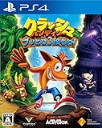
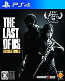

---
categories:
- ゲーム
date: Sun, 07 Jul 2013 06:28:51 +0000
slug: post-2525
tags:
- PS4
title: おすすめPS4ゲーム「THE LAST OF US」
---

近所のゲーム屋でバイオハザードのデモ映像を見た時の衝撃、今でも覚えています。体を電流が走って絶対にゼッタイにこのゲームやりたい！！！当時スーファミしか持ってなかったぼくはその日からお小遣いをため、スーファミのソフトを売りまくりプレステを購入するために奮闘しました。

時は流れ、やがてぼくもゲームを卒業しました。プレステ2は持っていた記憶がありますが、具体的に何のソフトを遊んでいたのかは記憶にありません。そんなぼくが久しぶりに心の底からやりたいと思ったゲーム、それが「THE LAST OF US」(ラストオブアス )です。そこからプレステ3を購入し、再びゲームをするようになりました。今回、ラストオブアスの続編についての続報が発表されたので、改めてラストオブアスについて紹介したいと思います。

<!--more--> 

<h2>ラストオブアスとは</h2>

ノーティードッグというゲームスタジオが作ったホラーアクションゲームです。この会社、知らない人がいると思いますがこれを言えばすぐわかる。クラッシュバンディクーを作った会社です。ただ、ラストオブアス自体はクラッシュバンディクーからは想像もできないハードボイルドな世界観になっています。

<a href="https://www.amazon.co.jp/exec/obidos/ASIN/B071WNVY31/warawareotoko-22/" target="_blank" >【PS4】クラッシュ・バンディクー ブッとび3段もり!</a>
posted with <a href="https://kaereba.com" rel="nofollow" target="_blank">カエレバ</a>

 ソニー・インタラクティブエンタテインメント 2017-08-03    

<a href="https://www.amazon.co.jp/gp/search?keywords=%E3%80%90PS4%E3%80%91%E3%82%AF%E3%83%A9%E3%83%83%E3%82%B7%E3%83%A5%E3%83%BB%E3%83%90%E3%83%B3%E3%83%87%E3%82%A3%E3%82%AF%E3%83%BC%20%E3%83%96%E3%83%83%E3%81%A8%E3%81%B33%E6%AE%B5%E3%82%82%E3%82%8A%21&__mk_ja_JP=%E3%82%AB%E3%82%BF%E3%82%AB%E3%83%8A&tag=warawareotoko-22" target="_blank" >Amazon</a>

<a href="https://hb.afl.rakuten.co.jp/hgc/121ed5e1.954a9ce3.121ed5e2.9fc704ba/?pc=https%3A%2F%2Fsearch.rakuten.co.jp%2Fsearch%2Fmall%2F%25E3%2580%2590PS4%25E3%2580%2591%25E3%2582%25AF%25E3%2583%25A9%25E3%2583%2583%25E3%2582%25B7%25E3%2583%25A5%25E3%2583%25BB%25E3%2583%2590%25E3%2583%25B3%25E3%2583%2587%25E3%2582%25A3%25E3%2582%25AF%25E3%2583%25BC%2520%25E3%2583%2596%25E3%2583%2583%25E3%2581%25A8%25E3%2581%25B33%25E6%25AE%25B5%25E3%2582%2582%25E3%2582%258A%2521%2F-%2Ff.1-p.1-s.1-sf.0-st.A-v.2%3Fx%3D0%26scid%3Daf_ich_link_urltxt%26m%3Dhttp%3A%2F%2Fm.rakuten.co.jp%2F" target="_blank" >楽天市場</a>

<a href="//ck.jp.ap.valuecommerce.com/servlet/referral?sid=3041033&pid=882528283&vc_url=http%3A%2F%2Fsearch.shopping.yahoo.co.jp%2Fsearch%3Fp%3D%25E3%2580%2590PS4%25E3%2580%2591%25E3%2582%25AF%25E3%2583%25A9%25E3%2583%2583%25E3%2582%25B7%25E3%2583%25A5%25E3%2583%25BB%25E3%2583%2590%25E3%2583%25B3%25E3%2583%2587%25E3%2582%25A3%25E3%2582%25AF%25E3%2583%25BC%2520%25E3%2583%2596%25E3%2583%2583%25E3%2581%25A8%25E3%2581%25B33%25E6%25AE%25B5%25E3%2582%2582%25E3%2582%258A%2521&vcptn=kaereba" target="_blank" >Yahooショッピング</a>

<h3>ストーリー</h3>

※ネタバレしないところまで。Wikipediaには全部書いてあった。

主人公のジョエルは、娘のサラと2人暮らし。ある夜、サラは目覚めると家にはジョエルの姿はなく、ジョエルの弟のトミーから何度も電話があり異変を告げる。

やがて帰宅したジョエルはしまってあった拳銃に弾を込めると襲ってきた隣人を射殺。直後にトミーがやってきて3人は混乱の中町を出ようと車を走らせる。町では人が人を襲い、あらゆるところで火の手があがっていた。そして高速道路は封鎖しれ、ジョエルとサラは軍により銃で撃たれてしまう。サラは死に、駆けつけたトミーに助けられてジョエルは一命を取り留める。

それから20年後、このもの絶望しかないこの物語が始まる。

ここまでがオープニングです。もう少しだけ設定を話すと、20年後のジョエルは非合法な運び屋をなりわいとして生活しています。ある日依頼されたのは生きた女の子をあるところまで運ぶこと。

そして長い旅が始まる。

<h3>ゲーム性</h3>

第三者視点のアクションゲームです。銃や鉄パイプを使って敵を攻撃するのはもちろん、拾った部品を組み合わせて武器を強化したりできます。

しかし、謎のウィルスのパンデミックから20年後という設定のため、物資はかなり少なく銃弾や回復アイテムも限られています。

また、このゲームは音がかなり重要で敵から見えずとも物音を立ててしまうと気がつかれたり警戒されたりします。それを、逆手にとって空き瓶を投げることで気をそらしたり任意の方向に敵を導いたりということもできます。

<h3>どこが面白いのか</h3>

アクションゲームではありますが、敵に気がつかれずに後ろから近づきサイレントキルをしたりする部分は、どちらかというとパズルゲームに近い感覚でした。

ストーリー面では、どこまでいってもハラハラドキドキ、そして現実的。まるで映画を見ているようです。いろんなところに映画やドラマのようなお約束のシーンがあって、その辺も見どころです。

あと、久しくやってませんがマルチプレイでの対戦も楽しいです。

ちなみにマルチプレイが上手くなりたくて色々動画漁ってたら見つけたのがケッツん中級兵、当時けつ毛中級兵です。

アイテムボックスの角を見て下ネタ言ったり、試合中喋りすぎて一発も発泡しなかったり、長刀を使いるろ剣ネタで無双したり(無双してない )、こんな実況者見たことがなくて度肝抜かれました。

https://youtu.be/cg_mk21DW80

<h2>ラストオブアスパート2</h2>

さて、最後までストーリーを進めてクリアした人には驚きかもしれないですが続編が出るらしいです。

会社の方は最初の方続編は作らないなんていってた気がしますが、鋭意制作中で今回プレイ画面の動画も発表されました。楽しみで仕方ありません。

相変わらずのハードさ、そしてさらに救いのない世界観が広がっているのでしょう。

<iframe width="560" height="315" src="https://www.youtube.com/embed/btmN-bWwv0A" frameborder="0" allow="autoplay; encrypted-media" allowfullscreen></iframe>

<h3>いつ発売？</h3>

この会社はわりとじっくりコトコト煮込みまくって制作するらしいので早くて来年？遅くて再来年とかになりそう。

でも、もうそれくらい作り込んで欲しい！あの興奮をもう一度！！

<h2>しんぺーはこう思った。</h2>

全身を走る物欲の電流

それに支配されて手に入れたプレステとバイオハザード

そしてラストオブアス

脊髄から脳みそに走るあの興奮が忘れられない

あの神ゲーを再び！

ホラーホラーといっても幽霊系ではないので苦手じゃなければぜひおススメしたい！楽しいよ！

<a href="https://www.amazon.co.jp/exec/obidos/ASIN/B00LGFD3UM/warawareotoko-22/" target="_blank" >The Last of Us Remastered 【CEROレーティング「Z」】 - PS4</a>
posted with <a href="https://kaereba.com" rel="nofollow" target="_blank">カエレバ</a>

 ソニー・インタラクティブエンタテインメント 2014-08-21    

<a href="https://www.amazon.co.jp/gp/search?keywords=the%20last%20of%20us&__mk_ja_JP=%E3%82%AB%E3%82%BF%E3%82%AB%E3%83%8A&tag=warawareotoko-22" target="_blank" >Amazon</a>

<a href="https://hb.afl.rakuten.co.jp/hgc/121ed5e1.954a9ce3.121ed5e2.9fc704ba/?pc=https%3A%2F%2Fsearch.rakuten.co.jp%2Fsearch%2Fmall%2Fthe%2520last%2520of%2520us%2F-%2Ff.1-p.1-s.1-sf.0-st.A-v.2%3Fx%3D0%26scid%3Daf_ich_link_urltxt%26m%3Dhttp%3A%2F%2Fm.rakuten.co.jp%2F" target="_blank" >楽天市場</a>

<a href="//ck.jp.ap.valuecommerce.com/servlet/referral?sid=3041033&pid=882528283&vc_url=http%3A%2F%2Fsearch.shopping.yahoo.co.jp%2Fsearch%3Fp%3Dthe%2520last%2520of%2520us&vcptn=kaereba" target="_blank" >Yahooショッピング</a>

