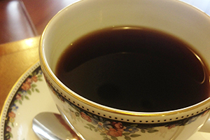

---
categories:
- ブログ
date: Sun, 14 Jul 2013 09:42:36 +0000
slug: post-2567
title: コーヒー断ちして2週間たってかわったこと
---

最近胃の調子が悪くて吐き気と痛みが酷かったので、毎日飲んでたコーヒーを断ってみました。<!--more-->
&nbsp;
&nbsp;
&nbsp;

<h2>
<b>その結果、胃の調子が治りました！！</b>
</h2>

胃の具合が治った・・・かな？
ただ、吐き気はなくなりました！

やっぱりコーヒーで胃が荒れていたみたいです。

ただし、胃の調子はよくなりましたがそれ以外に禁断症状と思われる副作用が現れました。
<li>眠い</li>
眠いです。眠いです。眠いです。やっぱりカフェインがないとふらふらするくらい眠かったです。

<li>なんか怠い</li>
なんか怠いです。しかも一日体力というか気力が持たない感じがしました。

ん〜やはりカフェインの力って凄いです。

<h2>
<b>胃の調子の不調はコーヒーだけだったのか？</b>
</h2>

そもそも胃の調子が悪かったのってなんだったのか・・・
ぼくの生活習慣から考えられる要因はこちら
<li>コーヒー飲み過ぎ及びカフェイン取り過ぎ</li>
<li>サプリ過剰摂取</li>
<li>寝不足</li>
<li>運動不足</li>
<li>ストレス</li>

<h3>
<b>コーヒー飲み過ぎ、カフェイン取り過ぎ
</b>
</h3>

これが主要因なのは解ってます。

だって毎日2杯以上かならずスタバ2杯飲んでましたから。

その他にもコーラ、紅茶、それでも眠いときはレッドブルかバーン飲んでましたw

こりゃ悪くなるわ

そもそも成人男性のカフェインの摂取許容量はどんくらいか？
1時間以内で6.5mg／kgってことなので1時間で390mgですかね

コーヒーも1時間に4杯以上飲むと急性カフェイン中毒の危険があるようです。

<h3>
<b>サプリメント飲み過ぎ</b>
</h3>

亜鉛のサプリメントを日々過剰摂取してました。

1粒でいいところを3粒飲んだりして、その他にもビタミン剤、ブルーベリーの錠剤やらを多量摂取

でも、これもダメです。

特に亜鉛の過剰摂取の副作用は顕著でした。

まず、吐き気。これが結構くる。

その次、鬱症状。これ唐突にくるので気をつけて。

カフェイン取りすぎと併せて、胃への負担が相当大きかったみたいです。

<h3>
<b>寝不足</b>
</h3>

普段4時間〜4時間30分程度しか寝ません。
だから日中ねむいねむい。

眠くなかったことはないくらいです。

そのため、カフェインをとり、やがて効きにくくなり、さらにとる。

悪循環

<h3>
<b>ストレス</b>
</h3>

普段ストレスは感じませんし、これは最も要因としては低いんじゃないかなと思います。

ただ、コーヒー飲んでも飲んでも眠いのはストレスになりますし、やっぱり寝不足もストレスになっていたのかもしれません。

もっとちゃんと寝て副交感神経にスイッチしなきゃ。

<h2>
<b>コーヒー断ち辛かった！！</b>
</h2>

かわりに紅茶飲みました

やっぱり中毒ですから、単に我慢ってのは辛かった・・・

で、どうしても眠いときは胃が荒れないようなものを飲む事にしました。

それがお紅茶です。しかも牛乳入れてのんでました。

コーヒーに比べて、中毒性はないと感じました。

<h2>
<b>しんぺーはこう思った</b>
</h2>

そもそも胃が悪くなるほど、カフェインとっちゃいかんですよね。

今回のコーヒー断ちはかなり無理を感じました。

やはり、生活リズムから見直して眠くならないような体を作る必要があります。

睡眠と運動。カフェインの力に頼らない自分を手に入れるために！

これにつきますね。少しは運動して体環境を改善しなければ！