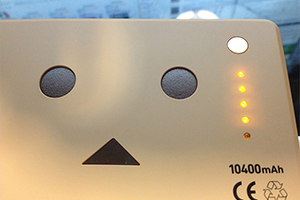
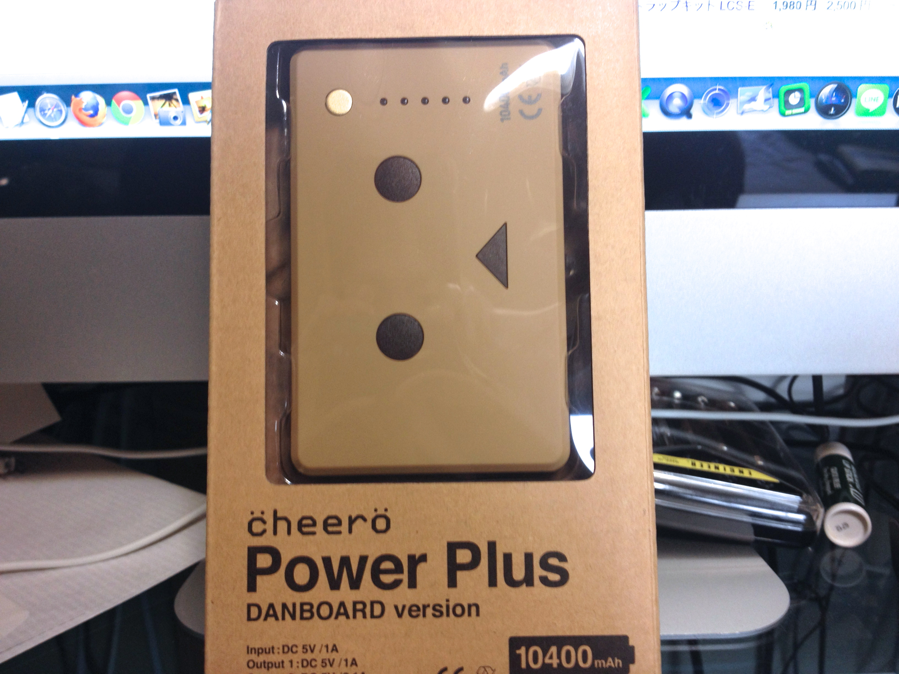
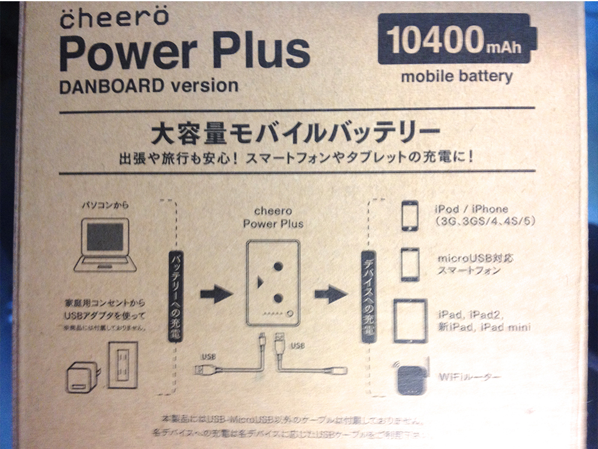

---
categories:
- レビュー
date: Sun, 04 Aug 2013 11:18:13 +0000
slug: post-2731
title: 大容量モバイルバッテリーチャージャー「ダンボー」買ったった！
---

ついに来た！ダンボー！<!--more-->皆さんダンボーをご存知ですか？これです。
&nbsp;
&nbsp;
&nbsp;
&nbsp;

何か話題だったので買いました。

以前発売された時はソッコーで売り切れになってしまったようです。

そんな大人気商品が7月18日に再販されるってことで、その瞬間にポチったのが昨日届きました！今回はそのレビューです。

<b>ダンボーはこんな商品だ！</b>

&nbsp;

<map id="map_ydwi94x5" name="map_ydwi94x5"> <area alt="" coords="14,269,303,311" shape="rect" href="http://amzn.to/19srJOG" /> <area alt="" coords="47,330,66,338" shape="rect" href="http://cheero.jp/powerplus_danboard/#box34" /> <area alt="" coords="47,340,92,348" shape="rect" href="http://p.tl/BIk1" /></map>

<a href="http://cheero.jp/powerplus_danboard/">cheero Power Plus DANBOARD version｜ダンボーデザイン、 スマホ・タブレット用 大容量モバイルバッテリー</a> via <a href="http://kwout.com/quote/ydwi94x5">kwout</a>

商品の説明
＊＊＊商品仕様＊＊＊
【内臓電量】3.7V 10400mAh、リチウムイオン
【入力】5V / 1A MicroUSB
【出力】USB1 5V/1A 、USB2 5V/2.1A
【主要機能】残量インジケーター(5段階)
【寸法(mm)】117mm×74mm×23mm
【重量】258g（本体）
【付属品】本体充電用USB-MicroUSBケーブル(75cm)、ポーチ
【各種保護機能】
1)過充電(電圧/電流)時 自動停止機能
2)過放電(電圧/電流)時 自動停止機能
3)短絡化(ショート)時 自動停止機能
4)発熱時　 自動停止機能
5)デバイス充電完了時 自動停止機能
【同梱物】本体、本体充電用USB-MicroUSBケーブル、ポーチ、説明書/保証書(半年保証)
※自動電源OFF機能、2.1Aポートは未対応のデバイスもございます。
※ケーブルと端末の相性もございますので、付属ケーブルで充電出来ない場合は、充電するデバイス付属のケーブルでお試し下さいませ。
※家庭用コンセントから充電する場合は、スマホ等に付属のUSBコンセントをご利用下さい。本製品には付属しておりません。
※付属はmicroUSBケーブルになります。各iPhone,iPad等のケーブルは付属しておりません。

まぁなんてことはない、普通のモバイルバッテリーです。別にエネループ持ってる人は、スルーでしょうね。

<b>予想以上にデカい</b>

これ商品写真じゃ小さく見えますよね？

エネループのモバブくらいだと思ってました。

ところがどっこい、デカい！！予想以上にデカくて思い！！

そしてそれと比例して当然のように容量が超多い！！

これがあれば相当充電できる！

しかも見た目がカワイイ！

iPhone5回充電できるそうなww

すげーー重いけど、やっぱりちょっとした安心のためにもこれくらいのを１つもっておいてもいいかもしれませんね。

ぼくはiPhone触ってないときがほぼないくらいなので、こういう「安心」はありがたいです。

これはかなりおすすめです！

<iframe style="width: 120px; height: 240px;" src="http://rcm-fe.amazon-adsystem.com/e/cm?lt1=_blank&amp;bc1=000000&amp;IS2=1&amp;bg1=FFFFFF&amp;fc1=000000&amp;lc1=0000FF&amp;t=warawareotoko-22&amp;o=9&amp;p=8&amp;l=as4&amp;m=amazon&amp;f=ifr&amp;ref=ss_til&amp;asins=B00CY6P968" height="240" width="320" frameborder="0" marginwidth="0" marginheight="0" scrolling="no"></iframe><iframe style="width: 120px; height: 240px;" src="http://rcm-fe.amazon-adsystem.com/e/cm?lt1=_blank&amp;bc1=000000&amp;IS2=1&amp;bg1=FFFFFF&amp;fc1=000000&amp;lc1=0000FF&amp;t=warawareotoko-22&amp;o=9&amp;p=8&amp;l=as4&amp;m=amazon&amp;f=ifr&amp;ref=ss_til&amp;asins=B00ASSGJ3Q" height="240" width="320" frameborder="0" marginwidth="0" marginheight="0" scrolling="no"></iframe>