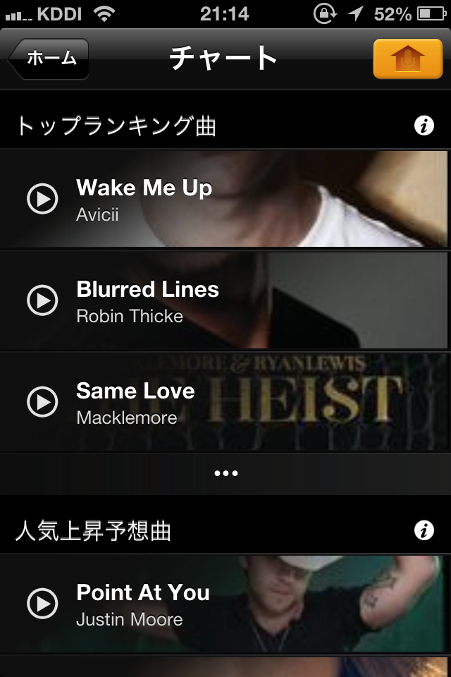
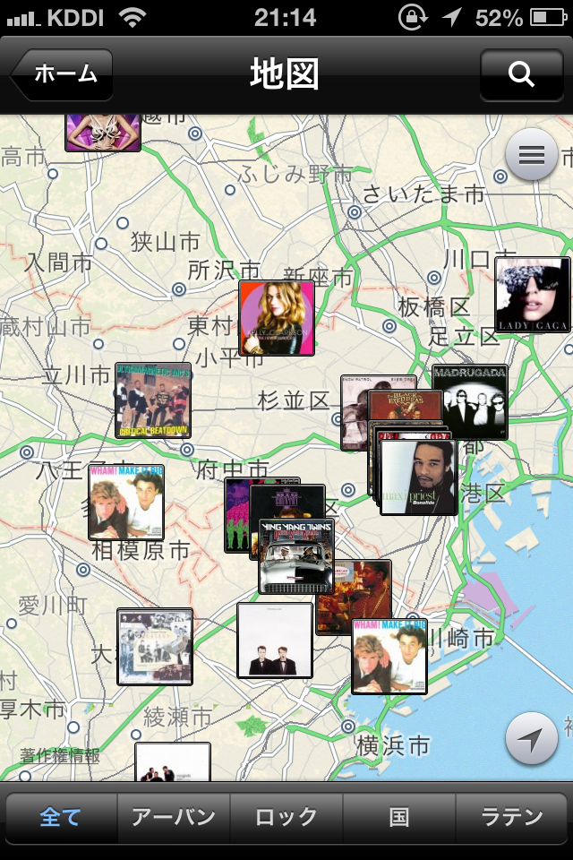

---
categories:
- アプリ
date: Sun, 11 Aug 2013 21:47:22 +0000
slug: post-2761
tags:
- アプリ
title: 高額だけど買ってよかったアプリレビューその1「Sound Hound」
---

&nbsp;
有料のアプリってダウンロードしにくいですよね！そんな方にぼくが高額だけど買って良かったアプリをご紹介します。<!--more-->
&nbsp;
&nbsp;

iphoneユーザーはAndroidユーザーに比べてアプリ購入をしやすい傾向にあり、さらに平均利用金額も高いらしいです。

<a href="http://www.tabroid.jp/news/2013/07/ipadiphone0719.html">iPad＞iPhone＞アンドロイド ← アプリにお金を払うユーザー順 | TABROID（タブロイド）</a> via <a href="http://kwout.com/quote/sxdjmv7g">kwout</a>

まぁ当然と言えば当然ですよね。
Androidのアプリは玉石混淆なので、お金払ってみたけど実際全く使えなかったとかざらにありそうで、、、

とは言っても、やはり高額アプリに手を出すはためらいますよね？
85円とか、せいぜい350円がボーダーだと思います。

さてそんな中どうしても気になるけど、高すぎて買おうか迷うって人のために今日から、ぼくが「買ってよかった」と思っている高額アプリをご紹介していきたいと思います。

<b>音楽にかざすだけでタイトルやアーティストを教えてくれるアプリ「Midomi Sound Hound ∞」</b>

はい、もう超有名アプリです。

説明は簡単「アプリを起動して、音楽にかざすだけで何の曲かを教えてくれる」

以上。

すげー、テクノロジーの偉大さを感じる一瞬です。

何が凄いってこのアプリ鼻歌でもOKって所です。

自分が歌っても即座に探してくれるんです。

それ以外にもこのアプリでいいなと思ったところはこの3つ
<ul>
	<li>このアプリを使ったサーチのランキングが解っちゃう</li>
</ul>
皆が気になる曲がわかるわけです。すごいですねー。

<ul>
	<li>いつどこできいたか地図で残してくれます</li>
</ul>

<ul>
	<li>youtubeも表示してくれます</li>
</ul>
<h2>Midomi SoundHound ∞ 5.3（￥600）</h2>

<iframe src="https://banners.itunes.apple.com/banner.html?partnerId=&aId=11ld5P&id=284972998&c=jp&l=ja-JP&bt=catalog&t=catalog_white&w=180&h=150" frameborder=0 style="overflow-x:hidden;overflow-y:hidden;width:180px;height:150px;border:0px"></iframe>

    

&nbsp;

<b>どれくらい使えるか？</b>

せっかく高額はたいたんだから使えないんじゃはなしになりません。

それでは実験してみましょう。

まずはアプリを起動

ボタンを押して音楽にかざすだけ

<iframe src="//www.youtube.com/embed/sSPqynTAH2A" height="315" width="560" allowfullscreen="" frameborder="0"></iframe>

概ね聞き取りました！ファイナルファンタジー5のメインテーマがニアミスで6がでてきちゃったり、マザー２のオネットのテーマは聞き取れなかったりしましたが、そこそこ有名は曲やファンしかしらないであろう曲でも以外といけたりしました。

基準がよくわかりませんが、まぁ海外製の割に日本の曲にもしっかり対応していてスゲーー！！

このアプリは月数回まで使える回数制限のついた無料版がでてますので、ぼくは最初そちらを使っておりました。

しかしながら、結構頻繁に使うので思い切って有料版を買いました。

気になるからは無料版をチェックしてから、有料を買ってみてもいいんじゃないでしょうか

海外ドラマとか見ていてすげーオシャレな曲とか、「うわ！何この曲！」ってのがそこそこあるときとか、このアプリをかざすと大抵いけます。

その他にも買い物先のお店とかの雑音にも負けずに聞き取ってくれたりします。

ですので、買って損はないアプリだと思います！！

同系等の有名なアプリとして他にもShazamってのがあるので、まずは無料版で試してみて、良い方を購入するといいと思います。

<iframe src="https://banners.itunes.apple.com/banner.html?partnerId=&aId=11ld5P&id=284972998&c=jp&l=ja-JP&bt=catalog&t=catalog_white&w=180&h=150" frameborder=0 style="overflow-x:hidden;overflow-y:hidden;width:180px;height:150px;border:0px"></iframe>

他にはこんなのもあります。
<iframe src="https://banners.itunes.apple.com/banner.html?partnerId=&aId=11ld5P&id=284993459&c=jp&l=ja-JP&bt=catalog&t=catalog_white&w=180&h=150" frameborder=0 style="overflow-x:hidden;overflow-y:hidden;width:180px;height:150px;border:0px"></iframe>