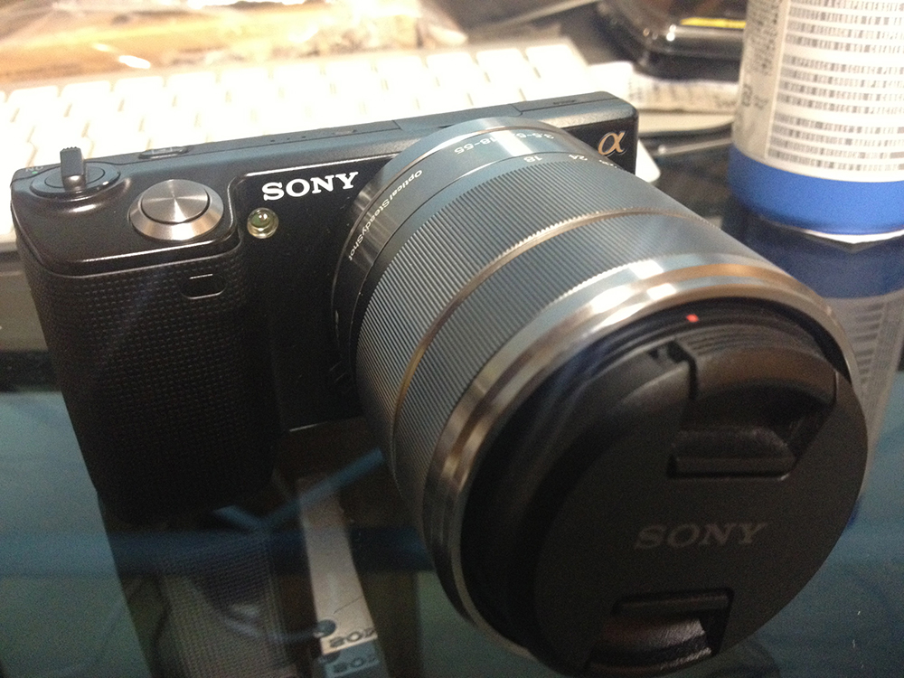
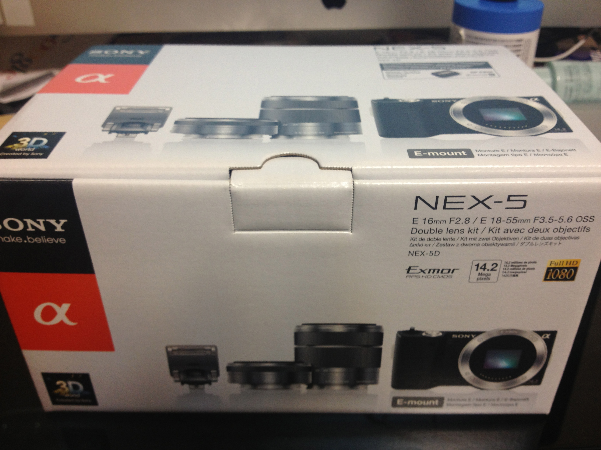
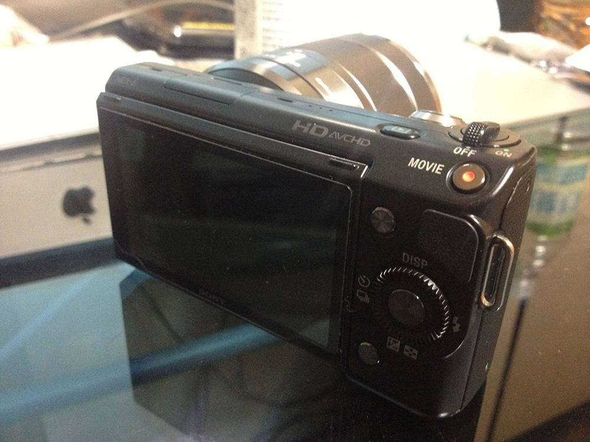

---
categories:
- ブログ
date: Fri, 23 Aug 2013 02:31:18 +0000
slug: post-2838
title: Amazonで買った商品は返品できるって知ってました？
---

Amazonで買った商品は返品できるって知ってました？<!--more-->
&nbsp;
&nbsp;
&nbsp;
&nbsp;
&nbsp;
&nbsp;

先日買った人生初のミラーレル一眼「SONY NEX-5D」

これです。まったくの初心者なので全然わかりませんが、好きなyoutuberがカメラ好きなので影響されて興味を持ちはじめたわけです。
何も解らずに購入してしまったので、カメラを使う人なら多分必須のこのアイテムを買うのを忘れてました。
それがこちら

カメラフィルターです。

これをカメラのレンズに被せることで、レンズを傷や汚れから守ってくれるわけです。

購入して、家に配送されてきて気がつきました。

「レンズとサイズが合わない・・・」

1000円程度の商品でしたが、カメラ自体も高価なものでしたので、少しでもコストを下げる為に返品できないかと探してみました。

そしたらありました。

<map id="map_bia3hrwd" name="map_bia3hrwd"> <area alt="" coords="575,39,594,50" shape="rect" href="http://www.amazon.co.jp/gp/help/customer/display.html?nodeId=16461971" /> <area alt="" coords="8,54,107,65" shape="rect" href="http://www.amazon.co.jp/gp/help/customer/display.html?nodeId=16461971" /> <area alt="" coords="167,79,196,90" shape="rect" href="http://www.amazon.co.jp/gp/help/customer/display.html/?nodeId=200712640" /> <area alt="" coords="517,79,546,90" shape="rect" href="http://www.amazon.co.jp/gp/help/customer/display.html?nodeId=200936070#gift" /> <area alt="" coords="8,105,119,116" shape="rect" href="http://www.amazon.co.jp/gp/help/customer/display.html?nodeId=3494121#step1" /> <area alt="" coords="8,120,189,131" shape="rect" href="http://www.amazon.co.jp/gp/help/customer/display.html?nodeId=3494121#step2" /> <area alt="" coords="8,136,179,147" shape="rect" href="http://www.amazon.co.jp/gp/help/customer/display.html?nodeId=3494121#step3" /> <area alt="" coords="8,151,249,162" shape="rect" href="http://www.amazon.co.jp/gp/help/customer/display.html?nodeId=3494121#step4" /> <area alt="" coords="8,167,107,178" shape="rect" href="http://www.amazon.co.jp/gp/help/customer/display.html?nodeId=200936020" /></map>

<a href="http://www.amazon.co.jp/gp/help/customer/display.html?nodeId=3494121">Amazon.co.jp ヘルプ: 返品および交換</a> via <a href="http://kwout.com/quote/bia3hrwd">kwout</a>

返品期間は購入から30日以内！
基本的には未開封、未使用の商品!

それ以外は返金額が下がったり、返品不可だったりするので注意が必要です。

注意事項をよく読みましょう

<a title="http://www.amazon.co.jp/gp/help/customer/display.html?nodeId=3494121#step2" href="http://www.amazon.co.jp/gp/help/customer/display.html?nodeId=3494121#step2" target="_blank">http://www.amazon.co.jp/gp/help/customer/display.html?nodeId=3494121#step2</a>

ぼくの場合は返品可能でしたので、Amazonさんのいうがままに、ラベルを印刷して貼付けて送付いたしました！
その後メールが送られてきて返品承認がされてました！もちろんレンズにあうフィルターも再度購入しました！

その結果・・・！

いまでは無事カメラにフィルターを装着でき、昨日も外に連れ出して初めてお外で撮影してきました！

それがこれ。

&nbsp;

Amazon使う人ってけっこう中毒的にポチっちゃう人ばっかりでしょうから、これ間違ったなってのもあると思います。

そんな人一度返品できるかどうか確かめてみてはいかがでしょうか？
<iframe style="width: 120px; height: 240px;" src="http://rcm-fe.amazon-adsystem.com/e/cm?lt1=_blank&amp;bc1=000000&amp;IS2=1&amp;bg1=FFFFFF&amp;fc1=000000&amp;lc1=0000FF&amp;t=warawareotoko-22&amp;o=9&amp;p=8&amp;l=as4&amp;m=amazon&amp;f=ifr&amp;ref=ss_til&amp;asins=B009Z3PCII" height="240" width="320" frameborder="0" marginwidth="0" marginheight="0" scrolling="no"></iframe><iframe style="width: 120px; height: 240px;" src="http://rcm-fe.amazon-adsystem.com/e/cm?lt1=_blank&amp;bc1=000000&amp;IS2=1&amp;bg1=FFFFFF&amp;fc1=000000&amp;lc1=0000FF&amp;t=warawareotoko-22&amp;o=9&amp;p=8&amp;l=as4&amp;m=amazon&amp;f=ifr&amp;ref=ss_til&amp;asins=B002XHAS8W" height="240" width="320" frameborder="0" marginwidth="0" marginheight="0" scrolling="no"></iframe>