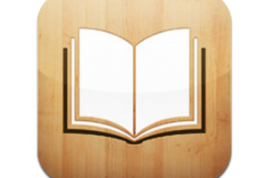

---
categories:
- ブログ
date: Sun, 25 Aug 2013 07:03:53 +0000
slug: post-2909
title: 読み終わった本は電子書籍化しておくのがおすすめ！
---

読んだ本どうしてますか？電子書籍化しておくと後で読み返せるし便利です。<!--more-->
&nbsp;
&nbsp;
&nbsp;
&nbsp;
&nbsp;

読み返した本どうしてますか？以前scansnapを買って、裁断機をDMMでレンタルして自炊をしたことがありますが、これかなり重労働です。

しかも、裁断の時は文字部分を切っていないか、よれてないか、はたまた分厚すぎる場合は少しずつ裁断しなければなりません。

スキャンはスキャンで、紙づまりに気を使ったり、2枚重なってないかとかで本当に大変です。

時間も体力も消耗します。

そこで今回は<a href="http://www.bookscan.co.jp">このサイト</a>にお願いすることにしました。

<h2>
<b>BOOKSCANはこんなサービス</b>
</h2>

<map id="map_98vurwdc" name="map_98vurwdc"> <area alt="" coords="41,2,115,13" shape="rect" href="http://www.bookscan.co.jp/" /> <area alt="" coords="282,2,314,11" shape="rect" href="http://www.bookscan.co.jp/" /> <area alt="" coords="322,2,375,11" shape="rect" href="http://www.bookscan.co.jp/service.php" /> <area alt="" coords="383,2,408,11" shape="rect" href="http://www.bookscan.co.jp/price.php" /> <area alt="" coords="417,2,449,11" shape="rect" href="http://www.bookscan.co.jp/payment.php" /> <area alt="" coords="457,2,496,11" shape="rect" href="https://system.bookscan.co.jp/join.php" /> <area alt="" coords="504,2,550,11" shape="rect" href="https://system.bookscan.co.jp/mypage.php" /></map>

<a href="http://www.bookscan.co.jp/">BOOKSCAN(ブックスキャン) 本・蔵書電子書籍化サービス - 大和印刷</a> via <a href="http://kwout.com/quote/98vurwdc">kwout</a>

ここなら1冊100円からスキャンをしてくれます。さらに文字をテキストとして認識可能なようにもしてくれます。これオプションです。（多分この辺は既存のscnacnapなどでも可）

料金はこんな感じです。

<a href="http://www.bookscan.co.jp/price.php">BOOKSCAN(ブックスキャン) 本・蔵書電子書籍化サービス - 大和印刷 - 料金案内</a> via <a href="http://kwout.com/quote/u3a3hrwd">kwout</a>

持っている本が何百冊、何千冊もあるなんて人は自炊する方がコスト的に安くすむかもしれませんけど、百冊以下とかならこっちでお願いするのがいいと思います！

サービスの流れはこんな感じだそうです。

<map id="map_ckbe6t94" name="map_ckbe6t94"> <area alt="" coords="439,444,481,455" shape="rect" href="http://www.bookscan.co.jp/price.php" /> <area alt="" coords="157,395,298,406" shape="rect" href="http://www.bookscan.co.jp/payment.php" /> <area alt="" coords="174,382,205,393" shape="rect" href="https://system.bookscan.co.jp/join.php" /> <area alt="" coords="375,382,414,393" shape="rect" href="http://www.bookscan.co.jp/order.php" /> <area alt="" coords="258,432,354,443" shape="rect" href="http://www.bookscan.co.jp/images/flow_status.jpg" /></map>

<a href="http://www.bookscan.co.jp/service.php">BOOKSCAN(ブックスキャン) 本・蔵書電子書籍化サービス - 大和印刷 - サービス案内</a> via <a href="http://kwout.com/quote/ckbe6t94">kwout</a>

基本的にはダンボールに詰め込んで、送るだけです。

ただし、１つだけネックがあります。それは納期です。。

通常配送してから、データとして納品されるまで2〜3ヶ月くらいかかるみたいです。
一度読んで本棚に置いてある系の本だったらこれでもいいでしょう。
ただし、読み返す予定が近々にありそうな本だと、ちょっと問題です。

そこで、プレミアム会員です。

プレミアム会員は、月額で1万円くらいかかりますが、それ以上にメリットが沢山あるようです。

<a href="https://system.bookscan.co.jp/premium_paypal_on.php">BOOKSCAN(ブックスキャン) 蔵書電子書籍化サービス - 大和印刷 - プレミアム会員</a> via <a href="http://kwout.com/quote/mewk7gyj">kwout</a>

50冊までは無料なので、実質5000円くらいが負担分という計算になります。
Amazon、楽天で買った本を直接送って電子書籍化してくれるなんて機能もあります。

なにより納品が1週間程度に短縮されるのがメリットですね！

それと箱詰め用のダンボールも送ってくれるんです。
登録したら翌日に送られてきました！ワオ！

さっそく箱詰めして、送ってやりました！第1陣としてワンピース50巻程度を送りつけてやりました！

どうなるか楽しみです。

本棚の中がダイブすっきりしました。

<h2>
<b>しんぺーはこう思った</b>
</h2>

<h3>
<b>電子書籍化のメリット</b>
</h3>
それは、スペースが空くことと本棚を持ちだせることだと思います。

引っ越しや掃除の時もあらかじめ本がなければ、時間と体力の短縮にも繋がりますしね！
それと外に持ち出せるということは、読書の時間と機会が増えるということだと思います。

重い本だと外に持ち出すのも一苦労です。でも電子書籍にしてiPadとかに入れれば通勤やカフェでのノマドなんかも捗ります。

<h3>
<b>電子書籍化のデメリット</b>
</h3>
ありますか？電子書籍化について苦言を呈する人は大抵、紙の手触りが〜とかページをめくる〜とか言いますけど、そもそも紙の前は竹簡だったわけですしwその前は亀の甲らだたり石盤だったわけで、さらにその前は洞穴の壁だったわけですよw

必要なのは媒体ではなくデータです。

ぼくとしては本を捨てるという行為はちょっと抵抗があります。それに本棚に置いておくってだけだと地震とかの時リスクにもなりますよね。（重さもそうなんですけど、燃えるものというのもお忘れなく。）

なのでそんな本が大量にあったなら電子書籍化することをオススメいたします！

<iframe style="width: 120px; height: 240px;" src="http://rcm-fe.amazon-adsystem.com/e/cm?lt1=_blank&amp;bc1=000000&amp;IS2=1&amp;bg1=FFFFFF&amp;fc1=000000&amp;lc1=0000FF&amp;t=warawareotoko-22&amp;o=9&amp;p=8&amp;l=as4&amp;m=amazon&amp;f=ifr&amp;ref=ss_til&amp;asins=B00A5YE7C8" height="240" width="320" frameborder="0" marginwidth="0" marginheight="0" scrolling="no"></iframe><iframe style="width: 120px; height: 240px;" src="http://rcm-fe.amazon-adsystem.com/e/cm?lt1=_blank&amp;bc1=000000&amp;IS2=1&amp;bg1=FFFFFF&amp;fc1=000000&amp;lc1=0000FF&amp;t=warawareotoko-22&amp;o=9&amp;p=8&amp;l=as4&amp;m=amazon&amp;f=ifr&amp;ref=ss_til&amp;asins=B00A378TNU" height="240" width="320" frameborder="0" marginwidth="0" marginheight="0" scrolling="no"></iframe>

<iframe src="http://ad.jp.ap.valuecommerce.com/servlet/htmlbanner?sid=3041033&amp;pid=882156320" height="250" width="300" frameborder="0" marginwidth="0" marginheight="0" scrolling="no"></iframe>