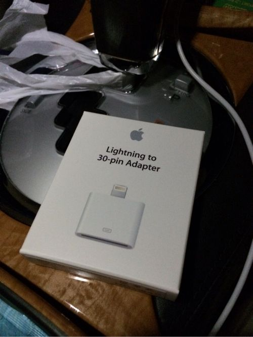
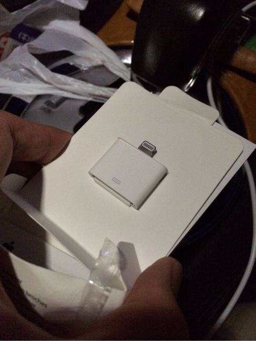
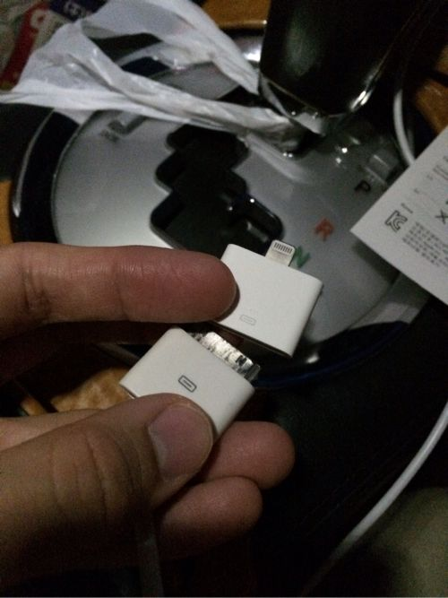
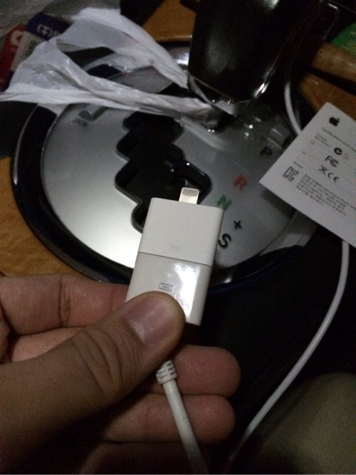

---
categories:
- iPhone
date: Wed, 25 Sep 2013 15:56:53 +0000
slug: post-3170
tags:
- apple
title: 車でiPhone5Sをカーオーディオやカーナビに接続して音楽聴く方法（多分iPhone6でもいけるはず）
---

さてiPhone5Sに機種変更してそれまで使用していたアクセサリー類が使えなくて困っているという人けっこう多いじゃないでしょうか？<!--more-->

その1つがカーオーディオだと思います。
現にぼくは困ってます。

ちなみにこれが動画編です。

それまでiPhoneに接続できる3色端子で音楽やら動画やらをカーナビに出力して視聴しておりました。

しかしながらライトニングケーブルに変わってからというもの動画はおろか、音楽すら聞けなくなりました。

無理矢理手持ちのiPadをテザリングでYouTubeに接続して、それを出力して見てました。

おかげで、iPhone5S購入から1週間と立たないうちにデータ通信の制限半分まで来てしまいました。

なのでこんなものをかいました。

今までの30ピンのUSBケーブルをライトニングコネクタに変換してくれるのです。
Apple純正品です。

高いですね〜

高いですね〜

いや、たかすぎたろう！！

同んなじようなのが数百円でAmazonにでてますよ！！
<iframe style="width: 120px; height: 240px;" src="http://rcm-fe.amazon-adsystem.com/e/cm?lt1=_blank&amp;bc1=000000&amp;IS2=1&amp;bg1=FFFFFF&amp;fc1=000000&amp;lc1=0000FF&amp;t=warawareotoko-22&amp;o=9&amp;p=8&amp;l=as4&amp;m=amazon&amp;f=ifr&amp;ref=ss_til&amp;asins=B009ZWARJ8" width="320" height="240" frameborder="0" marginwidth="0" marginheight="0" scrolling="no"></iframe><iframe style="width: 120px; height: 240px;" src="http://rcm-fe.amazon-adsystem.com/e/cm?lt1=_blank&amp;bc1=000000&amp;IS2=1&amp;bg1=FFFFFF&amp;fc1=000000&amp;lc1=0000FF&amp;t=warawareotoko-22&amp;o=9&amp;p=8&amp;l=as4&amp;m=amazon&amp;f=ifr&amp;ref=ss_til&amp;asins=B00DFI3ELQ" width="320" height="240" frameborder="0" marginwidth="0" marginheight="0" scrolling="no"></iframe>

っていってもAmazonに出回っているものはあくまで給電用のようです。

で、こちらの商品にぼくが期待することは勿論、音楽と動画をカーオーディオに出力することです。

さて、では早速取り付けです。

こんな感じにつきます。

で、結果は•••

音楽！いけました！

動画！いけませんでしてた！！

音楽は車のスピーカーから出てきたけど、映像の出力はできませんでした！！！

残念！！

今度は機会があれば数百円の方も買って試してみようと思います！

本日は以上です！それでは！

動画をみたい人は<a href="https://www.warawareotoko.com/2013/10/06/post-3238/">こちら</a>

<iframe style="width: 120px; height: 240px;" src="http://rcm-fe.amazon-adsystem.com/e/cm?lt1=_blank&amp;bc1=000000&amp;IS2=1&amp;bg1=FFFFFF&amp;fc1=000000&amp;lc1=0000FF&amp;t=warawareotoko-22&amp;o=9&amp;p=8&amp;l=as4&amp;m=amazon&amp;f=ifr&amp;ref=ss_til&amp;asins=B009A5EIWC" width="320" height="240" frameborder="0" marginwidth="0" marginheight="0" scrolling="no"></iframe>