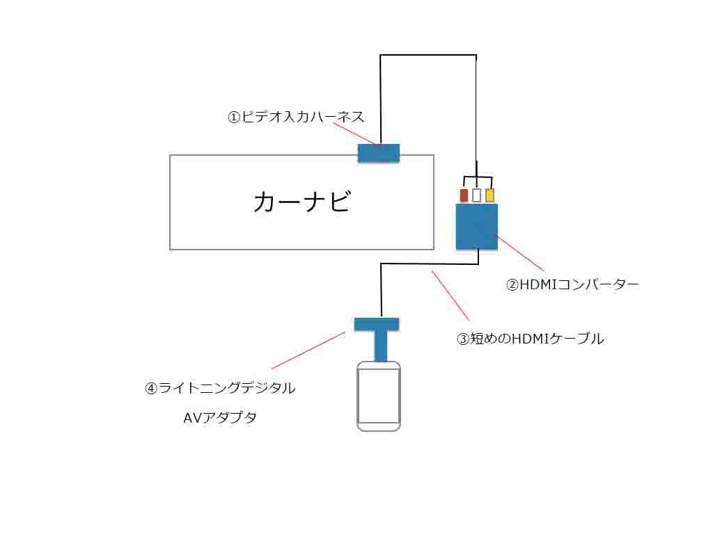

---
categories:
- iPhone
date: Sun, 06 Oct 2013 14:24:57 +0000
slug: post-3238
tags:
- apple
- iPhone
title: カーナビにiphoneを接続して音楽・動画を見る方法。
---

iPhoneには今のところ外部出力機能は搭載されておりません。そのため、ライトニングケーブルを接続するだけでモニターなどに動画を出力することはできません。そこで、iPhoneの画面をミラーリングすることでカーナビなどのモニターに動画などを写し出す方法をご紹介いたします。なおライトニングケーブルの接続を前提としております。
（Androidの場合は<a href="https://www.warawareotoko.com/2014/12/20/post-6761/">こちら</a>）
<h2>走行時でもカーナビに映像が映ることが前提</h2>
まずは大前提ですが、カーナビはわき見運転防止のためにパーキングブレーキがかかっている時でないとテレビやDVD再生といった動画の視聴ができないようになっています。

ちなみに道交法にも下記のように決められております。そのため、あくまで自己責任でお願いします。またくれぐれもモニターを注視し事故などを起こさないようにしてください。
<blockquote>道路交通法　第七十一条

自動車等に取り付けられ若しくは持ち込まれた画像表示用装置（道路運送車両法第四十一条第十六号 若しくは第十七号 又は第四十四条第十一号 に規定する装置であるものを除く。第百二十条第一項第十一号において同じ。）に表示された画像を注視しないこと。

引用：http://law.e-gov.go.jp/htmldata/S35/S35HO105.html</blockquote>
そこで、カーナビとパーキングの接続を解除する必要があります。こちらの方法はいくつかありますが、ここでは割愛いたします。

<!--more-->
<h2>iPhone内の動画をモニターに出力するために必要なアイテム</h2>
<b>ビデオ入力ハーネス</b>
古いカーナビなどで、AUXなどが外側に出ていない場合はこういうものをナビにつけて、入力用の口を作ります。もちろん車種にあったもの、カーナビにあったものを買いましょう。接続するためには、カーナビを外して後ろ側につけなければなりません。

ご自身の車種、カーナビに適合するものを選んでください。
[itemlink post_id="11812"]

<b>HDMIコンバーター</b>
カーナビから出た3色端子をこのコンバーターに接続します。これはアナログデータをHDMIに変換してくれる装置です。

[itemlink post_id="11813"]

なお、コンバーターは色々なタイプのものがでています。基本的にはUSBから電源を受けて起動するものが多いと思いますので、電源を取れない・USBがない場合はこういうものを一つ買っておいても損はないでしょう。最近の車はUSB付きのものも多いので不要かもしれません。

[itemlink post_id="11814"]

<b>短めのHDMIケーブル</b>
短い方がいいです。コンバーターにこれを接続。

[itemlink post_id="11815"]

<b>ライトニングデジタルAVアダプタ</b>
これは高額ですがApple純正品を買ってください。他のものは試していませんが、おそらく出力できないのではないでしょうか。多分。あと、壊れやすいので取り扱いには気をつけてください。断線します。

[itemlink post_id="11816"]

<h2>接続方法はこんな感じ</h2>

これでiPhoneの画面をカーナビのモニターにうつすことができます。Youtubeもhuluも見れますし、音楽もステレオできくことができます。

また、iPhoneでGoogleマップを表示すれば、カーナビとしても使うことできますので、古いカーナビのデータを使う必要もありません。iPhoneのマップを起動して、横画面にすることでカーナビサイズに最適化されます。

以上です！ただくれぐれも事故などにはお気をつけください！