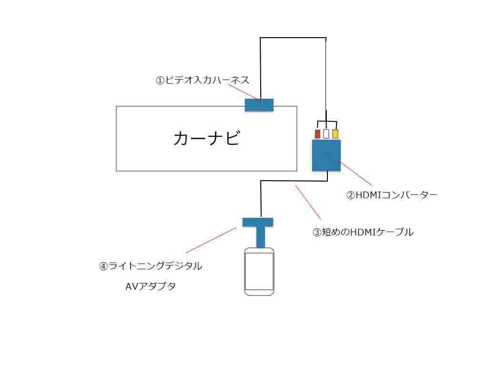

---
categories:
- iPhone
date: Sun, 06 Oct 2013 14:24:57 +0000
slug: post-3238
tags:
- apple
- iPhone
title: カーナビにiphoneを接続して音楽・動画を見る方法。
---

iPhoneには今のところ外部出力機能は搭載されておりません。そのため、ライトニングケーブルを接続するだけでモニターなどに動画を出力することはできません。そこで、iPhoneの画面をミラーリングすることでカーナビなどのモニターに動画などを写し出す方法をご紹介いたします。なおライトニングケーブルの接続を前提としております。
（Androidの場合は<a href="https://www.warawareotoko.com/2014/12/20/post-6761/">こちら</a>）

## ビデオ入力ハーネス

これでiPhoneの画面をカーナビのモニターにうつすことができます。Youtubeもhuluも見れますし、音楽もステレオできくことができます。

また、iPhoneでGoogleマップを表示すれば、カーナビとしても使うことできますので、古いカーナビのデータを使う必要もありません。iPhoneのマップを起動して、横画面にすることでカーナビサイズに最適化されます。

以上です！ただくれぐれも事故などにはお気をつけください！