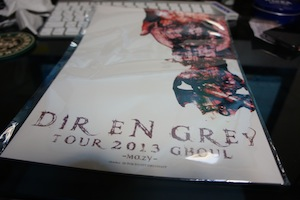
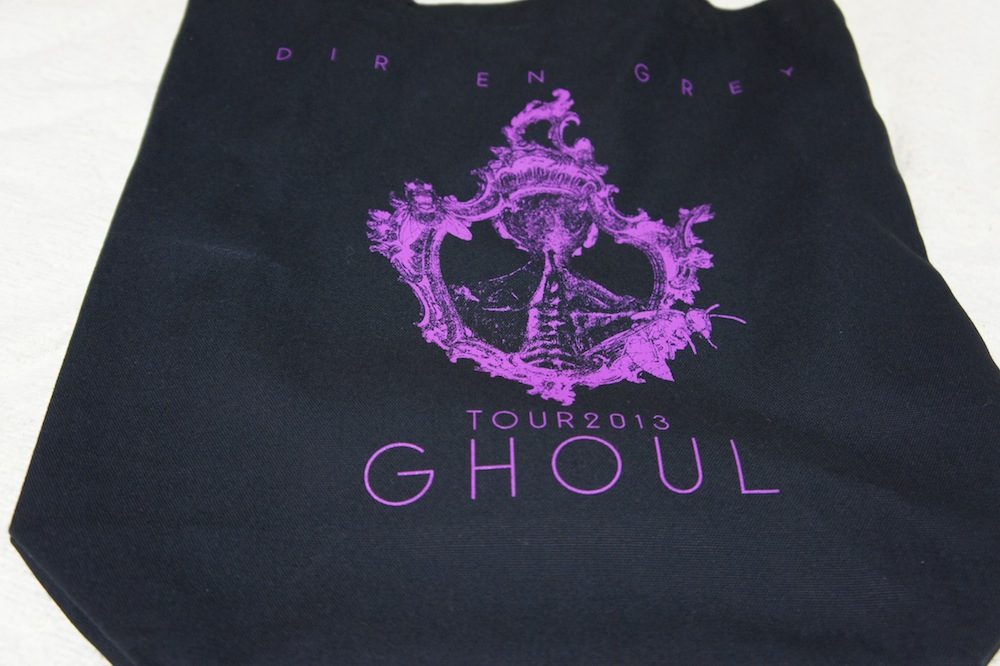
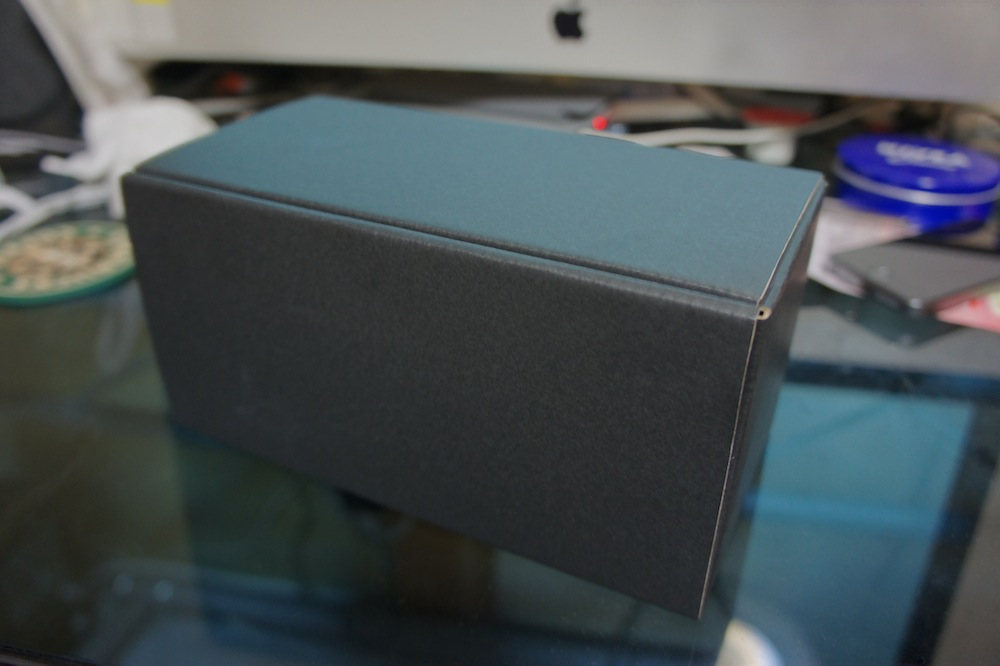
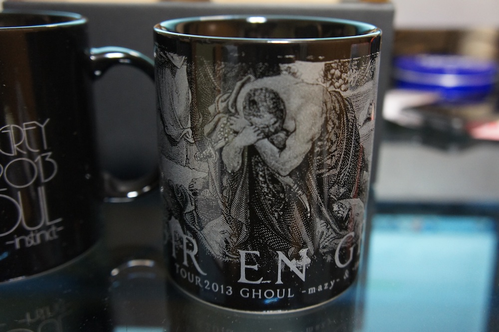
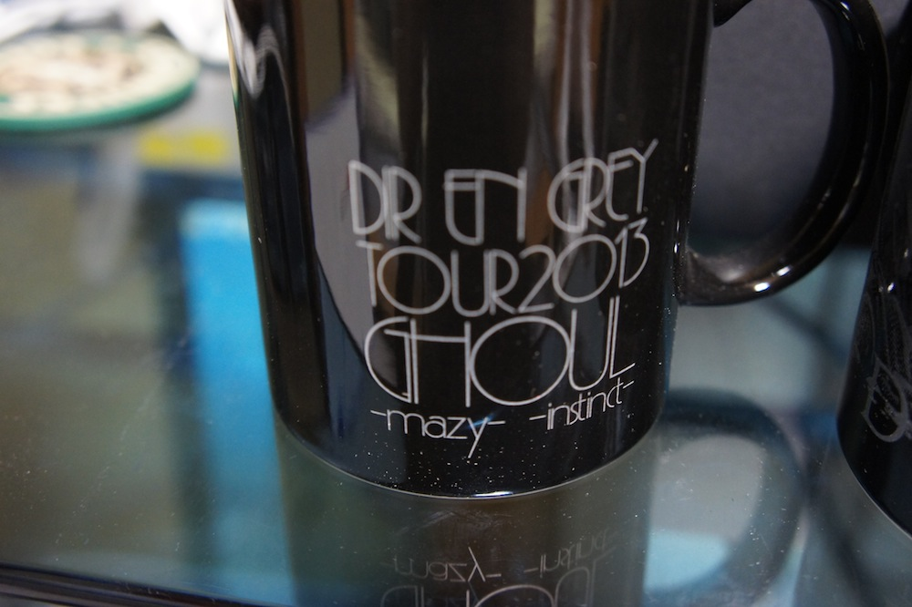
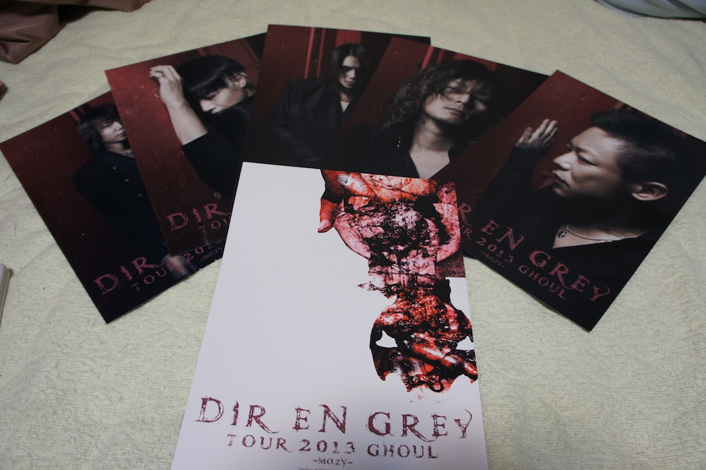

---
categories:
- DIR EN GREY
date: Sat, 19 Oct 2013 18:26:02 +0000
slug: post-3299
tags:
- DIR EN GREY
- LIVEレポ
title: DIR EN GREY TOUR2013 GHOUL -mazy- ＠新木場STUDIO COAST（スタジオコースト）行ってきたぜ！初のExclusiveチケット
---

はい、いってきましたDIR EN GREY TOUR2013 GHOUL -mazy- の関東ラストの新木場スタジオコーストちゃん！！初のエクスクルーシブチケットでした！

<!--more-->

&nbsp;
&nbsp;

<h2>
<b>まずはセトリ</b>
</h2>

冷血なりせば
Unknown.Despair.Lost
業
LOTUS
OBSCURE
霧と繭
audience KILLER LOOP
BUGABOO
蜜と唾
輪郭
「欲巣にDREAMBOX」あるいは成熟の理念と冷たい雨
Unraveling
獣慾
かすみ

凱歌、沈黙が眠る頃
HADES
STUCK MAN
THE FINAL

<h2>
<b>本編で気がついたこと〜演出について〜</b>
</h2>

<h3>
<b>ブルーのライト</b>
</h3>

途中なんかの曲でブルーのライトが一瞬はいったんだけど、ブルーのライトって珍しいかなと思った。
しかも、ケルビン数が高くなった白いのライトだと思うんだけど、DQNの車のヘッドライドみたいな色で、めずらしいなと。

紫やら緑やらはよくあるけどブルーでした。

<h3>
<b>蜜と唾の映像大幅リニューアル</b>
</h3>

今回のツアー初参戦でしたので、初めてあの映像を見ました。
今までの文字だけのものも好きでしたけど、今回の映像ありのものも、これまたおぞましい感じでたまらなかったです。

やっぱり赤児集団●●●とかって言葉ってすっげーまずい気がして本当にこれはもう社会的に蓋をして、人の目に触れさせちゃいけないくらいの演出だと思いました。

<h2>
<b>本日のハイライト</b>
</h2>

<h3>
<b>押しの凄さ</b>
</h3>

上から見てて凄かったのが押しでした。
まず開演5分前くらいに突然のいつもの押しが発生。すごかったー

それと結構救出&搬送される人多かったようで、かなりの激しさだったようです。上から見る限りだと大きなトラブルはなかったみたいでした。
あと空調効いてなかった気がする。。。

<h3>
<b>スモークの凄さ</b>
</h3>

輪郭？かなんかの時のスモークが凄すぎて液体がぶちゅーって飛んでて笑った。
そして一切何も見えなくなりましたとさww

それとスモークが堕威の扇風機に巻き上げられて、全て上手へと流れたあと、やも氏の方へと流れる気流が生まれてました。
いやー2階にいると普段見えないものが見えてきますw

<h3>
<b>京と堕威絡みの凄さ</b>
</h3>

京が上手側に移動する際、堕威氏に接触しそうになったが間に合わなかったのだが、それを見て堕威氏がほらほらーって感じで背中をあわせてはにかむ京にキュン死。
あれは本当にかわいかったww

<h2>
<b>エクスクルーシブシートお土産</b>
</h2>

全てこのトートバックに入っております。これとは別にチケットと同じくらいのフライヤーのようなものもいただきました！

それでは気になる中身です。

まずはこれです。リオポーネグリフです。

箱を開けますと、マグカップが二つ

あとはポートレート6枚

こんな所ですね。これで普通のチケットの倍の値段とはちょっとばかし高い気がします。
まぁ、でもカップルで行くとかであればおすすめですね。周りもそういう人ばっかりだったし。

<h2>
<b>しんぺーはこう思った</b>
</h2>

年内のLIVEはあるのか？
はい、それについての発表はありませんでした。よって大阪でのツアーfinalにて何かしらの発表があるかと思われます。
というかあってください。お願いします。

3月までLIVEなしとか耐えられない。

それと、物販ですが、販売開始の前に並びました。前には多分30~50人いないくらい並んでたと思います。
それでも限定Tシャツとパーカーが売り切れました。

ファイナルで買おうと思っている方々！！早めにというか一番前に並ぶくらいの覚悟で並んでください！

といった所で本日は以上です！おやすみなさい！