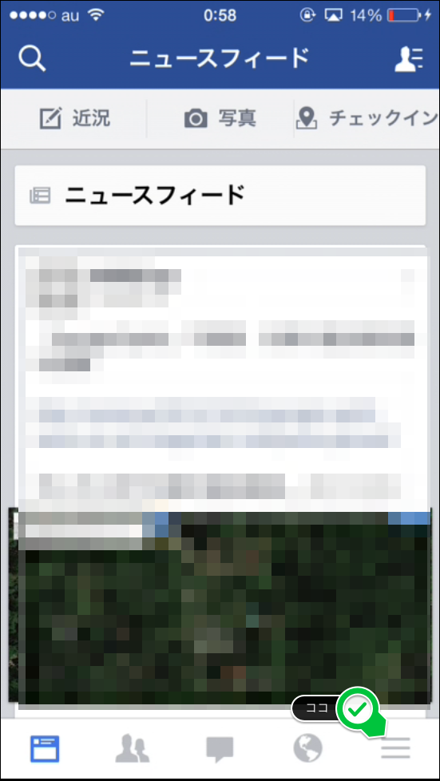
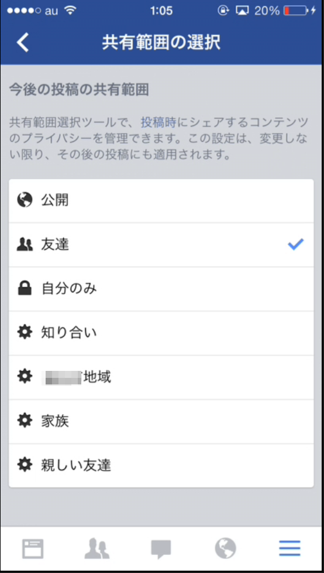
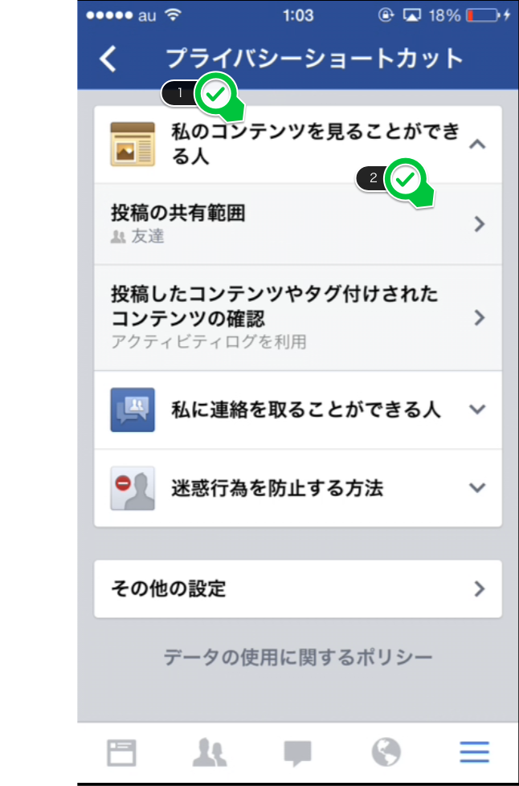
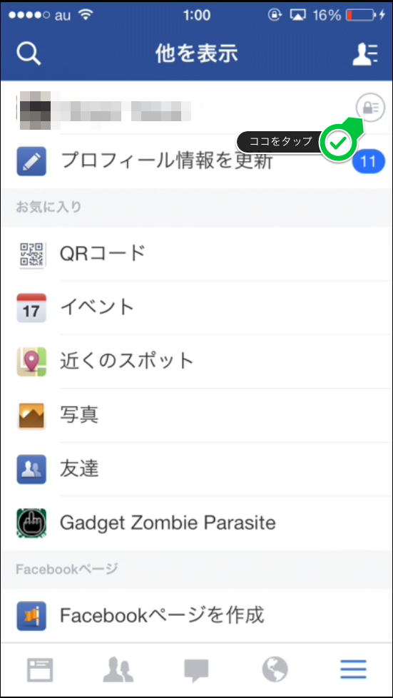
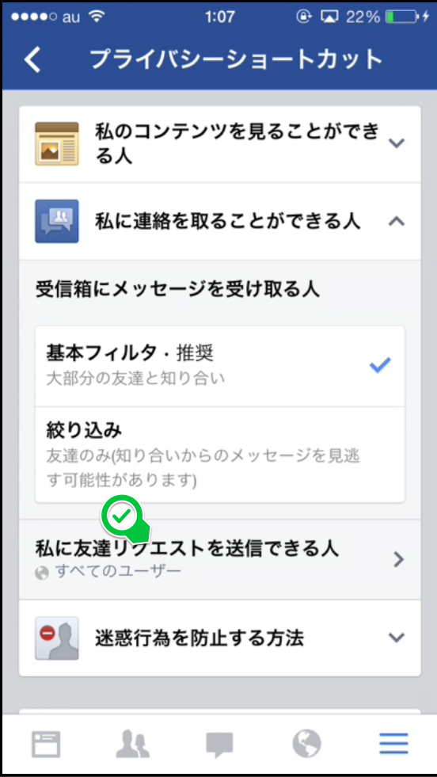
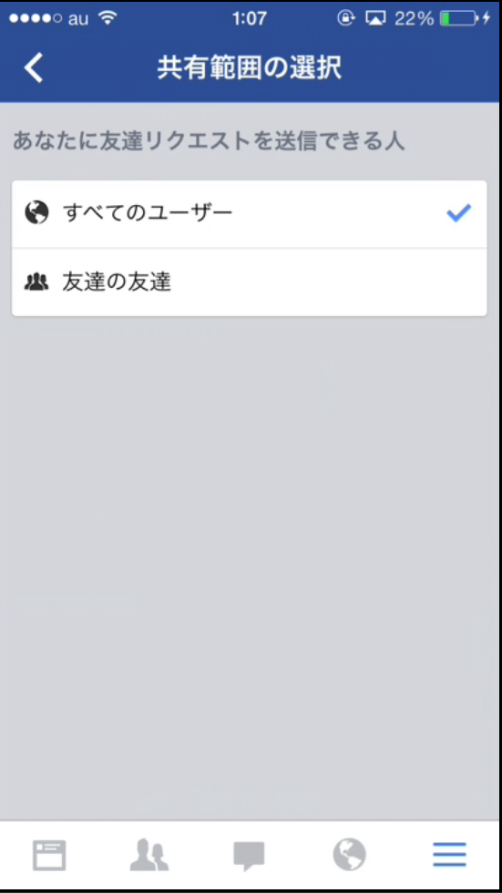
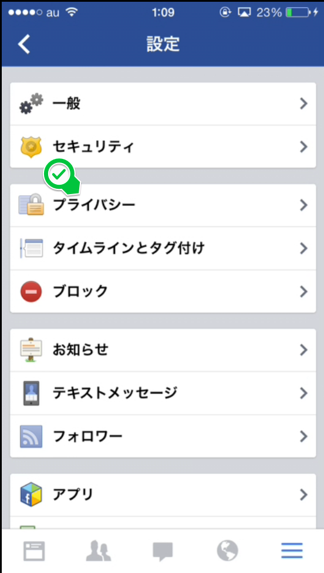
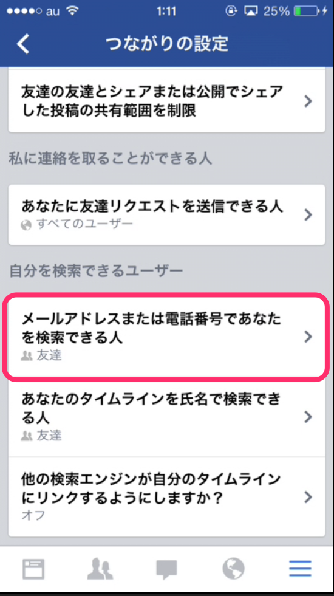
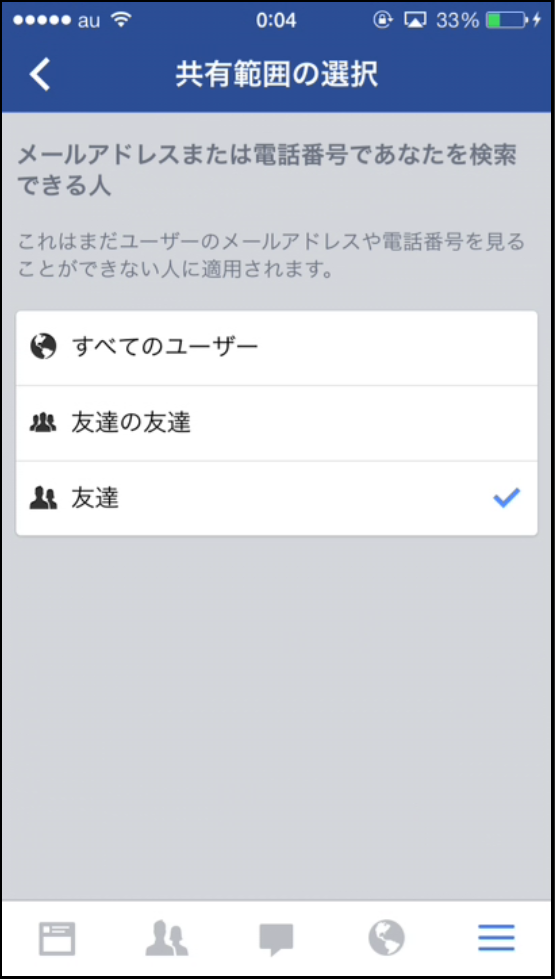

---
categories:
- アプリ
date: Sun, 27 Oct 2013 15:09:08 +0000
slug: post-3317
tags:
- アプリ
title: 覚えておきたい最低限のfacebookのロックの掛け方
---

実名登録のFacebookは、プライベート情報が満載です。ちゃんとロックかけてますか？そして単に非公開にしただけで満足してませんか？そのセキュリティ不十分ですよ！<!--more-->
&nbsp;
&nbsp;

Facebookで建前を嘯き、Twitterで本音を叫ぶ。ってことで建前のFacebookとは言え、知らない人や上司から見えないようにちゃんとブロックしておきましょう！

Facebookのセキュリティについてご紹介

<h2>
<b>友達以外に見られないようにロックをかける。</b>
<h2>

<h3>設定方法</h3>

<h3>セキュリティレベル：★☆☆</h3>

これはfacebookをする上で最低限の設定です。
むしろ皆知っているでしょう？って感じです。もし、皆に見られて困るのであればこれを設定しましょう。

<h2>
<b>自分に友達申請可能な範囲の設定</b>
<h2>

友達以外から見られなくても、見つけられたら嫌な人に友達申請されちゃう！上司とかに申請されちゃったらシカトも気まずい！！
って人はこれをしておきましょう。

<h3>設定方法</h3>

<h3>セキュリティレベル：★★☆</h3>

これ友達が上司と繋がってたら通用しないので、気休めと言えば気休めですが、最初にご紹介したロックの掛け方と合わせて設定しておきましょう。

<h2>
<b>メールアドレスで検索できなくしちゃおう</b>
<h2>

さて最後にメールアドレスで検索できなくしちゃいましょう。
これでメアドでの検索ができなくなりますので、知り合いではあるけどfacebook繋がりたくないって人から見えなくなります。

<h3>設定方法</h3>

その他の設定をタップしてプライバシーをタップ

ここから検索可能な範囲を設定

<h3>セキュリティレベル：★★☆</h3>

これで知り合いだけど、つながりたくない人からも隠れることができます。

<h2>
<b>しんぺーはこう思った</b>
<h2>

実名で登録するfacebookだからこそ、知らない人から情報を守るべきだと思います。

さらにいくら建前しか書かないと思っていても、うっかり想定しない人間の目に触れることがあります。

そんな事態を防ぐためにもしっかりとロックをかけておくべきです！

ここに紹介したのは、あくまでもライトレベルなセキュリティです。今後独自に編み出したものをご紹介したいと思いますので次回もお楽しみにねwww

といったところで、本日は以上です！