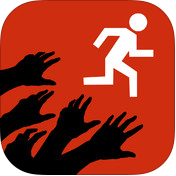
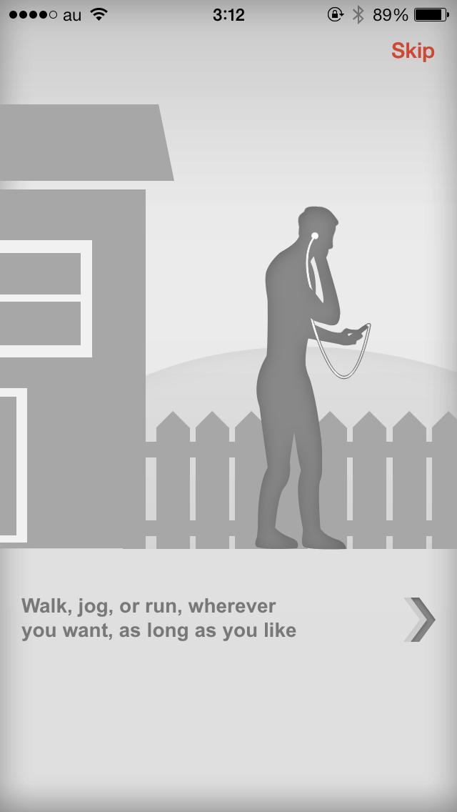
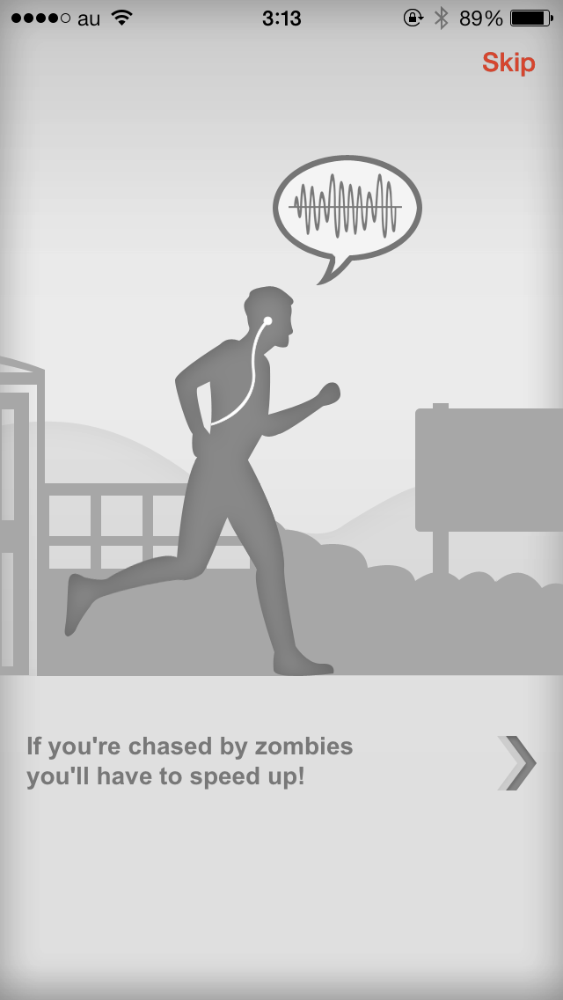
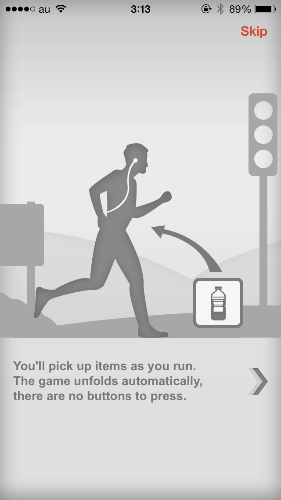
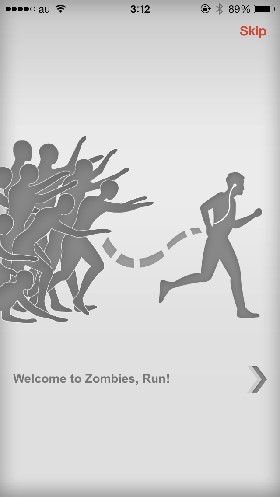
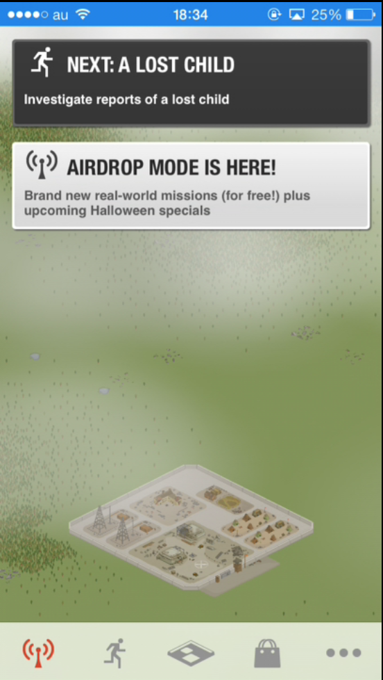
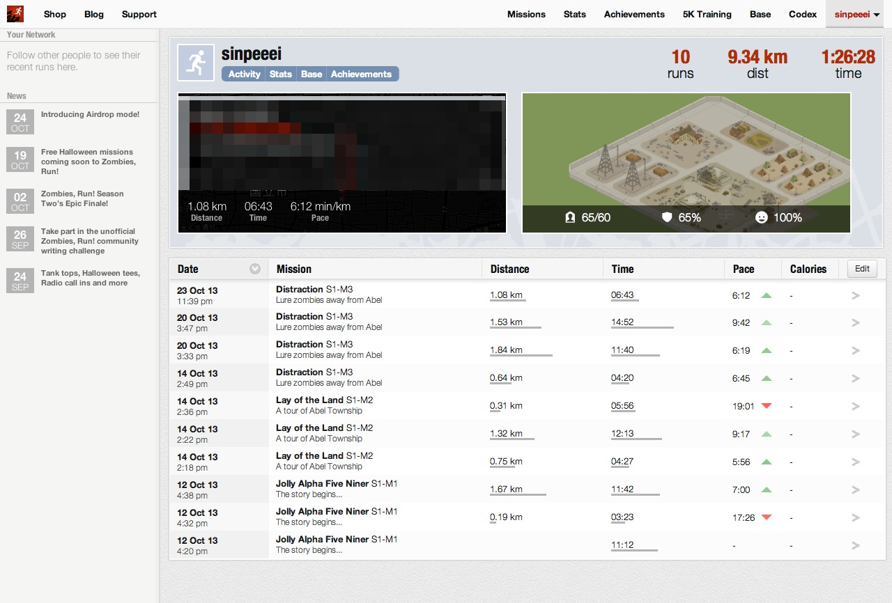

---
categories:
- アプリ
date: Sun, 27 Oct 2013 09:58:37 +0000
slug: post-3461
tags:
- アプリ
title: ゾンビから本当に走って逃げるランニングアプリ「Zombies,Run!」
---

あなたも健康のためにゾンビから走って逃げて見ませんか？<!--more-->
&nbsp;
&nbsp;

今までいくつもゾンビから逃げる系のアプリを紹介してきましたが、こんなアプリは初めて見ました。

このアプリでは自分が実際に走ってゾンビから逃げます。その名も「Zombies,Run!」

<h2>
<b>Zombies,Run!のストーリー</b>
</h2>

<iframe src="https://banners.itunes.apple.com/banner.html?partnerId=&aId=11ld5P&id=503519713&c=jp&l=ja-JP&bt=catalog&t=catalog_white&w=300&h=250" frameborder=0 style="overflow-x:hidden;overflow-y:hidden;width:300px;height:250px;border:0px"></iframe>

プレイヤーはゾンビだらけになった世界であるベースキャンプに逃げ込んでます。
ここはゾンビの侵攻を防げる程度の壁などがあり、内部には雨露を防ぐための建物などがあります。

ただし、ゾンビアポリプスの後の世界なので施設はボロボロで資源や物資も不足しています。

そんななかプレイヤーはランナー5となって、ベースキャンプの外に物資調達に向かうのです。走って、、、

マジかよwwちょっとラー油切れてるからコンビニで買ってきてってレベルじゃねーぞおい！

<h2>
<b>Zombies,Run!の使い方</b>
</h2>

このアプリはランニングアプリとサウンドノベルゲームを一緒にしたARアプリです。

使い方は簡単、イヤホンを着けて、アプリを起動して走るだけ。

走るだけです。
イヤホンからは各ミッションに合わせて、ベースキャンプからの指示や効果音が流れてきます。
これがかなりリアル

走ってると自動でアイテムを拾って行きます。とくにやることはありません。

で、唯一やらなければいけないアクション、それはゾンビが近づいて来た時に全速力で走ることです。
結構な速さと距離を走らないとゾンビに捕まってしまいます。
捕まると拾ったアイテムがなくなります。
死亡というわけではありませんが、せっかく走ったのが無駄になりますので、ゾンビが近づいてきたらとにかく逃げましょう。

1ミッション30分なので、だいたい5km前後を走ると1ミッション終わる感じではないでしょうか。

30分たつと自動でベースキャンプに戻ります。持ち帰ったアイテムを使ってベースキャンプを強化していきます。

使い方は以上です。

<h3>
<b>Zombies,Run!について思うところ</b>
</h3>

全編英語です。ベースキャンプやら諸々の説明が英語なのでよくわかりません。

まぁキャラの声が日本語だったら微妙な感じもしますが、でもその際はぜひ海外ドラマ声優で固めてほしいものです。

<h3>
<b>ポータルサイトで走ったログ管理もばっちり</b>
</h3>

アカウントを作ってPCサイトと同期すれば自分が走った経路を地図で見ることができます。
さらにはどこでゾンビに追われ、どこで巻いたかなどなど。

それと週に何km走ったか、スピードとか、普通のヘルスアプリと同等の機能を見ることができますwww

健康のために走るのではなく、恐怖がモチベーションw
生きるために走る。

これけっこうぼくにぴったりのアプリですww

なんとか、これを実況できないか考えてますw

それでは！

<iframe src="https://banners.itunes.apple.com/banner.html?partnerId=&aId=11ld5P&id=503519713&c=jp&l=ja-JP&bt=catalog&t=catalog_white&w=300&h=250" frameborder=0 style="overflow-x:hidden;overflow-y:hidden;width:300px;height:250px;border:0px"></iframe>