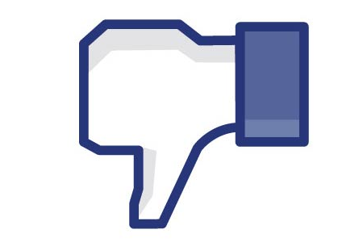

---
categories:
- アプリ
date: Thu, 31 Oct 2013 15:17:24 +0000
slug: post-3513
title: 上司や嫌いな人にフォローされたくないFacebookアカウントの設定の仕方
---

Facebookのセキュリティをいくら強固にしても、リアルの世界でFacebookフォローしていい？とか言われて断ったら気まずくなっちゃう人っていますよね？その対処法です。<!--more-->
&nbsp;
&nbsp;

上司やら先輩やらに休みの日の活動まで見られたくない、休日明けに昨日はどこどこ行ったんだ？誰と行ってたの？とかあーだこーだ言われたくないですよね！

だからこそ、<a href="https://www.warawareotoko.com/2013/10/28/%e8%a6%9a%e3%81%88%e3%81%a6%e3%81%8a%e3%81%8d%e3%81%9f%e3%81%84%e6%9c%80%e4%bd%8e%e9%99%90%e3%81%aefacebook%e3%81%ae%e3%83%ad%e3%83%83%e3%82%af%e3%81%ae%e6%8e%9b%e3%81%91%e6%96%b9/" title="覚えておきたい最低限のfacebookのロックの掛け方">前回お伝えした方法</a>で無用な危険をシャットアウトした方がいいのですが、リアルにFacebookフォローしていい？とか聞かれたら断りづらいですよね。

特に、セキュリティを強固にしても友達の友達として、そのつながりたくない人が存在していたら、「もしかして友達？」とかFacebook側が不要な気を利かせたりして見つかっちゃいます。

そんな時はこの方法をぜひ試してみてください。

<h2>
<b>ダミーアカウントを作ってフォローされる前にフォローしちゃう</b>
</h2>

これです。同名でアカウントを作っちゃって、見つかる前に友達申請しちゃう。

そうすれば、プライベートは守られます。ぼくは実際にこの方法をとっています。

ただし・・・

繋がってもいい友達がこっちにひっかかっちゃったりします。

ある程度は繋がって、ダミーの方も賑やかしておかないと疑われるので、多少の更新はしましょうw

<h2>
<b>注意事項</b>
</h2>

<h3>
<b>スパムに疑われないようにしましょう</b>
</h3>

自分のアカウントを3つ以上つくるのはやめましょう。

なぜならFacebook側にスパムだと疑われ、最悪アカウントを凍結される恐れがあるためです。

<h3>
<b>それぞれのアカウントの設定に注意</b>
</h3>

ダミーの方とプライベートの方とで使う写真は違うものにしましょう。

どうもここが重要なようです。

様は2種類のアカウントが同一人物であるというように見せないこと、これが重要な様です。

<h2>
<b>しんぺーはこう思った</b>
</h2>

2つのアカウント運用を実施して久しいですが、これはぜひとも実施すべきです。

ずっと友達ですか？とか表示されてて、消しても消してもでてくる場合、それって向こうがこっちのページを何回も見に来ているためって場合もあります。

なので、そんな時こそ、この方法で先に申請しちゃいましょう。

といったところで本日は以上です！