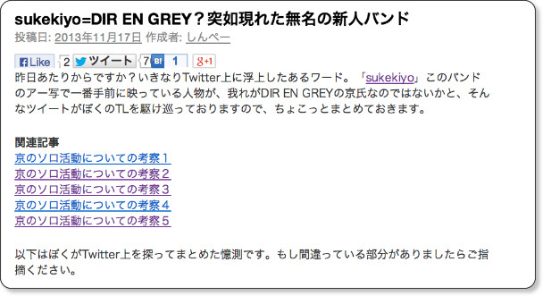
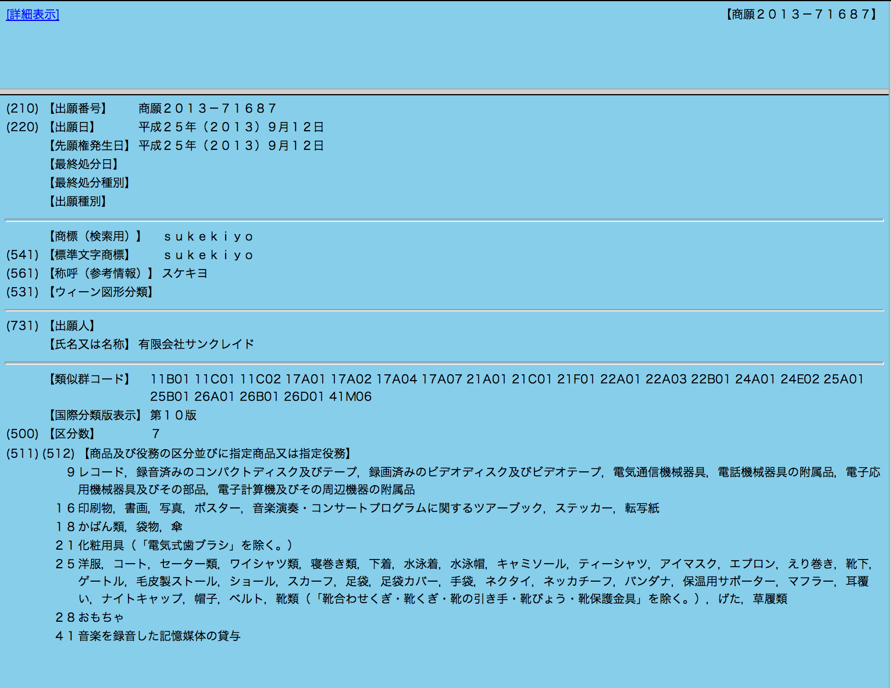
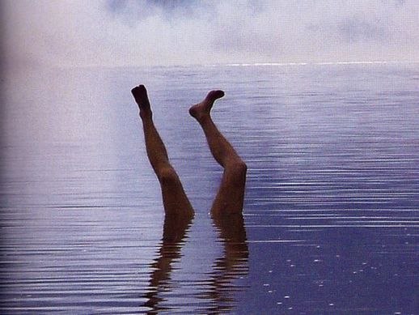

---
categories:
- sukekiyo
date: Mon, 18 Nov 2013 16:06:49 +0000
slug: post-3612
tags:
- DIR EN GREY
- sukekiyo
- 京
title: 続報：sukekiyo=DIR EN GREYを裏付ける憶測
---

さて、昨日の記事がツイートされまくってます。ありがとうございます。今日はいくつか続報的な感じの発見と勝手な予想をしてみいたと思います。<!--more-->
&nbsp;
&nbsp;

昨日の記事

<map id="map_h4x25az8" name="map_h4x25az8"><area coords="62,33,159,48" href="https://www.warawareotoko.com/2013/11/17/sukekiyodir-en-grey%ef%bc%9f%e7%aa%81%e5%a6%82%e7%8f%be%e3%82%8c%e3%81%9f%e7%84%a1%e5%90%8d%e3%81%ae%e6%96%b0%e4%ba%ba%e3%83%90%e3%83%b3%e3%83%89/" alt="" shape="rect" /><area coords="208,33,258,48" href="https://www.warawareotoko.com/author/warawareotoko/" alt="" shape="rect" /><area coords="410,80,463,95" href="http://sukekiyo-official.jp/" alt="" shape="rect" /><area coords="16,170,192,185" href="https://www.warawareotoko.com/2013/06/09/dir-en-grey%e3%80%8c%e4%ba%ac%e3%80%8d%e3%83%9e%e3%83%bc%e3%82%b1%e3%83%86%e3%82%a3%e3%83%b3%e3%82%b0%e3%81%ab%e3%81%a4%e3%81%84%e3%81%a6%e3%81%ae%e8%80%83%e5%af%9f%ef%bc%9a%e3%81%9d%e3%81%ae1/" alt="" shape="rect" /><area coords="16,188,192,203" href="https://www.warawareotoko.com/2013/06/09/dir-en-grey%e3%80%8c%e4%ba%ac%e3%80%8d%e3%83%9e%e3%83%bc%e3%82%b1%e3%83%86%e3%82%a3%e3%83%b3%e3%82%b0%e3%81%ab%e3%81%a4%e3%81%84%e3%81%a6%e3%81%ae%e8%80%83%e5%af%9f%ef%bc%9a%e3%81%9d%e3%81%ae2/" alt="" shape="rect" /><area coords="16,205,192,220" href="https://www.warawareotoko.com/2013/06/09/dir-en-grey%e3%80%8c%e4%ba%ac%e3%80%8d%e3%83%9e%e3%83%bc%e3%82%b1%e3%83%86%e3%82%a3%e3%83%b3%e3%82%b0%e3%81%ab%e3%81%a4%e3%81%84%e3%81%a6%e3%81%ae%e8%80%83%e5%af%9f%ef%bc%9a%e3%81%9d%e3%81%ae%ef%bc%93/" alt="" shape="rect" /><area coords="16,223,192,238" href="https://www.warawareotoko.com/2013/06/10/dir-en-grey%e3%80%8c%e4%ba%ac%e3%80%8d%e3%83%9e%e3%83%bc%e3%82%b1%e3%83%86%e3%82%a3%e3%83%b3%e3%82%b0%e3%81%ab%e3%81%a4%e3%81%84%e3%81%a6%e3%81%ae%e8%80%83%e5%af%9f%ef%bc%9a%e3%81%9d%e3%81%ae%ef%bc%94/" alt="" shape="rect" /><area coords="16,240,192,255" href="https://www.warawareotoko.com/2013/06/10/dir-en-grey%e3%80%8c%e4%ba%ac%e3%80%8d%e3%83%9e%e3%83%bc%e3%82%b1%e3%83%86%e3%82%a3%e3%83%b3%e3%82%b0%e3%81%ab%e3%81%a4%e3%81%84%e3%81%a6%e3%81%ae%e8%80%83%e5%af%9f%ef%bc%9a%e3%81%9d%e3%81%ae%ef%bc%95/" alt="" shape="rect" /></map>
sukekiyo=DIR EN GREY？突如現れた無名の新人バンド | Gadget Zombie Parasite

<h2>
<b>sukekiyoはsun-krad名義で商標出願済</b>
</h2>

こちらTwitterで見かけた情報をもとに調査しました。というか検索しただけですw
こちらから商標登録されているか調べられます。

<map id="map_n3apaz8p" name="map_n3apaz8p"><area coords="6,0,587,9" href="https://www.j-platpat.inpit.go.jp/web/all/top/BTmTopPage#contentstop" alt="" shape="rect" /><area coords="361,0,391,11" href="https://www.j-platpat.inpit.go.jp/web/all/top/BTmTopEnglishPage" alt="" shape="rect" /><area coords="397,0,440,11" href="https://www.j-platpat.inpit.go.jp/web/all/top/BTmTopPage" alt="" shape="rect" /><area coords="446,0,483,11" href="https://www.j-platpat.inpit.go.jp/web/HELP/japanese/index.html" alt="" shape="rect" /><area coords="489,0,532,11" href="https://www.j-platpat.inpit.go.jp/web/doc/sitemap.html" alt="" shape="rect" /><area coords="539,0,557,11" href="http://www.jpo.go.jp/indexj.htm" alt="" shape="rect" /><area coords="563,0,588,11" href="http://www.inpit.go.jp/" alt="" shape="rect" /><area coords="6,50,121,75" href="https://www.j-platpat.inpit.go.jp/web/all/top/BTmTopPage#" alt="" shape="rect" /><area coords="123,50,238,75" href="https://www.j-platpat.inpit.go.jp/web/all/top/BTmTopPage#" alt="" shape="rect" /><area coords="239,50,354,75" href="https://www.j-platpat.inpit.go.jp/web/all/top/BTmTopPage#" alt="" shape="rect" /><area coords="355,50,470,75" href="https://www.j-platpat.inpit.go.jp/web/all/top/BTmTopPage#" alt="" shape="rect" /><area coords="472,50,587,75" href="https://www.j-platpat.inpit.go.jp/web/all/top/BTmTopPage#" alt="" shape="rect" /><area coords="282,114,314,123" href="https://www.j-platpat.inpit.go.jp/web/HELP/japanese/knks/index.html" alt="" shape="rect" /></map>
<a href="https://www.j-platpat.inpit.go.jp/web/all/top/BTmTopPage">特許情報プラットフォーム｜J-PlatPat</a> via <a href="http://kwout.com/quote/n3apaz8p">kwout</a>

はい、こちらでsukekiyoっとけんさくけんさく

・・・。・・・。

・・・！！

はい、どうやらsun-krad所属は確定ですね。

<h2>
<b>ゼメキス家の妹ライミちゃんのあたまにスケキヨささっとるがな</b>
</h2>

<blockquote class="twitter-tweet" lang="ja">
ライミちゃんってスケキヨがあたまに刺さってるということに今更気がつく <a href="http://t.co/b3ZVFsWTyN">pic.twitter.com/b3ZVFsWTyN</a>
&mdash; しんぺー@sukekiyo (@s_s_p_y) <a href="https://twitter.com/s_s_p_y/statuses/402355287564103680">2013, 11月 18</a></blockquote>

犬神って書いてあるし、よくよく見たら触覚じゃなくて人の足でした。

これですねw

完全一致

そこからぼくの中である考えが浮かびました。

もしかして、このsukekiyoというバンドはゼメキス家を擬人化したものなんじゃないか・・・

過去にFOVSというシークレット名でLIVEをやったことのあるDIR EN GREYですが、これもシークレットでの活動のためにつけられたバンド名なんじゃね？という思考に至りました。

まてまて•••そう考えるとだなってことは薫がお父さんで、堕威がお母さん、双子がリズム隊で、もちろん悪意ちゃんが京

ということは堕威がセーラー服ってことでOK?

<h2>
<b>メリーのプロデューサーのクレジットにスケキヨってあったらしい</b>
</h2>

これ、申し訳ないですがぼくはソース未確認です。

なんでもメリーのシングルのCDクレジットにスペシャルアドバイザースケキヨってあったらしい。。。

メリーのスペシャルアドバイザーは言わずと知れた我らが、京氏

詳しくはこちらを読むべし。

<a href='http://www.amazon.co.jp/MASSIVE-%E3%83%9E%E3%83%83%E3%82%B7%E3%83%B4-Vol-03-%E3%82%B7%E3%83%B3%E3%82%B3%E3%83%BC%EF%BD%A5%E3%83%9F%E3%83%A5%E3%83%BC%E3%82%B8%E3%83%83%E3%82%AFMOOK/dp/4401636031%3FSubscriptionId%3DAKIAJBCXQ4WQGJ7WU3WA%26tag%3Dwarawareotoko-22%26linkCode%3Dxm2%26camp%3D2025%26creative%3D165953%26creativeASIN%3D4401636031' rel='nofollow' target='_blank'>MASSIVE (マッシヴ)  Vol.03 (シンコー･ミュージックMOOK)</a>

posted with <a href='http://amazlink.keizoku.com/' title='アマゾンアフィリエイトリンク作成ツール' target='_blank'>amazlink</a> at 13.11.19
<noscript><a href='http://bust-up.gob.jp'>xn--cck2b5as2b7b</a></noscript>

<a href='http://www.amazon.co.jp/MASSIVE-%E3%83%9E%E3%83%83%E3%82%B7%E3%83%B4-Vol-03-%E3%82%B7%E3%83%B3%E3%82%B3%E3%83%BC%EF%BD%A5%E3%83%9F%E3%83%A5%E3%83%BC%E3%82%B8%E3%83%83%E3%82%AFMOOK/dp/4401636031%3FSubscriptionId%3DAKIAJBCXQ4WQGJ7WU3WA%26tag%3Dwarawareotoko-22%26linkCode%3Dxm2%26camp%3D2025%26creative%3D165953%26creativeASIN%3D4401636031' rel='nofollow' target='_blank'>Amazon</a>

<h3>
<b>しんぺーはこう思った</b>
</h3>

とりあえずsun-krad所属ってこと以外は謎のままwwwww

はい、明日も引き続き調査行います！

といったところで本日は以上です！おやすみなさい