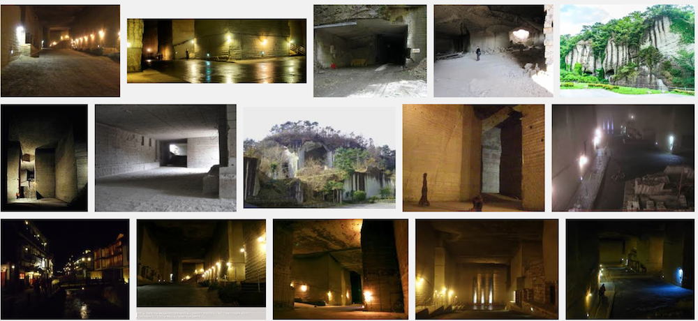

---
categories:
- sukekiyo
date: Wed, 20 Nov 2013 16:04:58 +0000
slug: post-3624
tags:
- DIR EN GREY
- sukekiyo
- 京
title: 虜特定班の情報まとめました。sukekiyo=DIR EN GREYは8割方確定か？
---

今日もTwitterで見かけた情報をまとめつつら私見を絡めて書きます。<!--more-->
&nbsp;
&nbsp;

<h2>
<b>sukekiyoとDIR EN GREYのドメインのIPアドレスが一緒？</b>
</h2>

こちらフォローしてる方がTweetされておりました。ぼく未確認です。すいません。

<a href="http://php.s3.to/net/lookups.php">IP-ドメイン変換</a>

このサイトにsukekiyoのURLを入れますと、DIR EN GREYのサイトと同じIPアドレスを表示するとのこと。

<h3>
<b>IPアドレスとは•••
</b>
</h3>

パソコンに割り当てられてる住所的なものとお考えください。

つまりIPアドレスが同じということは、ホームページのデータが保存されているサーバーも同じである可能性がたかいということです。

正直これ系のことはぼくまだわかりません。。。不勉強すんません。

ただ、

世界中に同一のIPは存在しない・・・
同じということは、これすなわち・・・

他の方の情報によりますと、DIR EN GREYのオフィシャルサイトと同じIPは、sukekiyo以外にも、kyo-officialやら他にもあるようです。

これだけじゃ一概に何とも言えませんがね•••

<h2>
<b>sukekiyoのアー写撮影場所特定される
</b>
</h2>

栃木県の大谷採石跡という場所らしいです。
<iframe width="425" height="350" frameborder="0" scrolling="no" marginheight="0" marginwidth="0" src="https://www.google.com/maps?f=q&amp;source=s_q&amp;hl=ja&amp;geocode=&amp;q=%E5%A4%A7%E8%B0%B7%E6%8E%A1%E7%9F%B3%E8%B7%A1&amp;aq=&amp;sll=37.0625,-95.677068&amp;sspn=46.36116,79.013672&amp;ie=UTF8&amp;hq=%E5%A4%A7%E8%B0%B7%E6%8E%A1%E7%9F%B3%E8%B7%A1&amp;hnear=&amp;radius=15000&amp;t=m&amp;ll=36.599956,139.824715&amp;spn=0.048234,0.072956&amp;z=13&amp;iwloc=A&amp;output=embed"></iframe> <small><a href="https://www.google.com/maps?f=q&amp;source=embed&amp;hl=ja&amp;geocode=&amp;q=%E5%A4%A7%E8%B0%B7%E6%8E%A1%E7%9F%B3%E8%B7%A1&amp;aq=&amp;sll=37.0625,-95.677068&amp;sspn=46.36116,79.013672&amp;ie=UTF8&amp;hq=%E5%A4%A7%E8%B0%B7%E6%8E%A1%E7%9F%B3%E8%B7%A1&amp;hnear=&amp;radius=15000&amp;t=m&amp;ll=36.599956,139.824715&amp;spn=0.048234,0.072956&amp;z=13&amp;iwloc=A" style="color:#0000FF;text-align:left">大きな地図で見る</a></small>

調べて見たらここ、Pay money To my PainもPV撮影した場所らしい。

<a href='http://www.amazon.co.jp/Another-day-comes-money-Pain/dp/B000TCU77A%3FSubscriptionId%3DAKIAJBCXQ4WQGJ7WU3WA%26tag%3Dwarawareotoko-22%26linkCode%3Dxm2%26camp%3D2025%26creative%3D165953%26creativeASIN%3DB000TCU77A' rel='nofollow' target='_blank'>Another day comes</a>

posted with <a href='http://amazlink.keizoku.com/' title='アマゾンアフィリエイトリンク作成ツール' target='_blank'>amazlink</a> at 13.11.21
<noscript><a href='http://bust-up.gob.jp'>xn--cck2b5as2b7b</a></noscript>
バップ 

<a href='http://www.amazon.co.jp/Another-day-comes-money-Pain/dp/B000TCU77A%3FSubscriptionId%3DAKIAJBCXQ4WQGJ7WU3WA%26tag%3Dwarawareotoko-22%26linkCode%3Dxm2%26camp%3D2025%26creative%3D165953%26creativeASIN%3DB000TCU77A' rel='nofollow' target='_blank'>Amazon</a>

そしてさらに調べたら、色んなアーティストがここでLIVEやったりしてるらしい。映画撮影やらなんやら

写真見る限り、信じられないくらいの地下ダンジョンでした。行って見たい。。。

<h2>
<b>しんぺーはこう思った。
</b>
</h2>

sukekiyoがDIR EN GREYなのかまだ、まだ確証なし！わかんない！！←

でも、、、この採石後はかなり興味ありますね。こういう意図しないところから、自分の世界が広がる感じって凄いいいですよね。

近々行ってみようと思います。

さらに、下北シェルターも行ってみようかな。LIVEと関係なくwどんな雰囲気なのかを見にw

といった所で本日はこんな所です！そろそろ現状のsukekiyo情報からくるざわめきは落ち着きをみせるんじゃないでしょうかね？

あとは、そう、それこそ震えて待てってことですかね！

さて、杉様かCDJかどっちのチケを取るが勝ちか・・・！！！！

といったとことで本日は以上です。おやすみなさい。