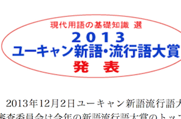

---
categories:
- DIR EN GREY
date: Mon, 02 Dec 2013 16:18:25 +0000
slug: post-3702
tags:
- DIR EN GREY
- TABULA RASA
- 京
title: 流行語大賞も決まったことですしDIR EN GREYの流行語を振り返ってみよう
---

流行語大賞がきまったそうで、父親に何になったのか聞いた結果。「今日やるんですか？やらないんですか？どっちですか？」「今日やります」ってやつって言われた。<!--more-->
&nbsp;
&nbsp;

さて、毎年これマジで流行った？って候補がいくつも入ってて、大賞に選出されるわけですけど今年はどんなもんだったか。

<h2>
<b>今年の流行語はこれ</b>
</h2>

<h3>流行語年間大賞「今でしょ！」</h3>

<h3>流行語年間大賞「おもてなし」</h3>

<h3>流行語年間大賞「じぇじぇじぇ」</h3>

<h3>流行語年間大賞「倍返し」</h3>

で、その他はアベノミクス、ご当地キャラ、特定秘密保護法、PM2.5、ブラック企業、ヘイトススピーチ

引用元（http://singo.jiyu.co.jp）

ってことでまぁまぁ例年に比べれば納得のいくものでした。

じぇじぇじぇとかは働いている人は出勤時間も濾過ぶりだから知らない人の方が多いのではとか思ったり、使ってるの聞いたことねーよって思ったり。

おもてなしとかも使ってるのテレビの中の人だけだろって思ったり。

ま、そんな所ですかね。

<h2>
<b>じゃあ我ら虜＝DIR EN GREYファンの流行語は何なのよ！</b>
</h2>

ってことで勝手に、本当に勝手に個人的に選出しました。

<h3>
<b>扁桃炎</b>
</h3>

というかTABLA RASA

<map id="map_ctitjbqs" name="map_ctitjbqs"><area coords="31,16,76,24" href="https://www.warawareotoko.com/2013/05/26/tabula-rasa-%e6%8f%9a%e7%be%bd%e3%83%8e%e7%be%bd%e3%83%8e%e5%a4%a2%e3%83%8f%e8%9b%b9-%ef%bc%a0%e6%b8%8b%e8%b0%b7%e5%85%ac%e4%bc%9a%e5%a0%82%e5%85%ac/" alt="" shape="rect" /><area coords="101,16,126,24" href="https://www.warawareotoko.com/author/warawareotoko/" alt="" shape="rect" /></map>
-揚羽ノ羽ノ夢ハ蛹-＠渋谷公会堂公演行ってきた | Gadget Zombie Parasite

これですよね。とくに印象的だったのは京の扁桃炎により開催が危ぶまれた渋公でのファイル。

鬼気迫るパフォーマンスで乗り切る姿は圧巻でした。
LIVE後に虚脱してしばらく動けなくなって、渋谷の街で茫然自失。
その後、意識をしっかり持つまで１時間近く徘徊したのを覚えています。

すげーLIVEだった。。。

<h3>
<b>やぐる</b>
</h3>

というか要は京のソロです。個展なんかも開いちゃって。やかん・ダイ・学にも突如現れて伝説の言葉「やぐる」を残しました。

そしてそのソロ活動での集金がこれまたツアーが終わった虜たちの財布に追い打ちをかけるドSさだったのは今思い返しても鳥肌がたちます。

<map id="map_u2g25az8" name="map_u2g25az8"><area coords="33,25,78,32" href="https://www.warawareotoko.com/2013/06/16/%e4%ba%ac%e3%83%9e%e3%83%bc%e3%82%b1%e3%83%86%e3%82%a3%e3%83%b3%e3%82%b0%e3%81%ab%e3%81%a4%e3%81%84%e3%81%a6%e3%81%ae%e8%80%83%e5%af%9f/" alt="" shape="rect" /><area coords="102,25,127,32" href="https://www.warawareotoko.com/author/warawareotoko/" alt="" shape="rect" /><area coords="10,122,181,129" href="https://www.warawareotoko.com/2013/06/09/dir-en-grey%E3%80%8C%E4%BA%AC%E3%80%8D%E3%83%9E%E3%83%BC%E3%82%B1%E3%83%86%E3%82%A3%E3%83%B3%E3%82%B0%E3%81%AB%E3%81%A4%E3%81%84%E3%81%A6%E3%81%AE%E8%80%83%E5%AF%9F%EF%BC%9A%E3%81%9D%E3%81%AE1/" alt="" shape="rect" /><area coords="181,122,181,129" href="https://www.warawareotoko.com/2013/06/09/dir-en-grey%E3%80%8C%E4%BA%AC%E3%80%8D%E3%83%9E%E3%83%BC%E3%82%B1%E3%83%86%E3%82%A3%E3%83%B3%E3%82%B0%E3%81%AB%E3%81%A4%E3%81%84%E3%81%A6%E3%81%AE%E8%80%83%E5%AF%9F%EF%BC%9A%E3%81%9D%E3%81%AE1/" alt="" shape="rect" /><area coords="10,141,181,148" href="https://www.warawareotoko.com/2013/06/09/dir-en-grey%e3%80%8c%e4%ba%ac%e3%80%8d%e3%83%9e%e3%83%bc%e3%82%b1%e3%83%86%e3%82%a3%e3%83%b3%e3%82%b0%e3%81%ab%e3%81%a4%e3%81%84%e3%81%a6%e3%81%ae%e8%80%83%e5%af%9f%ef%bc%9a%e3%81%9d%e3%81%ae2/" alt="" shape="rect" /><area coords="10,160,183,167" href="https://www.warawareotoko.com/2013/06/09/dir-en-grey%e3%80%8c%e4%ba%ac%e3%80%8d%e3%83%9e%e3%83%bc%e3%82%b1%e3%83%86%e3%82%a3%e3%83%b3%e3%82%b0%e3%81%ab%e3%81%a4%e3%81%84%e3%81%a6%e3%81%ae%e8%80%83%e5%af%9f%ef%bc%9a%e3%81%9d%e3%81%ae%ef%bc%93/" alt="" shape="rect" /><area coords="10,179,183,186" href="https://www.warawareotoko.com/2013/06/10/dir-en-grey%e3%80%8c%e4%ba%ac%e3%80%8d%e3%83%9e%e3%83%bc%e3%82%b1%e3%83%86%e3%82%a3%e3%83%b3%e3%82%b0%e3%81%ab%e3%81%a4%e3%81%84%e3%81%a6%e3%81%ae%e8%80%83%e5%af%9f%ef%bc%9a%e3%81%9d%e3%81%ae%ef%bc%94/" alt="" shape="rect" /><area coords="10,197,183,204" href="https://www.warawareotoko.com/2013/06/10/dir-en-grey%e3%80%8c%e4%ba%ac%e3%80%8d%e3%83%9e%e3%83%bc%e3%82%b1%e3%83%86%e3%82%a3%e3%83%b3%e3%82%b0%e3%81%ab%e3%81%a4%e3%81%84%e3%81%a6%e3%81%ae%e8%80%83%e5%af%9f%ef%bc%9a%e3%81%9d%e3%81%ae%ef%bc%95/" alt="" shape="rect" /></map>
<a href="https://www.warawareotoko.com/2013/06/16/%E4%BA%AC%E3%83%9E%E3%83%BC%E3%82%B1%E3%83%86%E3%82%A3%E3%83%B3%E3%82%B0%E3%81%AB%E3%81%A4%E3%81%84%E3%81%A6%E3%81%AE%E8%80%83%E5%AF%9F/">京マーケティングについての考察 | Gadget Zombie Parasite</a>

<h3>
<b>sukekiyo</b>
</h3>

ってことで今年ラストを飾るのは間違いなくこのワードです。
sukekiyo関連の記事を書いた瞬間から当ブログのアクセス数が急増
リツイートされまくった結果、検索結果が一時オフィシャルサイトの上に行くという異常事態にwww

sukekiyo=DIR EN GREY？突如現れた無名の新人バンド | Gadget Zombie Parasite

<h2>
<b>しんぺーはこう思った</b>
</h2>

さて今年もDIR EN GREYに支えられ生かされる日々でした。彼らなくして虜なし。

これからも人生の糧としてきっちりついていきます。

そして、まだまだ今年は終わらない！sukekiyoの正体を突き止めるべく、日々情報配信をしていきますので今後ともガジェットゾンビィパラサイトをごひいきに！

シェアお願いします！

といったところで本日は以上です！おやすみなさい！

sugizoのLIVE行こうかな・・・