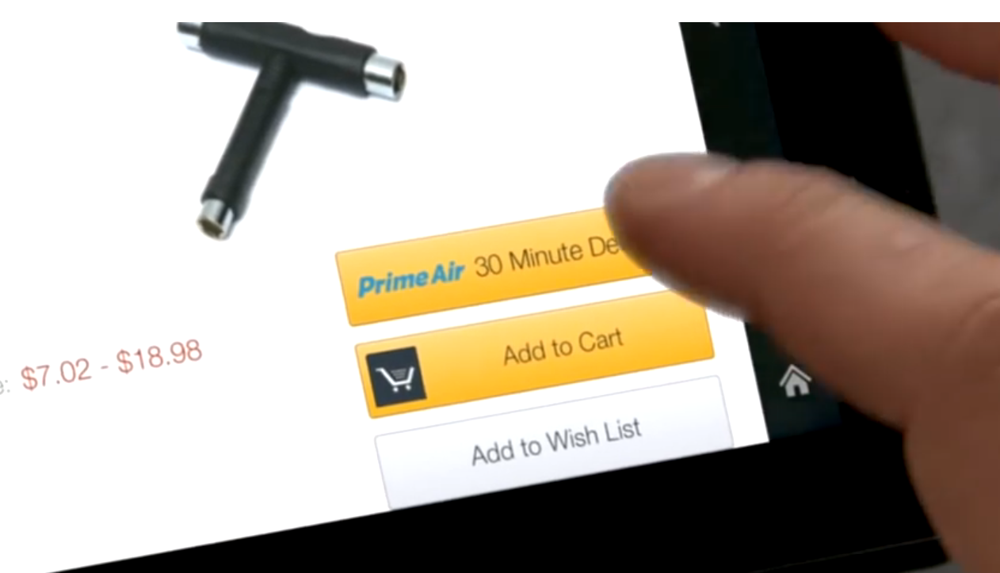
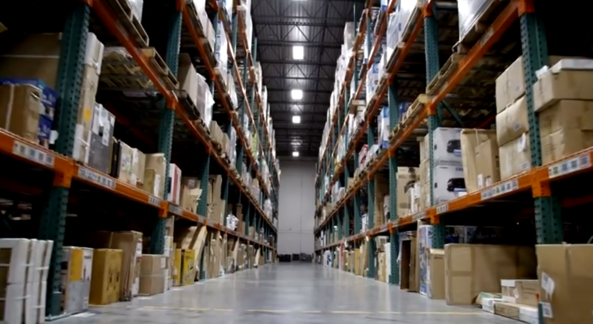
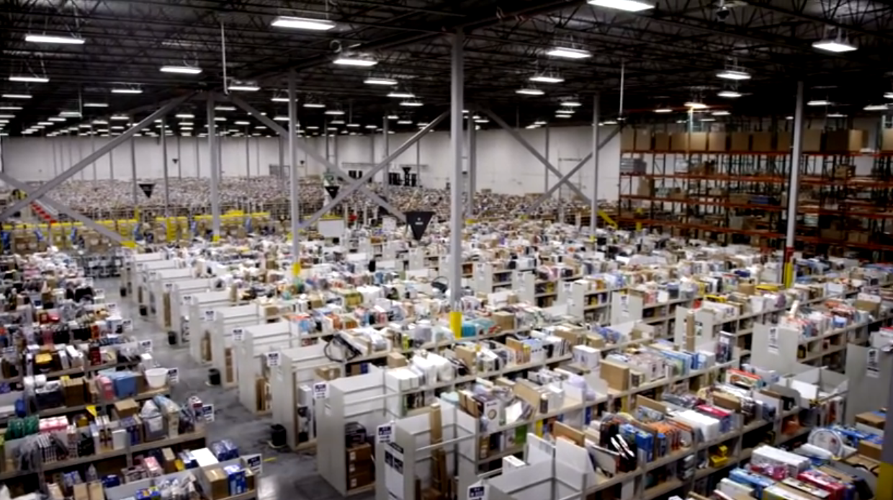
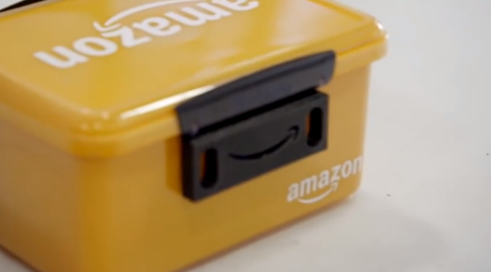
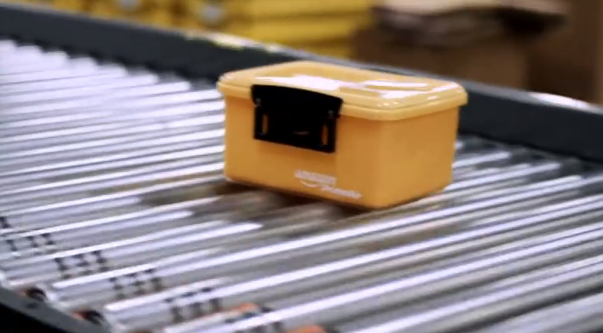
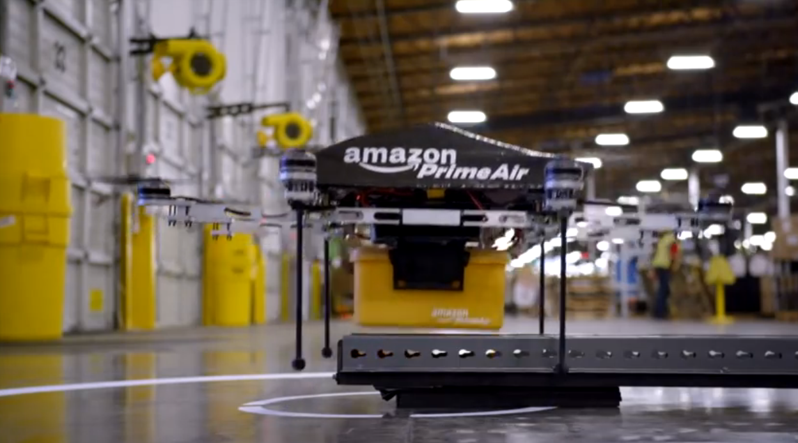
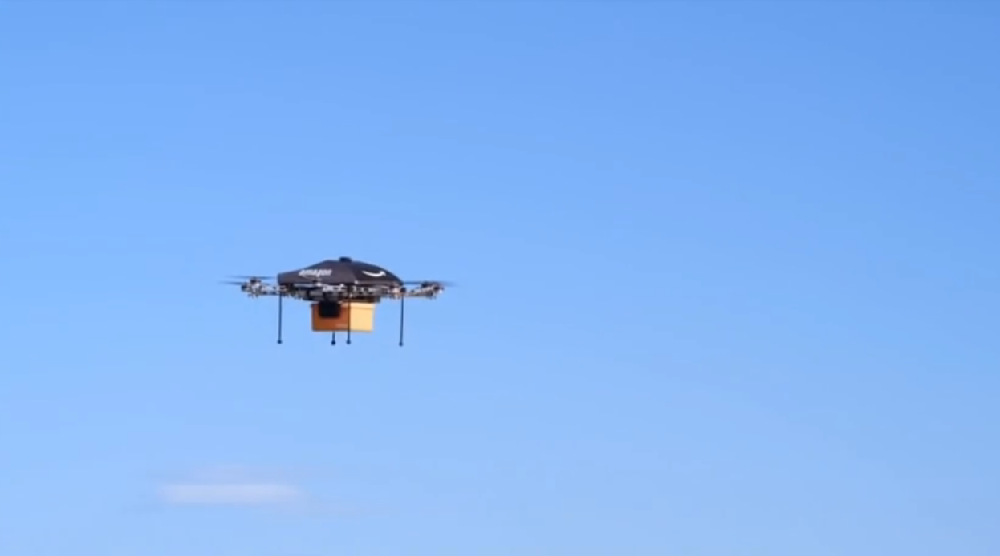
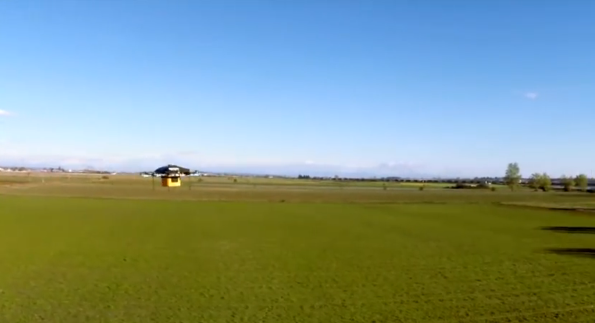
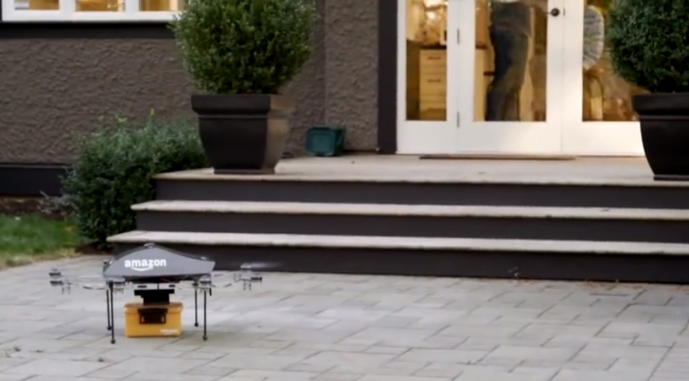
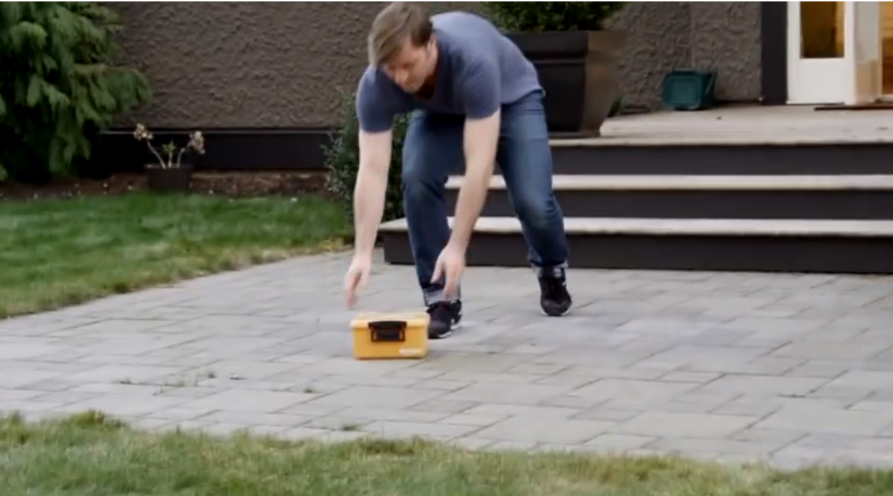

---
categories:
- レビュー
date: Tue, 03 Dec 2013 16:05:42 +0000
slug: post-3708
tags:
- amazon
title: Amazonが注文から最速30分で配送するサービス「Amazon Prime Air」をテスト中らしい
---

Amazonで買い物してますか？ぼくはクレジットカードがやばいことになってたのでここ２週間何も注文していません。<!--more-->

１度注文したものをキャンセルしたくらいです。
Amazonってなんかクリックすることが目的になってる気がしますwww

次の日には手元に届いているので本当に便利ですよね。

でも、今回Amazonが公開した動画によると、この注文から配送までの時間がさらに短縮します。

それがこちら<h2>「Amazon Prime Air」</h2>です。

<iframe width="560" height="315" src="//www.youtube.com/embed/98BIu9dpwHU" frameborder="0" allowfullscreen></iframe>

まずはこちらをご覧ください。

注文するといつも通りの配送センターで仕分け作業やらなんやらでお目当ての商品が梱包されます。

レーンにのって進むさきにはドローン＝無人機が待ち構えています。

これがまたSFちっくな造形をしております。
昔こういうのドラえもんの映画で見た気がします。

そいつが、がちっと商品を挟んで、ぶーんってお客さんの所へ運んでいくわけです。

すげー

ちなみに現在のAmazon Primeは最速で24時間以内とかそんな感じです。夜中頼んで、次の日の昼間来るくらいの体感です。

<h3>
<b>こんなんただのコンセプト動画だろ！</b>
</h3>

って思ってたんですけど、マジで検討中みたいです。
実用化は速くても2015年。アメリカの色んなお役所の許可をもらわなければいけないって感じです。

そりゃーそうだ。

こんなもんが、ぶーんぶーんって飛び交ってたら、それに伴う心配も色々とでてきそうだし。

<h2>
<b>しんぺーはこう思った</b>
</h2>

Amazonの凄いところは、ユーザビリティを上げる事で、クリックつまりは購入までのハードルを限りなく下げているという点だと思います。

「人間は感情でまず買って、理論でそれを正当化する」ってのを何かでみました。

まさにそうです。クリックするときは衝動です。
「あ、この本読みてー」とか「あ、これ欲しい」とかって実際いるかいらないかわからないけどとりあえずクリックしちゃいます。

で、届くまで時間かかるような商品だと、「いやいやいやい、いらねーだろう」ってなってキャンセルしちゃうわけです。

でも、すぐ届いたら？

欲しい！という衝動がそのまま商品を使える！っていうエクスペリエンスに昇華されるわけです。

つまりは、このサービスが実施されれば人間の消費行動は加速し、欲求から行動までの制約が低くなる時代が訪れる訳です。

人々はより本能的になり、我慢ができなくなり、ストレスにも弱くなるでしょう。

そして、争いが絶えなくなり、弱者は強者に蹂躙され、強く、賢い者のみが生き残る世界になるでしょう。

しかし、資源は有限です。Amazonの倉庫に並ぶストックもやがては枯渇するでしょう。

少なくなる資源を巡る争いはさらに加速度を増します。

やがてほとんどの人類がいなくなった世界でAmazon Prime Airのドローンだけが、今日も空を飛ぶのです。

そんな時代が来るかもしれませんね。

といったところで本日は以上です！おやすみなさい！