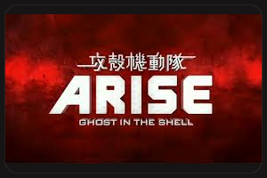

---
categories:
- アニメ
date: Fri, 20 Dec 2013 16:39:55 +0000
slug: post-3791
title: 攻殻機動隊ARISE「Ghost Whispers」見てきて微妙だったよって話
---

やはりぼくの人生を定義付けたって意味で凄い救われたアニメの１つが攻殻機動隊なわけです。それの最新作ってことで見ない手はないわけです!
<!--more-->
&nbsp;
&nbsp;

時系列は、前作のGhost Painの後のお話。

攻殻機動隊ARISEの感想 | Gadget Zombie Parasite

<h2>
<b>よく覚えてないけどあらすじ</b>
</h2>

確か冒頭は後の公安9課になるっぽい建物、荒巻課長が管轄する施設に原因不明のシステムダウンがおきます。ほんの数秒でしたが、その際にタチコマ、じゃなくて、ロジコマの一体に何らかのシステムが上書きされますーーーーって所からお話が始まるのです。

で、荒巻さんが素子にシステムダウンの原因の調査依頼をするってお話だったと思います。

で、そのあとはとある部隊を引き連れて、難民の虐殺を行ったとされる人が裁判にかけられています。

でも、この人は軍の衛星と直でリンクしているので、交通網にハッキングをかけて市民の命を盾の、軍のスキャンダル満載のサーバーの開示を要求します。

で素子はそれを阻止すべく動くわけですが、その部隊にはバトーやらイシカワやらが所属していて、戦いが始まるっちゅーわけです。

でいきなり話とびますけど、全部ウィルスのせいでした〜〜〜〜ちゃんちゃんって
感じで終わります。

一部劇場版の「Ghost In the shell」みたいなのがからみつつで終わります。

<h2>
<b>しんぺーはこう思った</b>
</h2>

えーっととりあえず、前作同様よくわからない。

攻殻機動隊特有のSFの設定よくわからんとかじゃなくて、なんかストーリーがよくわからない

なんていうかそこはちゃんと噛み砕いて説明してっていうか、しているんだけど、その説明が解りにくい

そこは解りやすくていいんじゃね？って感じです。

はい、それと今回も劇場でもらったブックがこんなんです。

中身は前回みたいに漫画がのってるわけじゃなくて、設定とか絵コンテみたいなのが書いてあるものでした。

はい、それとこの劇場版はもう今月DVD発売します。はえーww

それと次回「Ghost Tears」は来年6月26日公開です！さきだな！おい！

と言った所で本日は以上です！

<a href="http://www.amazon.co.jp/exec/obidos/ASIN/B00GU51IYG/warawareotoko-22/ref=nosim/" rel="nofollow" target="_blank">攻殻機動隊ARISE (GHOST IN THE SHELL ARISE) 3 [Blu-ray]</a>

posted with <a href="http://kaereba.com" rel="nofollow" target="_blank"> カエレバ</a>

坂本真綾 バンダイビジュアル 2014-07-25

売り上げランキング : 156

<a href="http://www.amazon.co.jp/gp/search?keywords=GHOST%20IN%20THE%20SHELL%20ARISE&__mk_ja_JP=%83J%83%5E%83J%83i&tag=warawareotoko-22" rel="nofollow" target="_blank" title="アマゾン" >Amazon</a>

<a href="http://www.amazon.co.jp/exec/obidos/ASIN/B00GU51IW8/warawareotoko-22/ref=nosim/" rel="nofollow" target="_blank">攻殻機動隊ARISE (GHOST IN THE SHELL ARISE) 3 [DVD]</a>

posted with <a href="http://kaereba.com" rel="nofollow" target="_blank"> カエレバ</a>

坂本真綾 バンダイビジュアル 2014-07-25

売り上げランキング : 3708

<a href="http://www.amazon.co.jp/gp/search?keywords=GHOST%20IN%20THE%20SHELL%20ARISE&__mk_ja_JP=%83J%83%5E%83J%83i&tag=warawareotoko-22" rel="nofollow" target="_blank" title="アマゾン" >Amazon</a>

