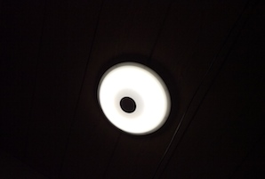
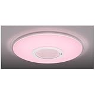
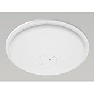
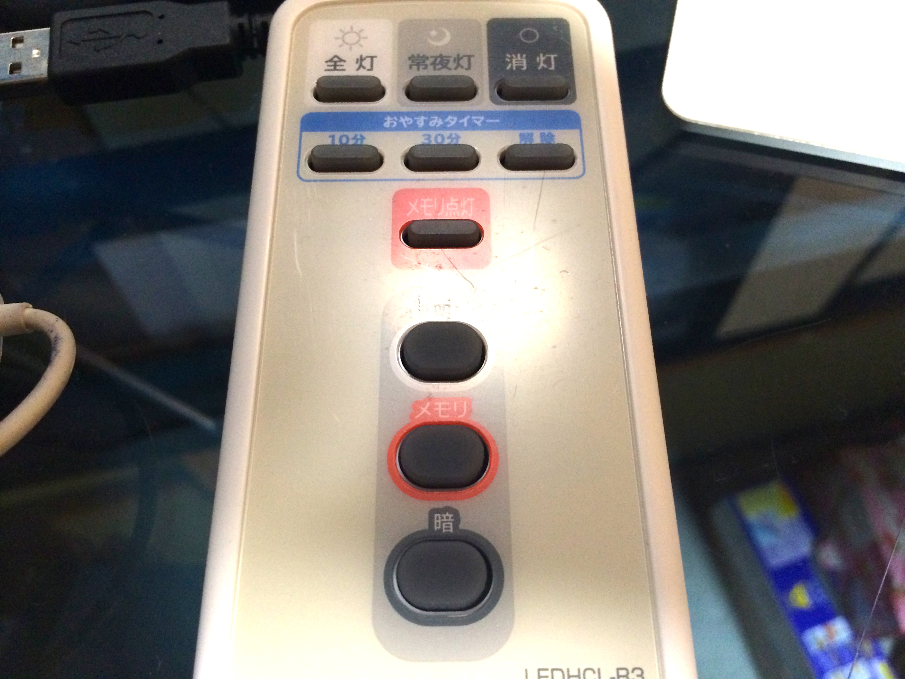

---
categories:
- レビュー
date: Mon, 23 Dec 2013 13:01:35 +0000
slug: post-3812
tags:
- おすすめ
title: 寝ながらスマホと寝落ち防止のために部屋の電気をLEDシーリングライトに変えたよって話
---

蛍光灯は人の目には認識出来ないくらいの速度で明滅しているのをご存知でしょうか？<!--more-->

そのため、付けっ放しで寝ると脳が覚醒状態のため疲れが取れないそうです。

ぼくは週末、ネットやらゲームやらをしつつお酒を飲んだりするので、そのままいつのかにかベッドに横たわってたりたわってなかったりするんですが、朝起きると電気がつけっぱなことがしょっちゅうあります。

そんな時は、決まって起きると疲れてるわけです。寝てる気がしません。

しかも、先日は悪夢を見てしまいました。

かなりの悪夢でした。

<b>どんな悪夢だったか？</b>

なぜかEXILEのメンバーとなって、ステージで踊るんですが、立ち位置も振り付けもわからないというものでした。

で、makidaiでもない、AKiraでもない、なんかネスミスとかな代くらいの人にこっちだからって手を引かれた所で目が覚めました。

全く寝た気がしませんでした。

そこで、なるべく薄暗くできるようなライトを買おうと決意したのでございます。

<b>価格帯によって別れる機能</b>

上位機種だと2〜3万くらいします。

<a href="http://www.amazon.co.jp/exec/obidos/ASIN/B00BR9XVIQ/warawareotoko-22/ref=nosim/" target="_blank" rel="nofollow noopener">シャープ LEDシーリングライトSHARP DL-C614K</a>

posted with <a href="http://kaereba.com" target="_blank" rel="nofollow noopener"> カエレバ</a>

シャープ

売り上げランキング : 67925

<a title="アマゾン" href="http://www.amazon.co.jp/gp/search?keywords=DL-C614K&amp;__mk_ja_JP=%83J%83%5E%83J%83i&amp;tag=warawareotoko-22" target="_blank" rel="nofollow noopener">Amazon</a>

これはピンク色の安らぐ色らしいです。
１０段階のカラーが選べるそうです。

つっても高価なので、ぼくが買ったのはこれです。

<a href="http://www.amazon.co.jp/exec/obidos/ASIN/B0080AN018/warawareotoko-22/ref=nosim/" target="_blank" rel="nofollow noopener">アイリスオーヤマ LEDシーリングライト 【4.5~6畳用】 3200lm 【調光4段階+LED常夜灯】 CL6N-E1</a>

posted with <a href="http://kaereba.com" target="_blank" rel="nofollow noopener"> カエレバ</a>

アイリスオーヤマ

売り上げランキング : 80559

<a title="アマゾン" href="http://www.amazon.co.jp/gp/search?keywords=CL6N-E1&amp;__mk_ja_JP=%83J%83%5E%83J%83i&amp;tag=warawareotoko-22" target="_blank" rel="nofollow noopener">Amazon</a>

<b>機能はシンプル</b>

全部付ける全灯、全部消す消灯、常夜灯と基本的な3つは当然ついてます。

それと２段階暗くすする、そこから明るくするというもの機能があります。
まぁ気持ち暗くなるくらいです。

で、気に入った機能がタイマー機能です。
10分と30分というのがあります。

つけた瞬間からだんだんと消えていきます。で、時間になるとふっと消えます。

こいつはいいです。寝落ち防止、寝る前のスマホいじりにちょうどいいです。

<b>取り付けもシンプル</b>

取り付けの写真ありませんけど、カチって付けるだけです。

こりゃー本当に楽でした。

LEDってことで超寿命なので今までの蛍光灯のように、数ヶ月で切れて交換って作業も必要ありません。

ってことでこいつはおすすめです！！

<b>しんぺーはこう思った</b>

変えて本当に良かった！！

暗くなる感じを撮影したかったんですが、ぼくのカメラスキルがなくて設定がよくわからず、
全部調整されていい感じの明るさで写っちゃうw

ってことでおいおい編集します！

とりあえずおすすめです。年末年始の掃除ついでに蛍光灯を変えて、気分も変えてみてはいかがでしょうか！

ってことで本日は以上です！

<iframe style="width: 120px; height: 240px;" src="http://rcm-fe.amazon-adsystem.com/e/cm?lt1=_blank&amp;bc1=000000&amp;IS2=1&amp;bg1=FFFFFF&amp;fc1=000000&amp;lc1=0000FF&amp;t=warawareotoko-22&amp;o=9&amp;p=8&amp;l=as4&amp;m=amazon&amp;f=ifr&amp;ref=ss_til&amp;asins=B00BR9XVIQ" width="300" height="150" frameborder="0" marginwidth="0" marginheight="0" scrolling="no"></iframe><iframe style="width: 120px; height: 240px;" src="http://rcm-fe.amazon-adsystem.com/e/cm?lt1=_blank&amp;bc1=000000&amp;IS2=1&amp;bg1=FFFFFF&amp;fc1=000000&amp;lc1=0000FF&amp;t=warawareotoko-22&amp;o=9&amp;p=8&amp;l=as4&amp;m=amazon&amp;f=ifr&amp;ref=ss_til&amp;asins=B0080AN018" width="300" height="150" frameborder="0" marginwidth="0" marginheight="0" scrolling="no"></iframe>