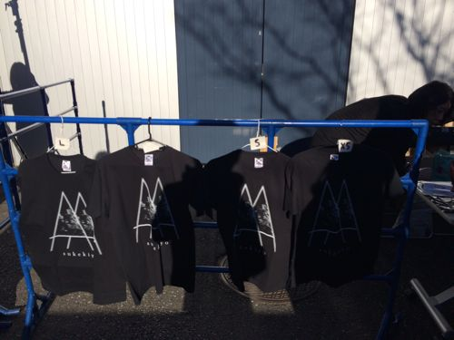

---
categories:
- sukekiyo
date: Sun, 29 Dec 2013 03:41:10 +0000
slug: post-3842
tags:
- DIR EN GREY
- sukekiyo
- 京
title: sukekiyo直前情報。sukekiyo=kyo関連確定
---

さて、本日16時頃、とうとうsukekiyoの正体が明かされるわけですが。ぼくはLIVEには参戦しない予定ですが、物販だけ買いに来ましたので現地より情報をお届けします。
<!--more-->
&nbsp;
&nbsp;

<h2>
<b>SUGIZO氏から事前コメント</b>
</h2>

さて、昨日あたりにsugizo氏がこんなコメントをしておりました。

<blockquote class="twitter-tweet" lang="ja">
更にオープニングアクトのsukekiyo、みんなお察しのとおりのスゲぇバンドだから、覚悟しておくように！続
&mdash; SUGIZO (@SUGIZOofficial) <a href="https://twitter.com/SUGIZOofficial/statuses/416567778674368512">2013, 12月 27</a></blockquote>

むむむーこれは•••

確定か？？

<h3>
<b>今から物販向かいます。
</b>
</h3>

間違ってセンター街の方にむかってたわ

考えてみれば、ぼくアックスくるのはじめて。

渋谷駅からいくなら、渋谷公会堂の方面に歩いていきます。

<iframe src="https://www.google.com/maps/embed?pb=!1m14!1m8!1m3!1d3241.4424626183513!2d139.6999889!3d35.6661058!3m2!1i1024!2i768!4f13.1!3m3!1m2!1s0x60188caf0b2053e5%3A0x3f4df14d8bfc8cd!2sshibuya+ax!5e0!3m2!1sja!2s!4v1388319283475" width="500" height="500" frameborder="0" style="border:0"></iframe>

ちらほら虜がおりますな。

<h4>さて物販は•••</h4>

12:50時点で100人？くらい並んでるかな。

日当たり良好につきあったかいです。

<h5>列が進んだぞ！あと1時間！</h5>

<blockquote class="twitter-tweet" lang="ja">
sukekiyo情報。列は多くても60人くらい。&#10;右翼凱旋カーが行きかう。
&mdash; しんぺー@sukekiyo (@s_s_p_y) <a href="https://twitter.com/s_s_p_y/statuses/417143185752592384">2013, 12月 29</a></blockquote>

今日の模様はニコ生にて放送するそうです。
ただsukekiyoが放送されるかは不明

<blockquote class="twitter-tweet" lang="ja">
[LIVE] The show will be live-streamed as well! <a href="http://t.co/yxdMSxFGjd">http://t.co/yxdMSxFGjd</a> <a href="http://t.co/H1OMoDNPty">pic.twitter.com/H1OMoDNPty</a>
&mdash; SUGIZO (@SUGIZOofficial) <a href="https://twitter.com/SUGIZOofficial/statuses/417152445681131522">2013, 12月 29</a></blockquote>

当日券でる
<blockquote class="twitter-tweet" lang="ja">
[LIVE] SUGIZO TOUR 2013 THRIVE TO REALIZE 渋谷AX公演、遂に今夜開催！当日券は15:00より販売。本公演はニコニコ生放送でも生中継されます。 <a href="http://t.co/yxdMSxFGjd">http://t.co/yxdMSxFGjd</a> <a href="http://t.co/XaKhFyLMlI">pic.twitter.com/XaKhFyLMlI</a>
&mdash; SUGIZO (@SUGIZOofficial) <a href="https://twitter.com/SUGIZOofficial/statuses/417152225064910848">2013, 12月 29</a></blockquote>

<h2>
<b>つに手に入れた！！</b>
</h2>
買えた！！

<h3>これが音源のジャケット</h3>

<h4>これがステッカー</h4>

<h5>これがTシャツ</h5>

<h2>
<b>そしてsukekiyo=KYO関連確定の件</b>
</h2>

EPに書いてありました。ゼメキスと。ゼメキスと。

<h3>
<b>さてLIVEに参戦するか否か・・・</b>
</h3>

結局LIVEには当日券で参加することにいたしました！！！その結果もあげております！！どうぞ