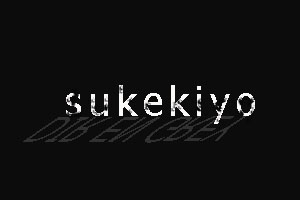
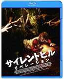
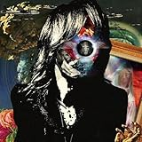

---
categories:
- sukekiyo
date: Mon, 30 Dec 2013 01:30:11 +0000
slug: post-3865
tags:
- DIR EN GREY
- LIVE
- sukekiyo
- 京
title: いいか昨日はsukekiyoのLIVEじゃなくてSUGIZOのLIVEだったんだからなってことでLUNA SEAすらちゃんと聞いたことのないぼくのSUGIZOの感想
---

いや〜一夜明けまして、冷静な思考で昨日のSUGIZOのLIVEのレビューというか感想を書きたいと思います。<!--more-->
&nbsp;
&nbsp;

昨日はどうしても冷静になれませんでした•••だって、だって武田真治（後述）

実はぼく、LUNA SEAってちゃんと聞いたことないんですよね。
ぼくが割とちゃんと聞いてるバンドって大体PIERROT以降なんですよ。

ただ今回sukekiyo目当てとは言え、せっかくの機会なのでそのまま残ってSUGIZOを見ることにしました。
※LIVEの途中で帰るのも、目当て見たから帰るのも個人の自由だと思います。

<h2>
<b>楽器の配置から嫌な予感しかしなかった</b>
</h2>

パーカッション的なのとDJブース的なのと中央の機材。。。これは今年のサマソニの小室哲哉を彷彿とさせて、なんか嫌な予感しかしなかった•••

なんつーかクラブ的な？

なんつーか重低音の無限ループの曲に対して、オーディエンスが「フー」的な？

眠くなるし、知らない曲だとこれぽかーんですわ。
例えばメリーとSIMとかがやったLIVEの合間のDJとかダイノジ的なノリならいいんすよ。

でも、でも、知らない曲を重低音でry)

で、予感的中。

知らない曲を重低音の無限ループでかけまくる。

しかし•••

<h3>
<b>これっていわゆるなんとかってやつですか？</b>
</h3>

音楽好きだけどジャンルとかよくわかんねーや。
でもこれあれですよね。オルタナってやつ？違う？違うか

でも、不協和音に即興的な感じのやつですよね

なんつーか久しぶりにギターを短く感じさせる人を見たって感じがします。主観的な表現ですが•••

で、LIVEの中盤、バイオリンがでてきたあたりでようやく自分のテンションも「お」ってなってきました。

そして•••

<h2>
<b>武田真治</b>
</h2>

ここが今日のぼくのマックスです。ピークです。

おかげで悪夢を見ました。サイレントヒルの世界観で学園生活を送り、気持ち悪いゲイの教師に目を付けられるという•••

<a href="http://www.amazon.co.jp/exec/obidos/ASIN/B00EID1PT0/warawareotoko-22/ref=nosim/" rel="nofollow" target="_blank">サイレントヒル:リベレーション [Blu-ray]</a>
posted with <a href="http://kaereba.com" rel="nofollow" target="_blank">カエレバ</a>

アデレイド・クレメンス Happinet(SB)(D) 2013-12-03    

<a href="http://www.amazon.co.jp/exec/obidos/ASIN/B00EID1PT0/warawareotoko-22/ref=nosim/" rel="nofollow" target="_blank">Amazon.co.jp で詳細を見る</a>

<a href="http://www.amazon.co.jp/exec/obidos/ASIN/B00EID1SK6/warawareotoko-22/ref=nosim/" rel="nofollow" target="_blank">サイレントヒル:リベレーション [DVD]</a>
posted with <a href="http://kaereba.com" rel="nofollow" target="_blank">カエレバ</a>

アデレイド・クレメンス Happinet(SB)(D) 2013-12-03    

<a href="http://www.amazon.co.jp/exec/obidos/ASIN/B00EID1SK6/warawareotoko-22/ref=nosim/" rel="nofollow" target="_blank">Amazon.co.jp で詳細を見る</a>

<h3>
<b>武田真治の存在感は異常</b>
</h3>

スペック
<ul>
<li>全身ギラギラの衣装</li>
<li>凄い筋肉</li>
<li>動きがゲイっぽい</li>
<li>ノリの変態感が異常値</li>
</ul>

しかしその結果、ステージ全体のクレイジー感が上がり、そしてソウルフルなサックスにより、それまでのステージには無かった彩りを添えていた。

そして•••

SUGIZO氏への絡みかたが•••ねっとりギットリどくどくびちゃびちゃ•••

これは同日に晴美で開催されている某イベントで売っている薄い本にでてきてもおかしくない展開•••

<blockquote class="twitter-tweet" lang="ja">
見える、見えるぞ！腐属性の人たちがたけだしんじとスギゾーのあれをあれしてこうする絵を年内に書き上げる姿が
&mdash; しんぺー@sukekiyo (@s_s_p_y) <a href="https://twitter.com/s_s_p_y/statuses/417254311404388352">2013, 12月 29</a></blockquote>

<h4>
<b>そのあとのTezyaさんもよかった</b>
</h4>

ほんと遠目に見たらキレイな女の人ですわ

それでいて声は低くて歌声はヘビーでした。

カッコ良かった！

その後のSUGIZO氏のMCの内容については、奴隷ではないのでぼくが語ることではないと考え割愛します。

とにかくよかったよ。もう。

<h2>
<b>しんぺーはこう思った</b>
</h2>

良いLIVE納めができました。
とにかく武田真治だった！

いやー本当に良いLIVEでした。
ハイライトはsukekiyoではなく•••間違いなく武田真治

めちゃイケでのお笑い芸人武田真治（←）しか知らない人が多かったと思いますが、そのサックスのソウルフル感が凄かったよ。

ほんと•••

お疲れさまでした。

<blockquote class="twitter-tweet" lang="ja">
おつかれさま <a href="http://t.co/NrpJmAgOS4">pic.twitter.com/NrpJmAgOS4</a>
&mdash; しんぺー@sukekiyo (@s_s_p_y) <a href="https://twitter.com/s_s_p_y/statuses/417463482779312128">2013, 12月 30</a></blockquote>

<a href="http://www.amazon.co.jp/exec/obidos/ASIN/B00ATRPFD6/warawareotoko-22/ref=nosim/" rel="nofollow" target="_blank">VESICA PISCES</a>
posted with <a href="http://kaereba.com" rel="nofollow" target="_blank">カエレバ</a>

SUGIZO WAKYO INC. 2013-03-06    

<a href="http://www.amazon.co.jp/exec/obidos/ASIN/B00ATRPFD6/warawareotoko-22/ref=nosim/" rel="nofollow" target="_blank">Amazon.co.jp で詳細を見る</a>

