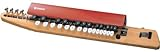

---
categories:
- sukekiyo
date: Mon, 30 Dec 2013 03:29:36 +0000
slug: post-3871
tags:
- DIR EN GREY
- LIVE
- sukekiyo
- 京
title: sukekiyoのメンバー情報（京、匠、YUCHI、UTA、未架）
---

ハローしんぺー(<a href="https://twitter.com/s_s_p_y" target="_blank">@s_s_p_y</a> )です。
オフィより詳しくて、wikiよりも有用なsukekiyo情報サイト「ガジェットゾンビィパラサイト」へようこそ。

<!--more-->

あの長髪長身集団は誰ぞ？誰ぞ？気になるsukekiyoメンバーを特定された方がちらほらいるようですのでまとめます。

<h2>
<b>sukekiyoメンバー</b>
</h2>

Vo.京　from DIR EN GREY
Gt.匠  ex.RENTRER EN SOI
Ba.裕地 from kannivalism
Dr.未架 ex.RENTRER EN SOI
GT.UTA ex.9goats black out

<h3>京</h3>
ゲイを広言し，高級化粧水を使うアラ50の男性
最近では女性誌にも出たりして活動の幅を広げつつある
<blockquote class="twitter-tweet" lang="ja">
sukekiyo vo.京 <a href="http://t.co/X4OhvXAyiF">pic.twitter.com/X4OhvXAyiF</a>
&mdash; しんぺー@sukekiyo (@s_s_p_y) <a href="https://twitter.com/s_s_p_y/statuses/417475324553617408">2013, 12月 30</a></blockquote>

間違えた。
我らが京様です。白いライダースの一番上だけを止めて、黒インナーに黒スキニー、片手の赤手袋、赤いマイクシールド
<blockquote class="twitter-tweet" lang="ja">
間違えた•••&#10;sukekiyo vo.京 <a href="http://t.co/uzLX8cpLy8">pic.twitter.com/uzLX8cpLy8</a>
&mdash; しんぺー@sukekiyo (@s_s_p_y) <a href="https://twitter.com/s_s_p_y/statuses/417475422746456064">2013, 12月 30</a></blockquote>

<h3>匠</h3>
今は解散してしまっているRENTRER EN SOIのギター
裏方仕事が多いようですね。THE FINALのunpluged verはこの人がピアノを弾いているらしい。
LOTUSのプログラミング名にも記載ありとのこと
<blockquote class="twitter-tweet" lang="ja">
sukekiyo Gt.匠 ex.RENTRER EN SOI <a href="http://t.co/YNHuv9noGy">pic.twitter.com/YNHuv9noGy</a>
&mdash; しんぺー@sukekiyo (@s_s_p_y) <a href="https://twitter.com/s_s_p_y/statuses/417479421918867456">2013, 12月 30</a></blockquote>

<h3>裕地</h3>
現在baroqueの活動再会にあたり、事実上活動休止中ぽいのがkannivalism
本人も当日呟いていたみたいwこういう情報をキャッチアップできるようになりたい
<blockquote class="twitter-tweet" lang="ja">
いい天気！いいライブしてきます！ <a href="http://t.co/hOL2nrXVym">http://t.co/hOL2nrXVym</a>
&mdash; YUCHI (@yuchivalism) <a href="https://twitter.com/yuchivalism/statuses/417151217039441920">2013, 12月 29</a></blockquote>

kannivalismの曲はitunesからダウンロードできます。

<a href="https://itunes.apple.com/jp/album/monokuromu-ep/id267874831?uo=4&at=11ld5P" target="itunes_store">モノクローム - EP - kannivalism</a>

<a href="https://itunes.apple.com/jp/album/helios/id359574552?uo=4&at=11ld5P" target="itunes_store">helios - kannivalism</a>

<a href="https://itunes.apple.com/jp/album/ritori-single/id192116735?uo=4&at=11ld5P" target="itunes_store">リトリ- Single - kannivalism</a>

<h3>未架</h3>
匠と同じくRENTRER EN SOIメンバー。現在はforbidden days rhapsodyというプロジェクトを行っているそうです。
<blockquote class="twitter-tweet" lang="ja">
sukekiyo Dr.未架 exRENTRER EN SOI <a href="http://t.co/22oOvUj05c">pic.twitter.com/22oOvUj05c</a>
&mdash; しんぺー@sukekiyo (@s_s_p_y) <a href="https://twitter.com/s_s_p_y/statuses/417479589586153472">2013, 12月 30</a></blockquote>

ちなみにAmazonで在庫ありでした。

<a href="http://www.amazon.co.jp/exec/obidos/ASIN/B002VA8E0K/warawareotoko-22/ref=nosim/" rel="nofollow" target="_blank" >canticum</a>

<h3>UTA</h3>
ヴァイオリンを横にした感じの楽器を、棒状のものを使用して弾いていました。
あとエレキギターも弾いてました。
新情報でましたので修正します。
9goats black outというバンドでギターをしていた方だそうです。2013年の2月に解散しているそうです。
オフィはこちら
<a href="http://9goats.net/pc/artist_prof.htm" target="_blank">http://9goats.net/pc/artist_prof.htm</a>

ちなみに楽器はこれです。

<a href="http://www.amazon.co.jp/exec/obidos/ASIN/B000Y7T3WA/warawareotoko-22/ref=nosim/" rel="nofollow" target="_blank">YAMAHA SH-30NR Violyre ヴィオリラ</a>
posted with <a href="http://kaereba.com" rel="nofollow" target="_blank">カエレバ</a>

 ヤマハ     

<h2>
<b>しんぺーはこう思った</b>
</h2>

こうきましたか。
全く関係のないジャンルからくるかと思ってましたが。ただ、どちら様も技巧派のようで、もっとじっくりと見て聞いてってしたかったです。

もう京しか見てなかったわ。

ということで本日のCOUNT DOWN JAPAN13/14が虜のLIVE納めですな。
行ってる人そんなに多くない気がしますが。

とにかく今年１年お疲れさまでした！来年は年明け早々に新曲だったりファンクラブ限定ツアーだったり、そのあとはいよいよ武道館！

武道館直後にしばらく活動休止とかなければいいけどな！ソロに専念とか言ってね。
ま、心配しても仕様がない！来年も全力で振り回されるだけ！

おつかれさま！