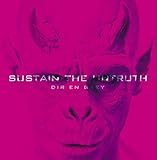

---
categories:
- sukekiyo
date: Tue, 31 Dec 2013 15:00:48 +0000
slug: post-3891
tags:
- DIR EN GREY
- sukekiyo
- 京
title: 京の新バンド「sukekiyo」始動
---

新年あけましておめでとうございます。新年一発目のネタはDIR EN GREYボーカルの京の新バンド「sukekiyo」についてです！<!--more-->
&nbsp;
&nbsp;

改めまして、新年あけましておめでとうございます。昨年より始めました当「ブログガジェットゾンビィパラサイト」ですが無事に年を越すことができました。
皆様のご支援あってのものでございます。

11月に入ってからのsukekiyoネタがヒットして一時はオフィシャルの上にまでいってしまいました。

本年もDIR EN GREY情報、sukekiyo情報とApple、ガジェット系の情報を中心に更新していきたいと思っておりますので、定期的にのぞいていただけますと幸いです。

それでは前置きが長くなりましたが、sukekiyoの最新情報をお届けいたします！

<h2>
<b>sukekiyo情報まずはおさらい</b>
</h2>

<a style="color:#0070C5;" href="https://www.warawareotoko.com/2013/11/17/post-3591/" target="_blank">sukekiyo=DIR EN GREY？突如現れた無名の新人バンド | Gadget Zombie Parasite</a>  

<a style="color:#0070C5;" href="https://www.warawareotoko.com/2013/12/29/post-3855/" target="_blank">速報！sukekiyo=KYOのバンドでした！ | Gadget Zombie Parasite</a>  

<a style="color:#0070C5;" href="https://www.warawareotoko.com/2013/12/30/post-3871/" target="_blank">sukekiyo後始末！虜特定班からの気になるメンバー情報 | Gadget Zombie Parasite</a>  

<h3>
<b>sukekiyoついに始動。元旦より世界111カ国に向けてMVを配信</b>
</h3>

MVはこちら

再生は<a href="https://itunes.apple.com/jp/music-video/aftermath/id768011894?uo=4&amp;at=11ld5P" target="itunes_store">こちら</a>

「歪みのなかの美しさ」を表現している作品とのこと

なお、オフィシャルTwitterアカウントも開設
<blockquote class="twitter-tweet" lang="ja">
京 サイドプロジェクトとして「sukekiyo」始動。(S) <a href="http://t.co/hwPAiYLzLw">http://t.co/hwPAiYLzLw</a>
&mdash; sukekiyo (@sukekiyo_band) <a href="https://twitter.com/sukekiyo_band/statuses/417560387756634113">2013, 12月 30</a></blockquote>

さらに各メンバーのブログです。
匠 <a href="http://ameblo.jp/takumixofficial/" target="_blank">http://ameblo.jp/takumixofficial/</a>

YUCHI <a href="http://ameblo.jp/yuchi-bassist/" target="_blank">http://ameblo.jp/yuchi-bassist/</a>

未架 <a href="http://ameblo.jp/mikan255/" target="_blank">http://ameblo.jp/mikan255/</a>

SHINJI <a href="http://www.horipro.co.jp/talent/PM008/" target="_blank">http://www.horipro.co.jp/talent/PM008/</a>

あ、間違えた。UTAさんのブログはないみたいです。

<h2>
<b>しんぺーはこう思った</b>
</h2>

今年もDIR EN GREY、sukekiyo、kyoから目が離せないぜ！

<a href="http://www.amazon.co.jp/exec/obidos/ASIN/B00FY10G7M/warawareotoko-22/ref=nosim/" rel="nofollow" target="_blank">SUSTAIN THE UNTRUTH(完全生産限定盤)(DVD付)</a>
posted with <a href="http://kaereba.com" rel="nofollow" target="_blank">カエレバ</a>

DIR EN GREY SMD itaku (music) 2014-01-22    

<a href="http://www.amazon.co.jp/exec/obidos/ASIN/B00FY10G7M/warawareotoko-22/ref=nosim/" rel="nofollow" target="_blank">Amazon.co.jp で詳細を見る</a>

<a href="http://www.amazon.co.jp/exec/obidos/ASIN/B00FY10GJ0/warawareotoko-22/ref=nosim/" rel="nofollow" target="_blank">SUSTAIN THE UNTRUTH</a>
posted with <a href="http://kaereba.com" rel="nofollow" target="_blank">カエレバ</a>

DIR EN GREY SMD itaku (music) 2014-01-22    

<a href="http://www.amazon.co.jp/exec/obidos/ASIN/B00FY10GJ0/warawareotoko-22/ref=nosim/" rel="nofollow" target="_blank">Amazon.co.jp で詳細を見る</a>

<a href="http://www.amazon.co.jp/exec/obidos/ASIN/B00FY10G86/warawareotoko-22/ref=nosim/" rel="nofollow" target="_blank">SUSTAIN THE UNTRUTH(初回生産限定盤)(DVD付)</a>
posted with <a href="http://kaereba.com" rel="nofollow" target="_blank">カエレバ</a>

DIR EN GREY SMD itaku (music) 2014-01-22    

<a href="http://www.amazon.co.jp/exec/obidos/ASIN/B00FY10G86/warawareotoko-22/ref=nosim/" rel="nofollow" target="_blank">Amazon.co.jp で詳細を見る</a>

