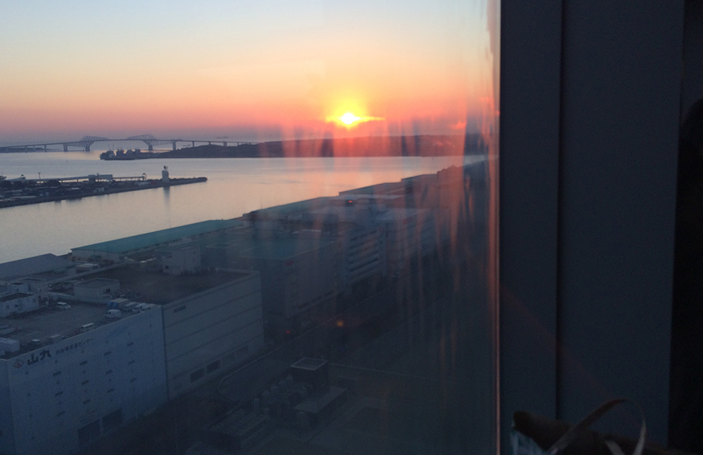

---
categories:
- ブログ
date: Wed, 01 Jan 2014 15:31:22 +0000
slug: post-3902
title: テレコムセンターで初日の出を見る際に気をつけたい5つのポイント
---

新年ry)今年もry)ってことで初日の出を見に行ってきました！場所は定番のスポットで色んな雑誌なんかにも紹介されているテレコムセンターです！<!--more-->
&nbsp;
&nbsp;

はい、初日の出以外の写真を撮るのをすっかり忘れておりました。

<h2>初日の出スポット「テレコムセンター」の場所はここだ！</h2>

場所はここです。

<iframe src="https://www.google.com/maps/embed?pb=!1m18!1m12!1m3!1d3243.412259991959!2d139.77941!3d35.617562!2m3!1f0!2f0!3f0!3m2!1i1024!2i768!4f13.1!3m3!1m2!1s0x60186207725e3dcd%3A0x663d0541500aeb9a!2z44OG44Os44Kz44Og44K744Oz44K_44O844OT44Or!5e0!3m2!1sja!2s!4v1388587443403" width="600" height="450" frameborder="0" style="border:0"></iframe>

ここの20階で初日の出を見ることができます。

<h2>注意事項</h2>

これだけは肝に銘じとけってやつ

<h3>入場料がかかる</h3>
大人800円ほどかかります。
ただし、コーヒー、ココア、その他の飲み物が一杯飲めます。

<h3>駐車場は８時に閉まる</h3>
車で行くなら、駐車場のキャパは200なので、ちょいと早めにいきましょう。
混雑してもたついていると、場所とりもままなりません。

そして、この駐車場朝８時で閉まります。次に開くのは下手したら正月休み開けの可能性もあります。
終わったら、寄り道、居眠りせずにすぐに出ましょう。

<h3>防寒対策</h3>
5時オープンと同時に入れば結構いい場所とりができますが、その分日の出まで待つ時間が増えますので、寒さ対策をしっかりしていきましょう。

<h3>見えるのは２面</h3>
東の地平線に日の出が見えるわけですけど、東側からだけじゃなくて、もう一方の側面からも見ることができます。
ただし、東の角には柱があって、邪魔なので場所によってはじゃっかん南よりでも問題ないでしょう。

下に載せますけど、びったり東側に陣取ったら、じゃっかん日がでてくる所からずれちゃいました。

人が多く陣取っているからといって、ベストポジションじゃない場合があります。気をつけましょう。

<h3>かなり混む</h3>
結構混みます。満員電車並に身動きとれなくなりますので色々と気をつけましょう。

<h2>日の出</h2>

<iframe width="500" height="281" src="//www.youtube.com/embed/miaUayOHyB8?rel=0" frameborder="0" allowfullscreen></iframe>

<h2>しんぺーはこう思った</h2>
初日の出を見に行くのってすんげー疲れます。
毎年いってますけど、くっそ眠くなり、途中紺コンビニの駐車場とかに車を止めて寝ちゃいます。

でも、車で寝るのって疲れませんか？

疲れると眠くなりますよね？

でも車で寝ると疲れますよね？

っていう無限ループを繰り返して、結局は疲れ果てて帰ってくるわけです。

今日も帰ってきたら、すぐにベッドイン。そして初夢はまた若干の悪夢でした。

なので、事前にしっかり休んでから行くか、どっかでちゃんと休むか。
それかもう電車で行くか。

ま、どちらにしろお気をつけて！

って所で新年２発目は来年の初日の出のためのネタでした！