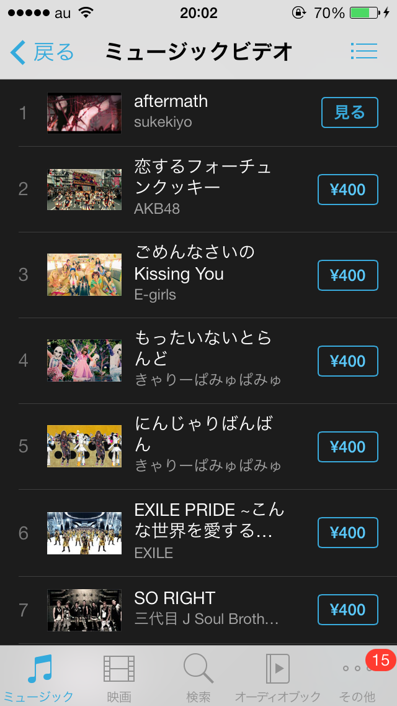
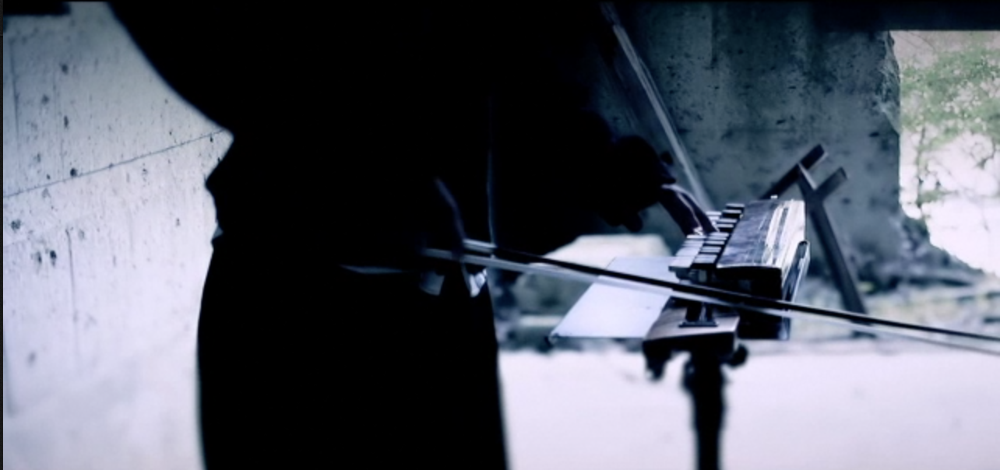
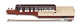

---
categories:
- sukekiyo
date: Wed, 01 Jan 2014 17:14:19 +0000
slug: post-3912
tags:
- DIR EN GREY
- sukekiyo
- 京
title: sukekiyoのMV「aftermath」がiTunesランキング１位獲得！
---

<a href="https://itunes.apple.com/jp/music-video/aftermath/id768011894?uo=4&amp;at=11ld5P" target="itunes_store">ダウンロード</a>

2014年1月1日ダウンロード開始の我らがsukekiyoのMV「aftermath」がiTunesのダウンロードランキング1位を獲得しました！

<h2>MVの内容はというと•••</h2>
暗い場所に、張り巡らされた赤い綱に少女が縛られ、その周りでメンバーが演奏しているというもの。

最初、本物の人間が吊るされているのかと思いましたが、これはドールでしょう。

そして、この縛りですが美術のスタッフさんが計算しつつ作ったと思ってたら、緊縛アーティストなる方の「作品」だそうです。

<blockquote class="twitter-tweet" lang="ja">
ディルアングレーの京さんの新しいバンドsukekiyoのMVの中で一鬼のこの縛りが扱われています。&#10;一年分の集中力を使い丁寧に仕上げました。&#10;iTunesにて配信中&#10;<a href="https://t.co/6W9H7Hpxr8">https://t.co/6W9H7Hpxr8</a> <a href="http://t.co/UhYtvIy4P5">pic.twitter.com/UhYtvIy4P5</a>
&mdash; 一鬼のこ (@hajimekinoko) <a href="https://twitter.com/hajimekinoko/statuses/418394145980301312">2014, 1月 1</a></blockquote>

奥がふけぇなぁ

<h3>ドールとは•••</h3>
「オリエント工業」か、もしくは「ラブドール」でぐぐってみましょう。
ちなみに<b>閲覧注意</b>です。

って思ったら人間ぽいぞ•••ほんとか？だとしたらどうやって吊ってるんだ•••すげぇ

<blockquote class="twitter-tweet" lang="ja">
sukekiyo&#10;「after math」&#10;のPVスチールの一部カットです。&#10;&#10;人形ではないです。&#10;生きてる本人ここです。 pic.twitter.com/2bVSIwajgP
&mdash; 奏ミチコ (@michi_k) 2014, 1月 1</blockquote>

<h2>MVから解ったこと</h2>
UTA氏の使用している楽器は、おそらく悠弓という楽器だと思われます。

鍵盤的なものがあり、弓で弾く楽器です。

<h3>これです。</h3>

Amazonで売ってますので良かったどうぞw

<a href="http://www.amazon.co.jp/exec/obidos/ASIN/B0083DEKN4/warawareotoko-22/ref=nosim/" rel="nofollow" target="_blank">弓弾き大正琴 スズキ 悠弓</a>
posted with <a href="http://kaereba.com" rel="nofollow" target="_blank">カエレバ</a>

 スズキ     

<a href="http://www.amazon.co.jp/exec/obidos/ASIN/B0083DEKN4/warawareotoko-22/ref=nosim/" rel="nofollow" target="_blank">Amazon.co.jp で詳細を見る</a>

<h2>撮影現場は栃木県の大谷採石場</h2>

以前の記事でも紹介しております。
栃木県の大谷採石跡ってところです。

そりゃーもう荘厳な所でした。圧倒的な迫力で、ダンジョン感半端なかったです。

<map id="map_95stjbqs" name="map_95stjbqs"><area coords="0,0,599,388" href="images/DSC01014.jpg" alt="" shape="rect" /></map>
<a href="https://www.warawareotoko.com/2013/12/01/post-3679/">sukekiyoのアー写撮影現場と言われる「大谷採石跡」いってきたぞ！ | Gadget Zombie Parasite</a>

以下ぼくが撮影した写真をつなげた動画です。

<h3>aftermath撮影現場「大谷採石跡」</h3>

<iframe width="500" height="281" src="//www.youtube.com/embed/RzU3YX6KLZk?rel=0" frameborder="0" allowfullscreen></iframe>

<h2>しんぺーはこう思った。</h2>

「aftermath」ってどういう意味だろう。
色々な所で見かける単語。確か海外のバンドでもそう言う名前あったしな•••
と思って調べてみました。

「戦争や災害の直後の状態」

例えば、地震で揺れている状態ではなくて、その後の荒れた状態のことだと思います。

これが何を意味するのか•••

<a href="https://itunes.apple.com/jp/music-video/aftermath/id768011894?uo=4&at=11ld5P" target="_blank" >aftermath</a>

400円

(2014.01.02時点)

<a href="https://itunes.apple.com/jp/artist/sukekiyo/id768011895?uo=4&at=11ld5P" target="_blank" >sukekiyo</a>

posted with <a href="http://pochireba.com" rel="nofollow" target="_blank">ポチレバ</a>

