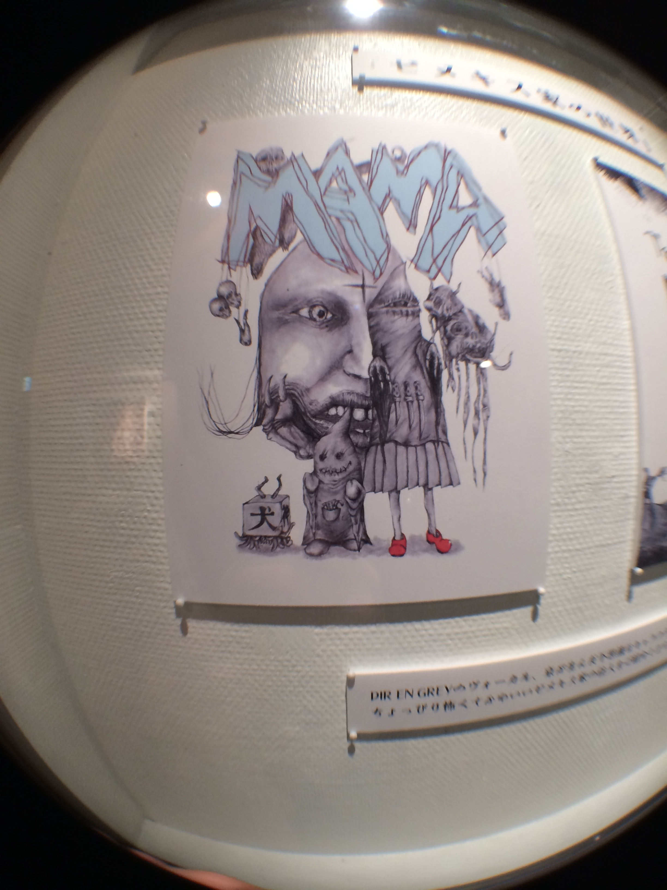
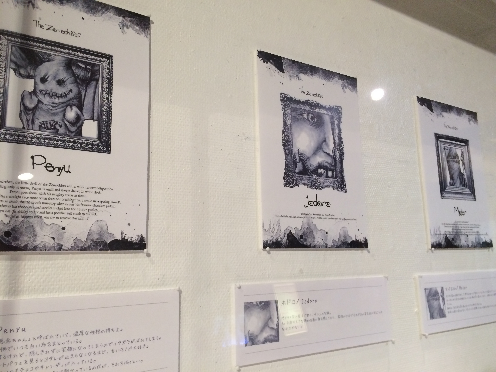
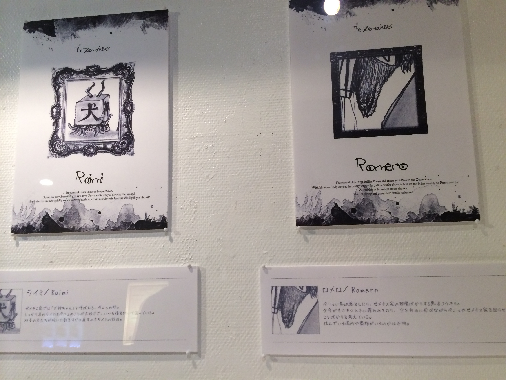
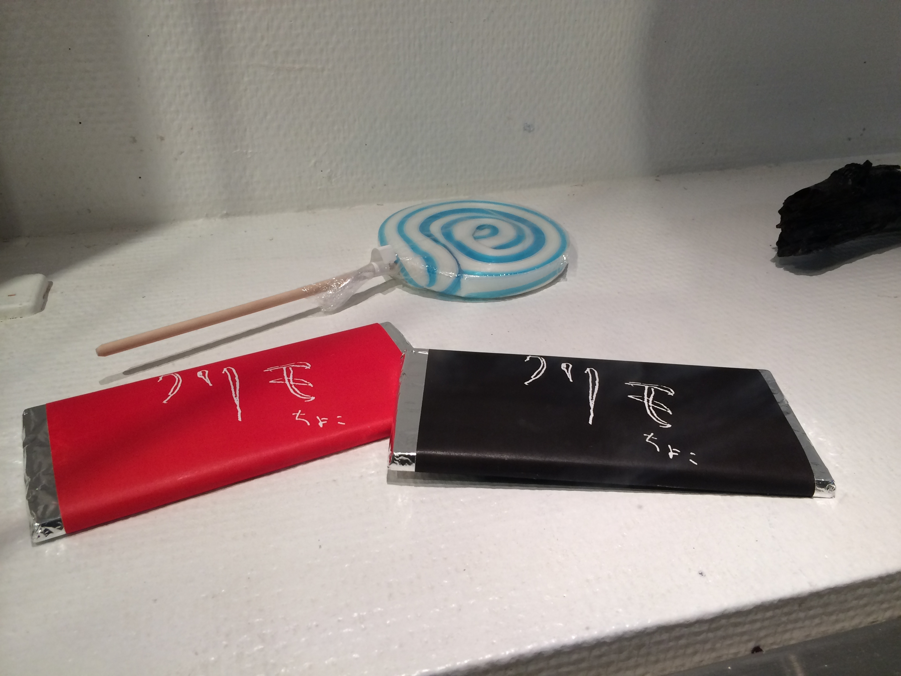
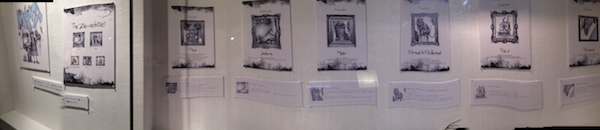
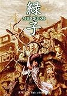

---
categories:
- DIR EN GREY
date: Fri, 03 Jan 2014 16:53:38 +0000
slug: post-3930
tags:
- DIR EN GREY
- 京
title: ゼメキスの世界いってきた！6日までなのでまだの人急げ！
---

sukekiyoのLIVEの前くらいですが、ゼメキスの原画が飾ってあるUPLINKに行ってきました。

<h2>ゼメキスの世界の概要</h2>
飾ってるのは悪意ちゃん含め、各キャラと全員集合のもの1枚ずつでした。

会場はかなり狭くて、本当に原画が飾ってあるというだけでした。

【以下全写真になります。（ネタバレ）】
撮影OKだったので以下にあげます。

iPhoneのパノラマ機能で撮影

<h2>メインは黒坂圭太監督のトークでした。</h2>
むしろそれよりもメインなのはAgitated Screams of Maggotsや輪郭のPVのアニメーションを作った黒坂圭太氏のトークの方だったでしょう。

<blockquote class="twitter-tweet" lang="ja">
UPLINK２Fのカウンターに黒坂圭太監督のドローイングが展示中！『緑子／MIDORI-KO』DVD発売記念アンコール上映＋最新作『輪郭』は明日まで。21:00～上映です！<a href="http://t.co/ZEMHt7eWAS">http://t.co/ZEMHt7eWAS</a> <a href="http://t.co/ONGCbp4F58">pic.twitter.com/ONGCbp4F58</a>
&mdash; UPLINKイベント担当 (@UPLINKFACTORY) <a href="https://twitter.com/UPLINKFACTORY/statuses/416160343207858176">2013, 12月 26</a></blockquote>

ぼくはまったくノーチェックだったので完全スルーで写真だけ撮って、そそくさと帰ってきてしまいました。

<h3>黒坂圭太監督とは•••</h3>
輪郭やAgitated Screams of MaggotsのPVのアニメーションを作った人です。この人を起用しようと提案したのはToshiyaだそうです。

<blockquote class="twitter-tweet" lang="ja">
『緑子／MIDORI-KO』DVD発売記念アンコール上映＋最新作『輪郭』 - 上映中～12/27（金） | UPLINK <a href="http://t.co/fRe8q0RFrk">http://t.co/fRe8q0RFrk</a> <a href="https://twitter.com/uplink_jp">@uplink_jp</a>さんから
&mdash; しんぺー@sukekiyo (@s_s_p_y) <a href="https://twitter.com/s_s_p_y/statuses/419146149983817728">2014, 1月 3</a></blockquote>

なんっつーか、こういう世界観ってマゴッツのPV見るまで見た事無かった•••

<iframe width="500" height="375" src="//www.youtube.com/embed/jEYvXLgLz0Y?rel=0" frameborder="0" allowfullscreen></iframe>

<iframe width="500" height="375" src="//www.youtube.com/embed/FX6U_ZWKQfc?rel=0" frameborder="0" allowfullscreen></iframe>

このMIDORI-KOのDVDはAmazonでも売ってるみたいです。

<a href="http://www.amazon.co.jp/exec/obidos/ASIN/B00H3L6XHS/warawareotoko-22/ref=nosim/" rel="nofollow" target="_blank">緑子/MIDORI-KO [DVD]</a>
posted with <a href="http://kaereba.com" rel="nofollow" target="_blank">カエレバ</a>

涼木さやか ミストラルジャパン 2014-01-05    

<a href="http://www.amazon.co.jp/exec/obidos/ASIN/B00H3L6XHS/warawareotoko-22/ref=nosim/" rel="nofollow" target="_blank">Amazon.co.jp で詳細を見る</a>

<h2>しんぺーはこう思った</h2>

ゼメキス家のTwitterってなんか独特の世界観というか、ああいう駆け引きは果たしてTwitterに適しているのかってのがちょっと疑問です。

だいたいタイムラインに溺れてちゃうから、それぞれのツイートをカバーするのってちょいと難しい気がします。

sukekiyo、ゼメキスと2014年どういった展開を見せていくのか楽しみですな〜

と言った所で本日は以上です。