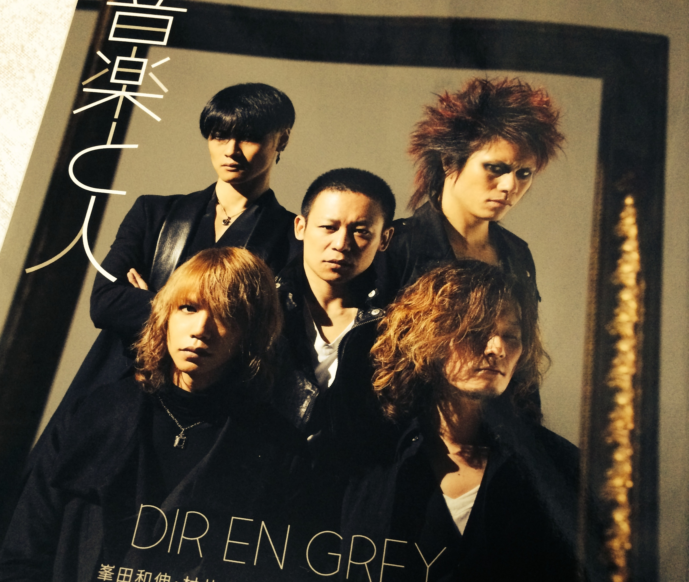

---
categories:
- DIR EN GREY
date: Wed, 08 Jan 2014 16:27:48 +0000
slug: post-3972
tags:
- DIR EN GREY
title: 最近のDIR EN GREY関連の刊行物「音楽と人」〜ソロ活動について〜
---

今月の「音楽と人」はDIR EN GREYづくし！まだの人これだけは買いですよ！

<h2>音楽と人のメンバーインタビュー要約</h2>
<ul>
<li>京のソロについてどう思うか</li>
<li>新曲「SUSTAIN THE UNTRUTH」について</li>
</ul>

それぞれのメンバーに対して京のソロについてどう思うかが聞かれています。

そして、それがバンドの雰囲気をどう変えたか•••

さらに、その雰囲気が新曲にどう反映しているのか

そういった話題が中心です。

<h3>見所は巻頭のインタビューだけじゃない！</h3>

巻頭のメンバーインタビューの次は、その直後にあるAA=の上田剛士とのスペシャル対談に目を通しましょう。

この記事を書いている現在、ぼくはまだ読んでいませんので、ここでは触れません。

次に薫虜なら忘れてはいけない、「薫の読弦」
今回から幼少期のエピソードが語られるようになるみたいです。

ちなみに少しだけ紹介すると、小さい頃誘拐未遂にあったみたいですw

<h2>しんぺーはこう思った</h2>

今月からですか？サイズがひと回りくらい小さくなりました！

恐らくカバンなどに入れて持ち運びしやすいようにって配慮ですね。
最近女性のファッション誌によく見られる傾向でしたが、音楽誌にもその流れがきましたね。

っていっても音楽誌買う人なんて、掲載バンドのファンとかで、キレイな写真を見たいって人が多いはずだから小さいのはどうなんでしょうかね。

紙質もちょこっと祖末な感じになってる。
いつもみたいにテラテラした輝かしい紙じゃなくて、ちょい新聞ぽい手触り

これでいいのかしら•••

こういう本は、我々からしたら読むっていう役割を果たしたら、保存って機能を発揮しだすわけですよ。

そうなると、やっぱりキレイなままがいいわけです。

ともすると痛みやすそうな、こんな素材でいいんでしょうか。。。

<h3>ソロでも心配ナイッシィング</h3>

ぼくとしては、京がソロを始めようが何しようが全く心配とか戸惑いはないんですが、今回の記事を読んで、よりその確信が固くなりましたよ。

だいたい、この前のSUGIZOのLIVE全員来てたしね。

といったところで、本日は以上です！おやすみなさい！

<a href="http://www.amazon.co.jp/exec/obidos/ASIN/B00HDOZJ5C/warawareotoko-22/ref=nosim/" rel="nofollow" target="_blank">音楽と人 2014年 02月号 [雑誌]</a>
posted with <a href="http://kaereba.com" rel="nofollow" target="_blank">カエレバ</a>

 音楽と人 2014-01-07    

<a href="http://www.amazon.co.jp/exec/obidos/ASIN/B00HDOZJ5C/warawareotoko-22/ref=nosim/" rel="nofollow" target="_blank">Amazon.co.jp で詳細を見る</a>

