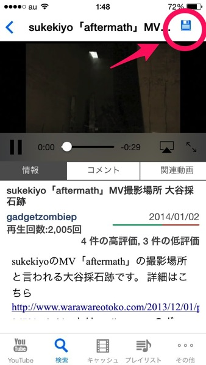
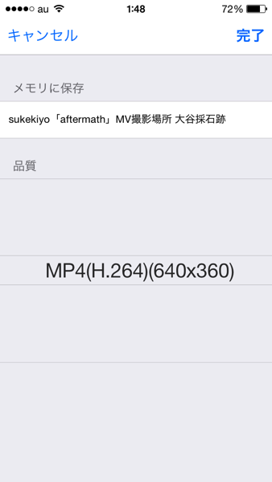
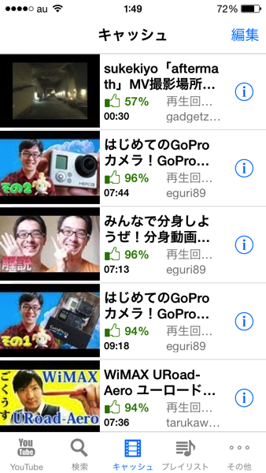
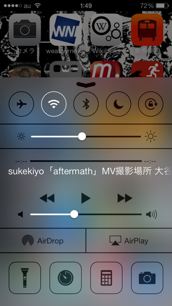

---
categories:
- アプリ
date: Fri, 10 Jan 2014 17:05:09 +0000
slug: post-4003
tags:
- アプリ
title: Youtubeをキャッシュで保存してオフライン再生できるアプリ「Mytube」が神過ぎるよって話
---

 

<a href="https://itunes.apple.com/jp/app/mytube-youtubega-da-haokide/id595560643?mt=8&uo=4&at=11ld5P" target="_blank" >MyTube - YouTubeが大好きで、なかったら生きていけないような人のためのものです(MyTube - For people who love YouTube and can’t live without it)</a>

300円

(2014.01.11時点)

lixia chen

posted with <a href="http://pochireba.com" rel="nofollow" target="_blank">ポチレバ</a>

 このアプリはキャッシュで動画を保存しておいて、オフラインで再生をすることができるアプリです。 つまり外での通信が発生しない＝通信制限の7Gを圧迫しないという素晴らしいアプリになっております。 <h2>「MyTube」を使ってYoutubeをオフライン再生させる方法</h2> まずはお目当ての動画をチェック 右上のピョンピョン動いているマークをタップ  <h3>動画の品質を選択。</h3> もちろん高いのを選ぶとその分容量を喰っちゃいます。基本低いので問題ないと思います。  <h3>保存すると一覧になります。</h3>  これでいつでもどこでも通信なしで再生がでできます。 <h2>さらにバックグラウンド再生対応</h2> ホーム画面に戻って、コントロールセンターから再生させれば、バックグラウンドでyoutubeを再生することができます！  <h2>しんぺーはこう思った</h2> <h3>MyTubeのここが凄い</h3> 超絶すんげー便利！ 外で通信しないから7G制限を気にせずにがんがん見れちゃいます！ といってもあらかじめWifi環境下でダウンロードして置く必要がありますけどね <h3>MyTubeのここがダメ</h3> 結構すぐに落ちます。 アカウントの中の購読中リストを読み込むと必ず落ちます。 あと、ストアでの評価を促すポップが出まくる。 この辺を改善してくれればかなり満足度があがります！ ま、このダメなところがあってもお釣りがあるほどの神機能ですけどね！ 

<a href="https://itunes.apple.com/jp/app/mytube-youtubega-da-haokide/id595560643?mt=8&uo=4&at=11ld5P" target="_blank" >MyTube - YouTubeが大好きで、なかったら生きていけないような人のためのものです(MyTube - For people who love YouTube and can’t live without it)</a>

300円

(2014.01.11時点)

lixia chen

posted with <a href="http://pochireba.com" rel="nofollow" target="_blank">ポチレバ</a>

