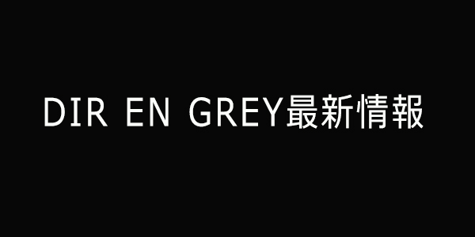
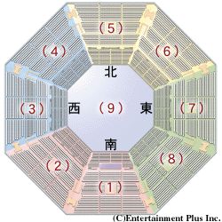

---
categories:
- DIR EN GREY
date: Tue, 14 Jan 2014 04:18:06 +0000
slug: post-4032
tags:
- DIR EN GREY
title: DIR EN GREY「SUSTAIN THE UNTRUTH」最新情報
---

本日オフィより公開されました情報は3つ以下オフィからの引用です。 

<h2>久しぶりの「DIR EN GREY×Booチャンネル」</h2>

ぶぃーーーーってことでひっさしぶりのBooちゃんです。

ゲストはToshiyaです。

ただ•••いつも思いますが、ニコニコ動画のリンクわかりづらくないですか？

ニコ動のアプリから探すとか、まじ不可能レベルです。ってことでオフィのツイート貼っときます。 

<blockquote class="twitter-tweet" lang="ja">
ニコニコ生放送「DIR EN GREY CHANNEL」特番決定！1月24日(金)13:30～22:30にシングルリリースを記念した特別番組をオンエア！ 21時からはToshiyaが生登場！今作の話や、ツアーを控えた近況にも迫ります！<a href="http://t.co/TRGNScyHzQ">http://t.co/TRGNScyHzQ</a>
&mdash; DIR EN GREY (@DIRENGREY_JP) <a href="https://twitter.com/DIRENGREY_JP/statuses/422972143526088704">2014, 1月 14</a></blockquote>

<a href="https://itunes.apple.com/jp/app/niconico/id307764057?mt=8&uo=4&at=11ld5P" target="_blank" >niconico</a>

無料

(2014.01.15時点)

<a href="https://itunes.apple.com/jp/artist/dwango-co.-ltd./id297539595?uo=4&at=11ld5P" target="_blank" >DWANGO Co., Ltd.</a>

posted with <a href="http://pochireba.com" rel="nofollow" target="_blank">ポチレバ</a>

<h2>テレ朝特番「DUM SPIRO SPERO at 日本武道館」</h2>

ツアー前の特番です。皆さんカレンダー登録をお忘れなく。
<blockquote class="twitter-tweet" lang="ja">
1月25日(土)27:45～28:15 には、テレビ朝日にて「DIR EN GREY 特番 DUM SPIRO SPERO at 日本武道館」と題した番組の放送が決定！メンバーインタビューやライヴ映像から武道館公演をフィーチャーします。<a href="http://t.co/oZIqUcCQmN">http://t.co/oZIqUcCQmN</a>
&mdash; DIR EN GREY (@DIRENGREY_JP) <a href="https://twitter.com/DIRENGREY_JP/statuses/422975154835034112">2014, 1月 14</a></blockquote>

<h2>そして•••日本武道館追加チケット発売</h2>

ただし先着！！

<blockquote class="twitter-tweet" lang="ja">
3/8.9に行われる日本武道館公演 ステージプラン決定につき追加席開放決定!&#10;特別先行受付を実施します！※先着受付&#10;＜受付期間：1/18(土)10:00～1/24(金)18:00＞&#10;<a href="http://t.co/BETFKGgBTY">http://t.co/BETFKGgBTY</a>&#10;一般発売は1/25(土)より開始！
&mdash; DIR EN GREY (@DIRENGREY_JP) <a href="https://twitter.com/DIRENGREY_JP/statuses/422991499022704640">2014, 1月 14</a></blockquote>

<h3>どんな風な席になるのか</h3>

多分、あれでしょ？北側を解放すんでしょ？

<a style="color:#0070C5;" href="http://eplus.jp/sys/T1U21P0421020080" target="_blank">日本武道館のチケット・公演・会場ガイド（座席表・会場図･アクセス）情報｜ｅ＋（イープラス）</a> <strong>ここから引用しました</strong>  

本来武道館の北側席ってステージの後ろになっちゃうから、使わないんですけど、そこを解放して360°客席っちゅーことでやるんでしょうね。

ただ、スタンドしかないと思われます。
北東スタンド、北スタンド、北西スタンドを解放してざっと2,000名追加くらいでしょうか•••

<h2>しんぺーはこう思った</h2>

正直武道館の両日行きたいな〜と考えてます。しかしながらチケットを撮ったのは土曜日のみ。
まさか売り切れるって思ってなくて•••

ということで日曜日分はどうしようかと思案中。

ツアーが終わり、武道館が終わると、そろそろアルバムの制作にがっつり入るんでしょうね。
そうなると武道館でDIR EN GREY見納めか、もしくはショートツアー挟むか、はたまたsukekiyoのショートツアーとかね。

もしかしてアルバム被せて発売とかありそうだしな。

何はともあれ、貯められるうちに貯めておかねば。

それと、このブログ、今後なるべくオフィの情報やその他DIR EN GREY情報は漏らさずに掲載したいのはもちろんのこと、忘れっぽい人のためのリマインダーとしての役割も担いたいと思ってます。

ぼくなんかよく漏らしちゃって、チケットとり忘れとか、雑誌の発売日忘れとかあるんですよ。同じような人いますよね？きっと。

色々と仕組みを考えてますんで、形になり次第公開したいと思っておりますといったところで、本日は以上です。おやすみなさい！