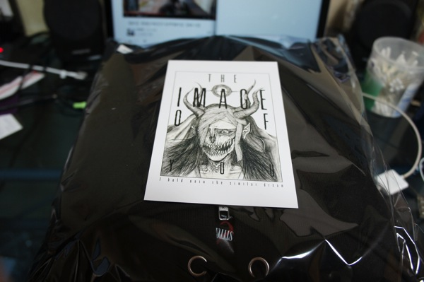
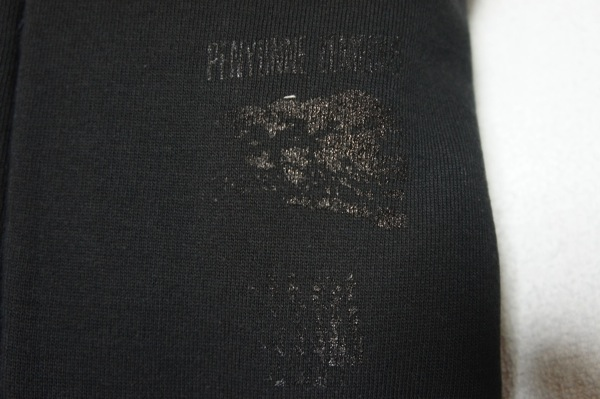
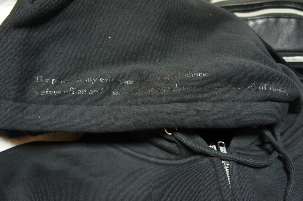
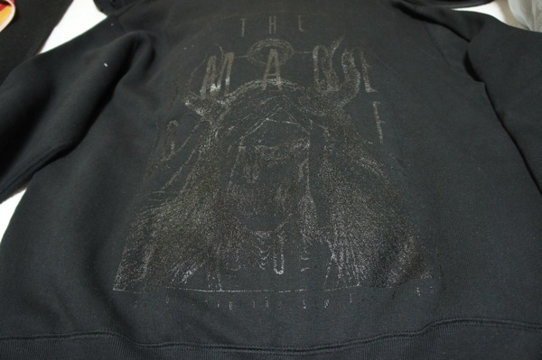

---
categories:
- sukekiyo
date: Wed, 15 Jan 2014 15:41:43 +0000
slug: post-4046
tags:
- DIR EN GREY
title: Zemeckis「漆黒パーカー」来た着た
---

来ました。年末に入金したDIR EN GREY kyoの漆黒パーカー

<h2>漆黒パーカーレビュー</h2>

まず今回注文しましたのはDIR EN GREYボーカルの京氏のソロワークス「Zemeckis」より発売しております<b>「漆黒パーカー」</b>でございます。

特徴としましては、大寒波絶賛到来中の日本列島にぴったりの厚手仕様というところでございます。

こまかく見ていきましょう。

<h3>右胸にプリント</h3>

<h3>フードにプリント</h3>

「The proof of my existence washes up to shore
It gives off an awful smell as the sun devours in to the road of decay」

ひっさしぶりに英語を読むので間違ってると思うけど・・・そしてぼくなりの意訳も含めて

“わたしの存在の証明は押し流さる。それは、腐敗した道を貪る太陽のような酷い臭いを放つ”

<h3>そしてバックは、ポストカードの絵と同じものがプリントされてます。</h3>

<h2>漆黒パーカーの感想</h2>
前回のDIR EN GREYファンクラブのパーカーと同じくらいの素材です。

暖房のついた部屋だと暑くて脱ぐぐらいです。

前回、ぼくはSサイズを買って、結構ぴったりだったんで今回はMサイズを購入しました。

しかーっし、それだと上に革ジャンを着ると革ジャンが浮くくらいのゆったり感です。

失敗したなーSにしておけばよかった。

170cm 65kgの男だとMだとちょいでかいかなっと思います。

<h2>しんぺーはこう思った。</h2>

失敗したわー単体で着るにはいいですよ。
武道館にはこれだけでも十分って感じの厚さです•••

でも、今の時期にジャケットの下に着る分にはちょいデカすぎるわ•••

どうしよ、もう一着買おうかな

そう言えばNUCREAR DESTROYS THE EARTHのパーカーが今やもうボッロボロなので、もう一着買えばよかったと、これまた後悔中なので、今のうちに買っとこうかしら。

新曲でて、sukekiyoに動きなさそうだったら買っちゃおうかな•••

でもノ限ツアーでもパーカーどうせ売り出しそうだし、やっぱ我慢しておくか！

迷っている人、多分今入金すればツアーに間に合うんじゃないかな？

といったところで、本日は以上です！今夜はこれを来て寝るぜ。おやすみなさい。