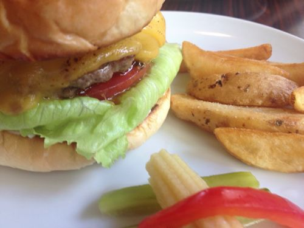
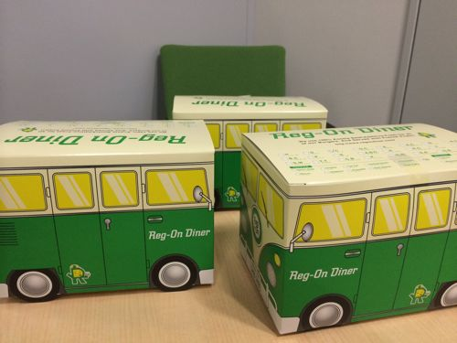
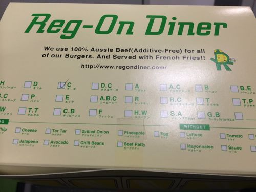
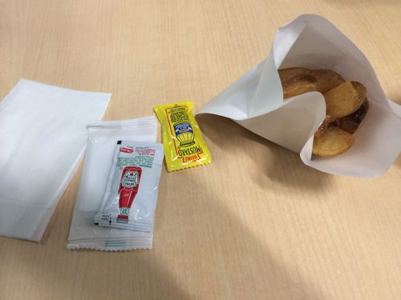
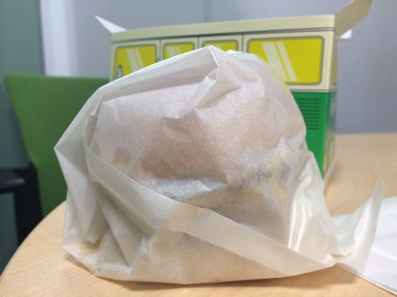

---
categories:
- グルメ
date: Thu, 16 Jan 2014 05:00:56 +0000
slug: post-4055
title: 渋谷ナンバー1バーガー「レッグオンダイナー」はデリバリーもオッケー！
---

<h2>僕が大好きなハンバーガーショップ「Reg on dinner(レッグオンダイナー)」</h2>
このお店は、デリバリーもしてくれるんです！

<strong><a href="http://tabelog.com/tokyo/A1303/A130301/13054359/" target="_blank">レッグオンダイナー</a></strong>

<strong>関連ランキング：</strong><a href="http://tabelog.com/rstLst/hamburger/">ハンバーガー</a> | <a href="http://tabelog.com/tokyo/A1303/A130301/R4698/rstLst/">渋谷駅</a>、<a href="http://tabelog.com/tokyo/A1303/A130302/R1528/rstLst/">恵比寿駅</a>、<a href="http://tabelog.com/tokyo/A1303/A130303/R5661/rstLst/">代官山駅</a>

本当は昨日食べたかったんですが、昼過ぎに電話したら混み合ってて1時間以上待ちっちゅーことで、断念。

本日リベンジで開店とほぼ同時に電話して、持ってきてもらいました。

<h3>箱がすごいカワイイ</h3>

バスです。

一目で何が入ってるかわかる表示。ユーザビリティを考えてますな

中にはナプキンとケチャップ、マスタード、お手拭きとお店と同んなじ装備

<h3>一つだけ注意事項</h3>

このお店のハンバーガーは肉汁と新鮮な野菜の水分で、食べてる間に水分が凄い出てくるんです。

だからいつもお店では、ハンバーガーを入れる通称「バーガー袋」を二重にして食べてます。

ただデリバリーだと一つしか入ってない上に、ハンバーガーがあらかじめ入れられている状態で、ラッピングされてます。

そのため、ラッピングを剥がす段階で破いてしまいました。

ここはもう1枚入れてほしいところ。

<h2>しんぺーはこう思った。</h2>

今日もうまかった！

最高！ウーピーゴールドバーガーやブラッカウズなんかもあるけど、ぼくはここが一番好き！

おすすめです！