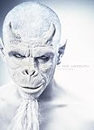

---
categories:
- 解釈・感想・解説
date: Sun, 26 Jan 2014 14:35:03 +0000
slug: post-4139
tags:
- DIR EN GREY
title: SUSTAIN THE UNTRUTHの感想と解釈
---

虜の皆さんは当然買って、すでに100回以上聴いているかと思います。

ちなみにまだ完全受注生産限定版Amazonで売ってます。

<a href="http://www.amazon.co.jp/exec/obidos/ASIN/B00FY10G7M/warawareotoko-22/ref=nosim/" rel="nofollow noopener noreferrer" target="_blank">SUSTAIN THE UNTRUTH(完全生産限定盤)(DVD付)</a>
posted with <a href="http://kaereba.com" rel="nofollow noopener noreferrer" target="_blank">カエレバ</a>

DIR EN GREY SMD itaku (music) 2014-01-22    

<a href="http://www.amazon.co.jp/exec/obidos/ASIN/B00FY10G7M/warawareotoko-22/ref=nosim/" rel="nofollow noopener noreferrer" target="_blank">Amazon.co.jp で詳細を見る</a>

初回版には横浜BLITZでのLIVE映像が収録されてるってことで、こっちも買おうか迷ってます。

<a href="http://www.amazon.co.jp/exec/obidos/ASIN/B00FY10G86/warawareotoko-22/ref=nosim/" rel="nofollow noopener noreferrer" target="_blank">SUSTAIN THE UNTRUTH(初回生産限定盤)(DVD付)</a>
posted with <a href="http://kaereba.com" rel="nofollow noopener noreferrer" target="_blank">カエレバ</a>

DIR EN GREY SMD itaku (music) 2014-01-22    

<a href="http://www.amazon.co.jp/exec/obidos/ASIN/B00FY10G86/warawareotoko-22/ref=nosim/" rel="nofollow noopener noreferrer" target="_blank">Amazon.co.jp で詳細を見る</a>

<h2>SUSTAIN THE UNTRUTHの感想</h2>

どのインタビューでも言ってますよね。「シンプル」だって。
ファーストインプレッションでぼくが感じたのは「べ、べつにシンプルです！！！って感じじゃなくね！？」ってことでした。

シンプルってもっと解りやすいのかと思ってたわ。

いつも通り曲は難解。

歌詞だけ見てると、多分京の詩って前後省略しまくってるのとかあるんじゃね？とか思った。

どういうことかというとこんな感じ

“■■■■■■■■■■■■■■■■俺はまだ■■■■■■■■■明日に■■■■■■■■■■”

ふと、思っただけですが。

あ、それと完全受注生産限定版の中身

<h3>流転の塔アコースティックバージョン</h3>

これ、めちゃくちゃかっこいい。

なんつーか、鬼兵犯科帳のEDって感じね。

<iframe width="420" height="315" src="//www.youtube.com/embed/ivX-m-8wYzQ?rel=0" frameborder="0" allowfullscreen></iframe>

<h2>DIR EN GREY×BooチャンネルでのToshiyaの発言</h2>

あいかわらずのノリなBooチャンネルでしたが、いつもよりも長くToshiyaの
語りが聞けたのは良かったですね。

で、色々と話をしている中でのToshiyaの発言に何でガスマスクをしているのかって理由を話していました。

「色々と忘れ去られていることがある中で、今敢えて」
確かそんなニュアンスのことを言ってました。

名言してはいませんがね。

あ、なるほど、そういう意味なのかって思いました。むしろ、意味があったのかとも思いました。

<h2>SUSTAIN THE UNTRUTHのPVを見て感じたこと</h2>

<iframe width="560" height="315" src="//www.youtube.com/embed/_GQDfmlDLck?rel=0" frameborder="0" allowfullscreen></iframe>

これ、ってさつまりそういうことなのかなって思った。

途中、瓦礫やらなんやらが映ってるんですけど、つまり壊れた・壊されたものを元に戻す作業や人の癒えていない傷とかってものがあるにも関わらず、「別のこと」をしようとしていて、そっちに目を向けさせようとしている人たちがいて、外の人たちにも「嘘」をついていて、それはまだ続けられているっていう。そういうことなのかなって思いました。

Toshiyaが名言しなかったので、ぼくも名言せずに書きました。

<h3>風化させないこと</h3>

次のアルバムや彼らの制作動機には、「風化させないこと」ってこともあるんじゃないかなって思います。

そして、それを世界に発信する力がある彼らが音楽にするってこともこれまた意味があるって思う。

嘘を継続しようとする人たちに対して、本当のことを発信したいって気持ちも少なからずあるんじゃないかな、と。

ま、勝手に思ってるだけですけど。

<h2>しんぺーはこう思った。</h2>
ぼく個人は昔のクソな自分を忘れないようにとかって意味もあってDIRを聞いているとか、そんなのもあるわけですけど。つまりは自分の中で風化させないということです。

以前なんかのDVDでToshiyaが言ってた「音楽で世界を変えることはできないけど、人の心を変えることはできるかもしれない」みないなこと。

そういう姿勢が垣間見えた気がしました。