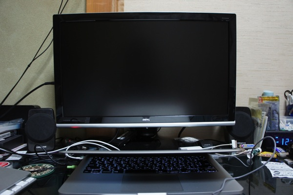
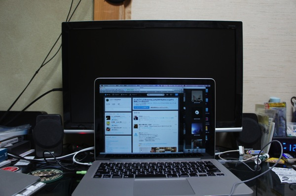

---
categories:
- ゲーム
date: Sun, 26 Jan 2014 15:06:23 +0000
slug: post-4147
tags:
- ゲーム
title: ゲーム用に外部モニターを導入しましたよーって話
---

iMac様がおイカレテおりまして、電源すら御入りになりあそばせんので、ヤフオクで外部モニターを購入いたしました。

<h2>BenQという台湾？のメーカーのものになります。</h2>

設置するとこんな感じ

21インチです。ちょい小さめなテレビって感じです。

<h2>Mac Book Pro13インチとの比較</h2>

以前のiMacと比べると小さいですね。
<a style="color:#0070C5;" href="https://www.warawareotoko.com/2013/11/06/post-3541/" target="_blank">#3:iMacを外部モニター化して新型MacBook Proのデュアルモニターとして使う方法 | Gadget Zombie Parasite</a>  

<h2>性能はどうなのよ！</h2>

明るすぎる！このメーカーのモニターについてAmazonでは明るすぎる！なんてレビューが沢山ありましたが、本当に明るすぎる。
目がめちゃくちゃつかれる。

さらに画質が粗すぎる！Retinaに慣れているからなのかとにかくきになる！

しょうがねいよね！だって7,000円で買ったんだもん！

<h2>しんぺーはこう思った。</h2>

ゲーム用に購入しました。今まで自分の部屋にテレビがなかったんでリビングにわざわざ行ってやってたんですが、とにかくめんどくさくて。寝落ちもできずに。

自室に設置したことによりようやく落ち着いてホラーゲームをやる事ができますw

ラストオブアスのダウロードコンテンツもリリースされるっちゅうことなので、自分の部屋で酒でも飲みながらやりたいね〜なんて思うのでした！

<a href="http://www.amazon.co.jp/exec/obidos/ASIN/B00BXSZYXQ/warawareotoko-22/ref=nosim/" rel="nofollow" target="_blank">The Last of Us (ラスト・オブ・アス)</a>
posted with <a href="http://kaereba.com" rel="nofollow" target="_blank">カエレバ</a>

 ソニー・コンピュータエンタテインメント 2013-06-20    

<a href="http://www.amazon.co.jp/exec/obidos/ASIN/B00BXSZYXQ/warawareotoko-22/ref=nosim/" rel="nofollow" target="_blank">Amazon.co.jp で詳細を見る</a>

