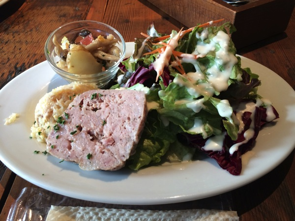
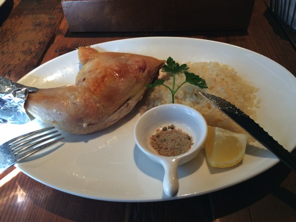

---
categories:
- グルメ
date: Tue, 28 Jan 2014 14:36:17 +0000
slug: post-4152
tags:
- グルメ
title: 渋谷新南口でオシャレかつ野性的なランチをしたきゃココにゆけ「COCORICO」
---

先に言っておこう。この店は正午から一気に混み出して、ほぼ満席になる。だから少し早めに行け！

<strong><a href="http://tabelog.com/tokyo/A1303/A130301/13147320/" target="_blank">LA COCORICO</a></strong>

<strong>関連ランキング：</strong><a href="http://tabelog.com/rstLst/italian/">イタリアン</a> | <a href="http://tabelog.com/tokyo/A1303/A130301/R4698/rstLst/">渋谷駅</a>、<a href="http://tabelog.com/tokyo/A1303/A130303/R5661/rstLst/">代官山駅</a>、<a href="http://tabelog.com/tokyo/A1303/A130301/R5207/rstLst/">神泉駅</a>

<h2>デッカいチキンをナイフで切って喰らう！</h2>

この店のメインは、看板にもなってるチキンです。これを鋭い肉切り用のナイフを使って、切り落として食べるわけです。
鳥の骨格の構造を考えつつ、肉を切り取る••• 

まるでベアグリルスにでもなったかのような気分です。 

<h3>ランチメニューはサラダとメインのチキン、デザートとドリンクがついて1,200円</h3>

サラダの量が多いんだこれが！

メインのチキンはこれや！

デザートの写真は忘れてもうたんだが、これがお腹いっぱいの状態でもふたくちくらいで食べられる大きさ！

そして手作りちっくな味で美味しいし、甘さも控えめ あと、ドリンクもついております！ こんなにお腹いっぱいで美味しくて大満足なのに1,200円！！ひゃっはー！

さらにこのお店をおすすめするポイントはこちら••• なんとお帰りのさいにお土産でホットコーヒーがもらえるんでっす！

どっすか？めちゃくちゃいいでしょう！

<h2>しんぺーはこう思った。</h2>

ここは店員さんも感じが良くて、尚かつオシャンティです。 店内がもうオシャンティなんす。 本当にこのチキンを食べてもらいたいです。

そんなココリコはこちらです。お近くにお立ち寄りの際はぜひ 

<strong><a href="http://tabelog.com/tokyo/A1303/A130301/13147320/" target="_blank">LA COCORICO</a></strong>

<strong>関連ランキング：</strong><a href="http://tabelog.com/rstLst/italian/">イタリアン</a> | <a href="http://tabelog.com/tokyo/A1303/A130301/R4698/rstLst/">渋谷駅</a>、<a href="http://tabelog.com/tokyo/A1303/A130303/R5661/rstLst/">代官山駅</a>、<a href="http://tabelog.com/tokyo/A1303/A130301/R5207/rstLst/">神泉駅</a>
