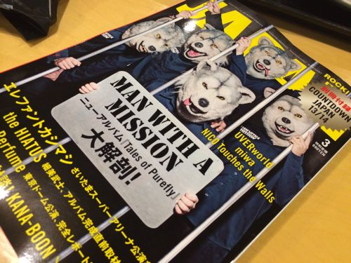
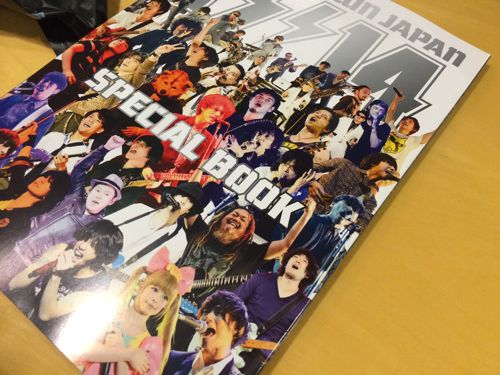
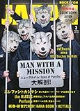

---
categories:
- sukekiyo
date: Wed, 29 Jan 2014 23:48:32 +0000
slug: post-4174
tags:
- sukekiyo
title: sukekiyo初めて雑誌に掲載されたってよ「ROCKIN'ON JAPAN」別冊にsukekiyo情報載ってまっせ
---

ハロー。しんぺー(<a href="https://twitter.com/s_s_p_y" target="_blank">@s_s_p_y</a> )です。

本日発売のロッキンオンジャパンは、年末のカウントダウンジャパン別冊付録付き sukekiyoはその中の、真ん中くらいのページに一コマだけ載ってます。 

<h2>sukekiyo情報は別冊に収録。なので立ち読みは多分不可</h2>

紐でくくられてるので立ち読みはできないかな
ちなみにカウントダウンジャパンでのセトリは以下の通り
<ol>
<li>elisabeth addict</li>
<li>aftermath</li>
<li>hemimetabolism</li>
<li>nine melted fiction</li>
<li>in all weathers</li>
</ol>

<h3>タイトルの意味をぐぐってみた。</h3>
直訳です。

elisabeth addict
意味不明。歌詞を見てみないとわかりませんな。
エリザベス？人の名前でしょうか

aftermath
後述します。

hemimetabolism
よくわからん。。。

nine melted fiction
これもよくわからんww

in all weathers
どんな天気でも

どういう意味だよw

<h2>しんぺーはこう思った。</h2>

今だから解る「aftermath」というタイトルの意味
思ったんですがsustain the untruthのPVとか、Toshiyaのガスマスクとか、そんなあたりから考えるとsukekiyoの「aftermath」もやっぱり震災のことを言ってるような気がしてきた•••

<a href="http://www.amazon.co.jp/exec/obidos/asin/B00HYIC82Y/warawareotoko-22/" rel="nofollow" name="booklink" target="_blank">ROCKIN'ON JAPAN (ロッキング・オン・ジャパン) 2014年 03月号 [雑誌]</a>
posted with <a href="http://yomereba.com" rel="nofollow" target="_blank">ヨメレバ</a>

 ロッキング・オン 2014-01-30    

<a href="http://www.amazon.co.jp/exec/obidos/asin/B00HYIC82Y/warawareotoko-22/" rel="nofollow" target="_blank" title="アマゾン" >Amazon</a>

<a href="http://www.amazon.co.jp/gp/search?keywords=ROCKIN%27ON%20JAPAN%20%28%83%8D%83b%83L%83%93%83O%81E%83I%83%93%81E%83W%83%83%83p%83%93%29%202014%94N%2003%8C%8E%8D%86%20%5B%8EG%8E%8F%5D&__mk_ja_JP=%83J%83%5E%83J%83i&url=node%3D2275256051&tag=warawareotoko-22" rel="nofollow" target="_blank" >Kindle</a>
                        	  	  	  	

<a href="https://itunes.apple.com/jp/music-video/aftermath/id768011894?uo=4&at=11ld5P" target="_blank" >aftermath</a>

400円

(2014.01.31時点)

<a href="https://itunes.apple.com/jp/artist/sukekiyo/id768011895?uo=4&at=11ld5P" target="_blank" >sukekiyo</a>

posted with <a href="http://pochireba.com" rel="nofollow" target="_blank">ポチレバ</a>

