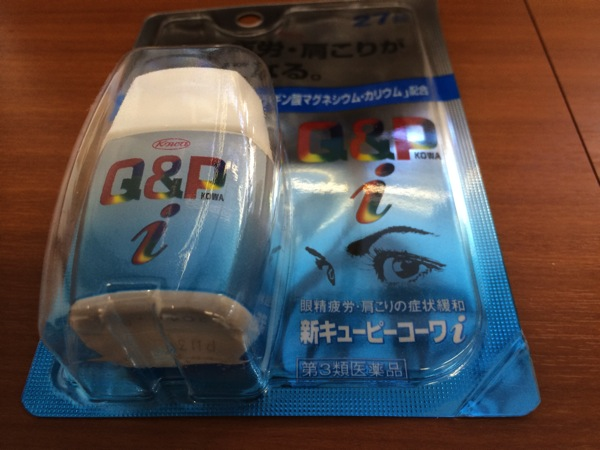
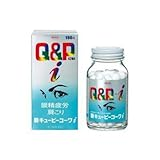

---
categories:
- ライフハック
date: Sat, 01 Feb 2014 05:40:23 +0000
slug: post-4186
tags:
- 眠気防止
title: 【仕事中眠け防止シリーズ】その1「Q&P KOWA i」飲んでみた
---

ハローしんぺー(<a href="https://twitter.com/s_s_p_y" target="_blank">@s_s_p_y</a> )です。

いつも睡眠時間が少ないために昼死んでます。

だからコーヒーを飲んだり、エナジードリンクを飲んだりして、胃があれ、色んな不調が出てきたりしてます。諸刃の剣です。 それでも眠い•••

どしたらいいのってことで最善の対策を求めていろいろ試して行くシリーズです。題して<b>「仕事中眠くならないために」</b>シリーズです。 

まず第一回目はこちら「Q&P KOWA　i」を服用してみましった！

<h2>「Q&P KOWA　i」トライアルパック服用してみましった！</h2>

今週は割と遅くまで会社におりました。だいたい22:３０くらいでしょうか。
それで今週は結構疲れている状態で、機能なんか、もうヘロヘロ状態でした。

そんな中かねてより気になっていた大人のサプリメント「Q&P KO」を試してみることにしました。

なお、購入したのは肩こり、眼正疲労用の「i」ってやつです。

<h3>効果</h3>

<ul>
<li>8:40 3粒 服用</li>
コーヒーを摂取。

<li>11:00 少し眠気を覚え、紅茶を一杯飲む</li>
そこからは、服用したことを忘れるくらい集中して、眠気なし
わき上がる力を感じた。急上昇というわけではなく、集中力が底上げされた感じ

<li>12:30　昼食</li>

<li>14:00</li>
いつもなら眠気というかフラフラになる時間帯
少しずつ、眠気がでてきた気がする。
関係あるかないかわからないけど、地震かと思うくらいのめまい？

<li>15:00 1粒追加で服用</li>
耐えきれないくらいの、眠気に。金曜日だし、今週割と遅めだったらからか。
睡眠時間も少なめだったしな•••
とにかく眠い眠い眠い眠い•••

<li>16:30　レッドブルに手を出す</li>
眠い眠い眠い眠い眠い眠い眠い眠い眠い眠い眠い眠い
とにかく眠い•••眠いする程眠い
ついに悪魔のドリンクを摂取しなければならないほどに
胃がきりきりしだした

<li>17:00 激しい離脱症状</li>

<li>18:00 色々な効果が切れている感じ。とくに離脱症状も虚脱感もない</li>

<li>22:00 夕食</li>

<li>23:30 激しい吐き気。吐くかと思った。</li>
</ul>

<h2>しんぺーはこう思った。</h2>

一応、ぼくだけだと効果がわかりにくいと思って、健康体の人他3名にも服用させてみました。

とくに効果があるという報告は受けていません。

効果があるのかないのか•••
来週１週間毎日1粒ずつ服用してみようと思います。

どうなるのかな

<a href="http://www.amazon.co.jp/exec/obidos/ASIN/B001JL8F4W/warawareotoko-22/ref=nosim/" rel="nofollow" target="_blank">【第3類医薬品】新キューピーコーワi 180錠</a>
posted with <a href="http://kaereba.com" rel="nofollow" target="_blank">カエレバ</a>

 興和 2009-10-06    

<a href="http://www.amazon.co.jp/exec/obidos/ASIN/B001JL8F4W/warawareotoko-22/ref=nosim/" rel="nofollow" target="_blank">Amazon.co.jp で詳細を見る</a>

