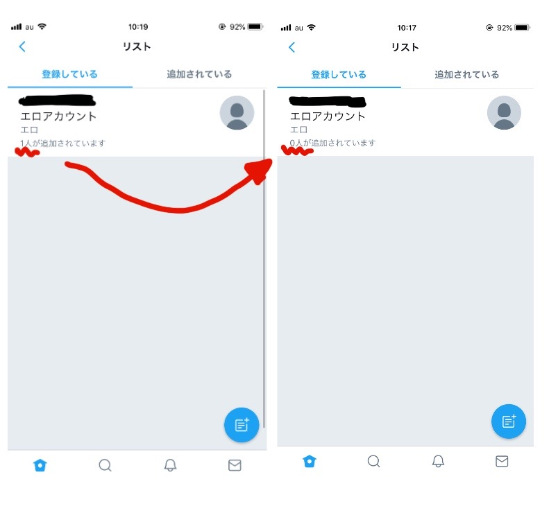

---
categories:
- アプリ
date: Mon, 03 Feb 2014 15:33:32 +0000
slug: post-4209
tags:
- Twitter
title: 追加されたTwitterのリストを解除する方法
---

Twitterで意図していないリストに勝手に登録されちゃうことってありませんか？エロ系のリストやら政治系やら仮想通貨系やら、儲け方教えます！系やら、いい加減にしろ。で、多分困ってる人が多いかと思いますが、簡単に抜けることができますし相手に通知されることもないので、その方法をご紹介します。
<h2>登録されたTwitterのリストから抜け出す方法</h2>
抜け出す方法は簡単です。追加した相手をブロックするだけです。
すると相手のリストから登録が解除されます。

そのあと、ブロックし続けるのもいいですが、ブロック解除しても相手にはなんの通知もいきませんので追加したつもりになってるけど、実はリストから抜けていたという状態になります。
むこうが再度リストに登録するまでは、リストから外れた状態になります。

<h3>手順１「相手のアカウントページに行く」</h3>

変なリストに追加されました。相手のアカウントページにいきましょう。

<h3>手順２「右上のアイコンをタップ」</h3>

<h3>手順３「ブロック」</h3>

以上です。

下の画像が実際にリストから外れた証拠です。人数が減っています。また、相手側にも通知はいきませんでした。

<h2>非公開リストに入れられてたら確認不可能</h2>
ただし、一点注意があります。

相手がリストを非公開にしている場合、自分が相手に追加されても通知も来ませんし、知るすべがありません。
そのため、見られていることを認識できません。見ず知らずの人にリスト追加されるのが嫌なのであれば、アカウントに鍵をつけて非公開にした上で、知ってる人のみとつながることでしょう。

ただし、知っている人が非公開リストに追加をしてきても、同じくわかりませんが。
<h2><a href="https://twitter.com/s_s_p_y">しんぺー</a>はこう思った。</h2>
現在のTwitterのアプリのUIはリストでの表示をしやすいものとなっています。おそらくそれほどリスト機能が使われているということでしょう。

ぼくもフル活用しています。ようやく待っていた機能だと言っても過言ではありません。なぜなら、特定の有名な方をフォローした際にその周辺で悪さをしようとする変なアカウントにフォローされたりするからです。
仮想通貨系や情報商材系は特にそういうのが多いです。与沢翼とかフォローすると自動で、与沢翼名言BOTみたいなのにいくつもフォローされたりします。

こういう系の方はリストで閲覧するのがよいと個人的には思います。

リストを有効に作成して、楽しいTwitterライフを過ごしましょう！

といったところで本日は以上です。おやすみなさい。
[itemlink post_id="12798"]