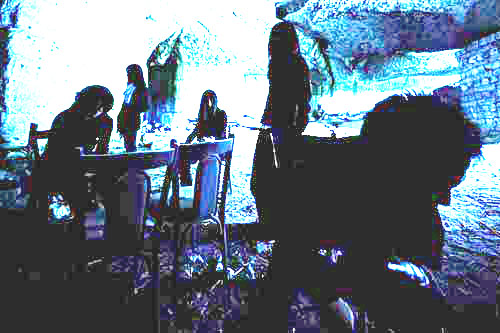

---
categories:
- sukekiyo
date: Tue, 04 Feb 2014 13:45:38 +0000
slug: post-4217
tags:
- sukekiyo
title: Is sukekiyo dir en grey?
---

I think that begun yesterday.Sundunly floated the word"sukekiyo".

Sukekiyo is the band which is thougth that it is kyo's solo project by TORIKO,and he stands inside in that photo is Kyo from DIR RN GREY. 
 Forward,I edited the topics from twitter.

First,suddenly COUNT DOWN JPAN which is the japanese music event publisged on home page.

Secondly,SUGIZO feat LUNASEA invited sukekiyo for his opening act at his live at shibuya in 15th November.

Thirdly,Sukekiyo photo is looked like Kyo from dir engrey. 

<!--sukekiyoの写真-->

This is it.So I think it must be Kyo exactly. 

So I formed it with Photoshop to make to be light.
But this photo is covered by Black shape　purposely.

Othoer members are slender and tall. One of them is looked like Kaoru from DIR EN GREY.

Is sitting member Toshiya?But his hair is not long now.

So, I got to be very useful information. The copyright of Official site is marked "Sun-krad".
"Sun-krad" is management office of DIR EN GREY.

But I found it secondly, that is removed.

Summary
The band has five members.
They belong to "Sun-Krad".
They will perform, Dec.2.
They will perform for opening act of SUGIZO,Dec.29.
They will perform for CDJ13/14.