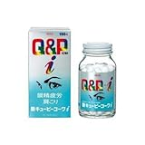

---
categories:
- ライフハック
date: Wed, 05 Feb 2014 15:48:36 +0000
slug: post-4222
tags:
- 眠気防止
title: 【仕事中眠け防止シリーズ】その2「キューピーコーワi」を3日間試したみた結果
---

ハローしんぺー(<a href="https://twitter.com/s_s_p_y" target="_blank">@s_s_p_y</a> )です。

以前、キューピーコーワiを服用した結果をお伝えしました。
<a style="color:#0070C5;" href="https://www.warawareotoko.com/2014/02/01/post-4186/" target="_blank">仕事中眠くならないために「Q&P KOWA i」飲んでみた | Gadget Zombie Parasite</a>  

あれから3日間服用し続けた結果をお伝えします。

<h2>キューピーコーワiを3日間のみ続けた結果</h2>

毎朝3粒服用した結果<b>全く眠くならない！</b>

効果抜群！少し眠気を感じることもありますが、そんな時はお紅茶を飲めばすっきり目が覚めます。

今までは、コーヒーを飲みまくってバキバキになってようやく眠くならないって感じでしたが、この3日間はこいつのおかげでだいぶ楽な感じです。

<h3>副作用は？</h3>

やっぱり最初に飲んだ時に感じた目眩は気のせいだったようです。
それと今日は気持ち悪さもなかったし。

気のせいか、他の要因ですねきっと。

つまり、副作用今の所なし！！

あと、目の疲れ！これもなんとなくですが感じなくなったきがします。
ただし、肩こりについては普通に感じてます。。

<h2>しんぺーはこう思った。</h2>

これはいい！コーヒーとかレッドブルとか飲み過ぎちゃって、体に悪い感じの眠気覚ましをするよりか、よっぽどいいと思います！

ただ、これは浪人している時に感じたことですが、眠気を取る一番の方法、それは眠ることです。

とは言え、そうもできない時はこういうのを服用してみてもいいんじゃないでしょうか！

<strong>キューピーコーワi</strong>

おすすめです。

<a href="http://www.amazon.co.jp/exec/obidos/ASIN/B001JL8F4W/warawareotoko-22/ref=nosim/" rel="nofollow" target="_blank">【第3類医薬品】新キューピーコーワi 180錠</a>
posted with <a href="http://kaereba.com" rel="nofollow" target="_blank">カエレバ</a>

 興和 2009-10-06    

<a href="http://www.amazon.co.jp/exec/obidos/ASIN/B001JL8F4W/warawareotoko-22/ref=nosim/" rel="nofollow" target="_blank">Amazon.co.jp で詳細を見る</a>

