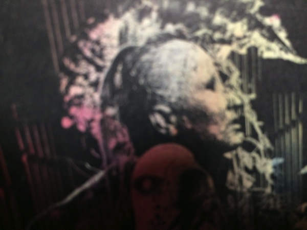

---
categories:
- DIR EN GREYのLIVEレポ
date: Thu, 06 Feb 2014 12:10:27 +0000
slug: post-4255
tags:
- DIR EN GREY
title: FINEM LAUDAツアー初日@なんばHatch まとめ
---

ハロー。しんぺー(<a href="https://twitter.com/s_s_p_y" target="_blank" rel="noopener">@s_s_p_y</a> )です。

さて、ドゥムの前哨戦とも言えるファンクラブ限定ツアーが始まりましたね。

どんな感じだったのでしょうか、気になるLIVEの内容をTwitterから拾ってきてまとめました。(ソースは虜様各位)

なんばHatch初日！

<iframe style="border: 0;" src="https://www.google.com/maps/embed?pb=!1m14!1m8!1m3!1d3281.454512376217!2d135.495772!3d34.6684766!3m2!1i1024!2i768!4f13.1!3m3!1m2!1s0x6000e70e0b27e6d7%3A0xb68715dbcb8c2843!2z5aSn6Ziq5bqc5aSn6Ziq5biC5rWq6YCf5Yy65rmK55S677yR5LiB55uu77yT4oiS77yR!5e0!3m2!1sja!2sjp!4v1391700061196" width="400" height="300" frameborder="0"></iframe>
<h2>まずはセトリ</h2>
いつも通り拾い物

狂骨の鳴り
Sustain the untruth
明日無き幸福、呼笑亡き明日

かすみ
鴉
獣慾
bottom of the death valley

愛しさは腐敗につき
Jesus Christ R'n R
Unraveling

業
Different sense
霧と繭
輪郭
激闇

暁
JESSICA
obscure
羅刹国
<h3>【ネタバレ】今日のライブはこんなんだったらしい。</h3>
全ての文の最後に「だったらしい」という言葉が省略されております。

ジェシカを演奏！！！！

なおかつメンバーは皆笑顔でとてもいいLIVEだった！！
Toshiyaはハイヒールじゃなし！
京は引き締まったボディで痩せていた！
Die氏も口ずさんじゃったりなんだかんだり

そして•••
<blockquote>Documentary Blu-ray &amp; DVD
『TOUR13 GHOUL』 2014.4.23 RELEASE　2/6 up

TOUR2013 GHOUL――2013年9月18日横浜BLITZを皮切りに行われた全国9都市15公演、11月3日より約1ヵ月をかけて行われた全米14都市14公演をカメラが完全密着。DIR EN GREYが直面する現実を記録したドキュメンタリー映像集の第4弾『TOUR13 GHOUL』、2014年4月23日に発売決定！</blockquote>
あれ？やもさんと薫氏の情報なしww
<h2>しんぺーはこう思った。</h2>
家に、ホテルに帰るまでがLIVEです！

それと風邪引くなよ！ツアーはまだ始まったばかり！日武まで乗り切りましょう！

それとグッズのピックストラップ、バッジ、ドッグタグ、コインケースですがかなりの種類があって、かつランダムで出るそうです。1回500円。

個人的にはコインケースが欲しいな

さて！明日はどんなセトリでくるんでしょうかな！予想はSustain the untruthはやらないんじゃないかなと思います。それでいて、DUMベースな曲でくるんじゃないかしらね。

皆さんはどんな風に予想されますかぃ？