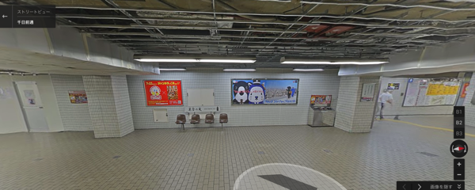
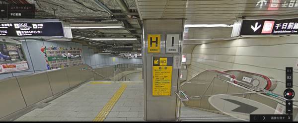
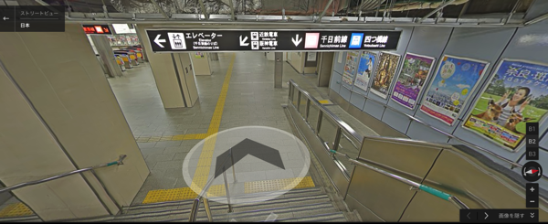
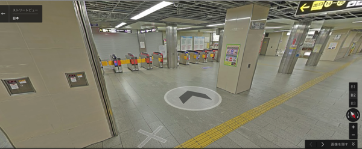
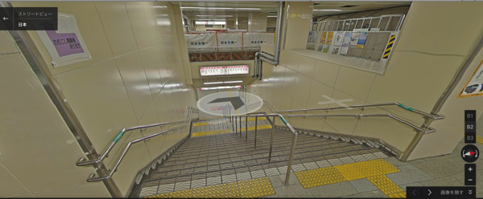
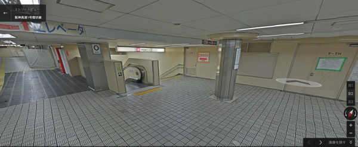
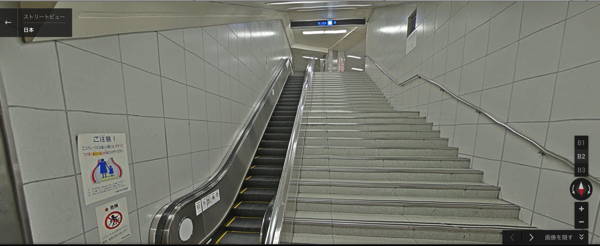
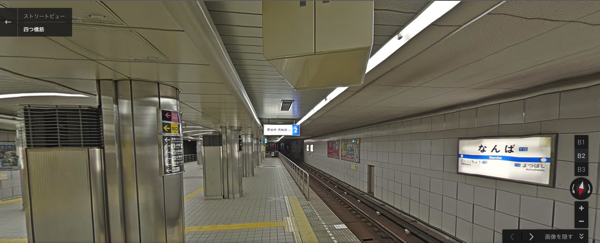
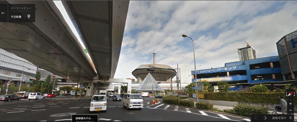
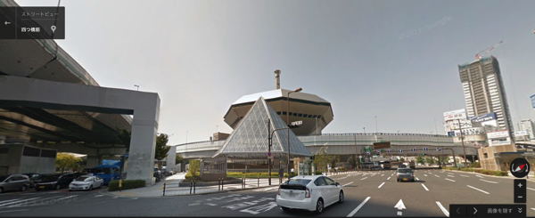

---
categories:
- DIR EN GREY
date: Thu, 06 Feb 2014 16:03:20 +0000
slug: post-4275
tags:
- DIR EN GREY
title: なんばHatchに行ったことのないぼくがGoogleマップで行ってみた
---

ハロー。しんぺー(<a href="https://twitter.com/s_s_p_y" target="_blank">@s_s_p_y</a> )です。

遠征は1回だけしたことがあるんです。大阪城ホールに。
寒かったな〜あの日は•••

さていずれは、DIR EN GREYの西のホームなんばHatchに行ってみたいもんです！

ってことでGoogleマップで行ってみよう！

<h2>なんばHatch</h2>

多分大阪までは夜行バスかなんかで行くんですかね。昔はそれで行きましたよ。帰りも日帰りだったんで、終わったらすぐにバス乗り場まで走りましたよ。あと少しで乗り遅れるところでしたけど。

バスって東京を夜でると朝着くんですよね〜そうすると夜まですることがないんですよね。

ってことで、まぁ大阪まで行く方法はバスか新幹線かどっちかで、今回はいきなりなんば駅に到着ということろからスタート！

はい、ゲームオーバー。何このダンジョンwwwどこ行っても行き止まりなんですけどwこわww

<h2>はい、なんばHatchはここです。</h2>

<iframe src="https://www.google.com/maps/embed?pb=!1m18!1m12!1m3!1d820.3682129873453!2d135.4954598!3d34.66801360000002!2m3!1f0!2f0!3f0!3m2!1i1024!2i768!4f13.1!3m3!1m2!1s0x6000e70e0aea2b1b%3A0x95f0543cc6961cfa!2z44Gq44KT44Gw77yo772B772U772D772I!5e0!3m2!1sja!2sjp!4v1391702165003" width="400" height="300" frameborder="0" style="border:0"></iframe>

高速道路の間に無理矢理作りましたって感じなんですね。
こんな感じなのか！ハッチ！

外観

内観

なるほど、こんな感じなのか。

<h2>しんぺーはこう思った。</h2>
確か大阪駅の地下もダンジョンだった気がする。

新宿駅もダンジョンだけど、慣れてないだけにこりゃー苦戦しそうだ！

ってまだ行く予定決まってないけどね！次のアルバムツアーでは行っても良いかな！

といった事で本日は以上です！おやすみなさい。